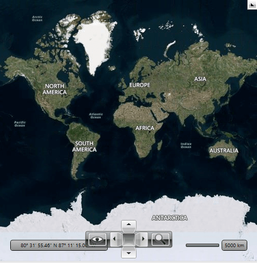

# Bing Map Rest Provider

The RadMap control supports visualizing tile data using the Bind Maps Rest imagery service. In order to create an instance of the __BingRestMapProvider__ you have to use the third overload of its constructor. This way you can easily pass the required parameters - map mode, labels visibility and a __Bing Maps Key__. The most important of them is the __Bing Maps Key__ parameter. Without supplying a valid key you will not be able to visualize the map inside the __RadMap__ control. In order to learn how to obtain one, please read [Accessing the Control Using a Bing Maps Key](http://msdn.microsoft.com/en-us/library/ee681900.aspx).        

>The RadMap BingRestMapProvdider is based on the Bing Maps [Imagery API](https://msdn.microsoft.com/en-us/library/ff701721.aspx?f=255&MSPPError=-2147217396).

Here is a list of the key properties which are used by __BingRestMapProvider__:        

* __ApplicationId__: Gets or sets __Bing Maps Key__.            

* __IsLabelVisible__: Gets or sets value which indicates whether labels should be visible on the map.            

* __Mode__: Gets or sets the mode defining how the map looks. You can choose between *Road*, *Aerial* and *Birdseye* options.            

* __UseSession__: Gets or sets value which indicates whether Bing session should be used.           

>If the provider’s initialization fails, the BingRestMapProvider will raise its InitializationFaulted event. The event can be fired for example, when the internet connection is lost or when the service is unavailable. The event arguments are of type __InitializationFaultEventArgs__ type. The arguments provides an __Error__ property which contains the exception which is thrown while initialization.          

#### __[XAML] Example 1: Setting BingRestMapProvider in XAML__
{{region xaml-radmap-features-providers-bing-rest-map_0}}
	<telerik:RadMap>
		<telerik:RadMap.Provider>
			<telerik:BingRestMapProvider ApplicationId="Bing_Map_Key" Mode="Aerial" IsLabelVisible="True"/>
		</telerik:RadMap.Provider>
	</telerik:RadMap>
{{endregion}}

#### __[C#] Example 2: Defining BingRestMapProvider programmaticaly__
{{region cs-radmap-features-providers-bing-rest-map_1}}
	BingRestMapProvider bingMap = new BingRestMapProvider( MapMode.Aerial, true, "Bing_Map_Key" );
	this.radMap.Provider = bingMap;
{{endregion}}

#### __[VB.NET] Example 3: Defining BingRestMapProvider programmaticaly__
{{region vb-radmap-features-providers-bing-rest-map_2}}
	Dim bingMap As New BingRestMapProvider(MapMode.Aerial, True, "Bing_Map_Key")
	Me.radMap.Provider = bingMap
{{endregion}}
Here is a snapshot of the map that appears:

You can the disable labels using the __IsLabelVisible__ property. When you set it to *False* the labels disappear. Here is a snapshot of the Aerial mode for Bing Map Rest Provider when the labels are not visible:

	
	
## See Also
 * [Providers Overview]()
 * [ArcGIS Online Map Provider]()