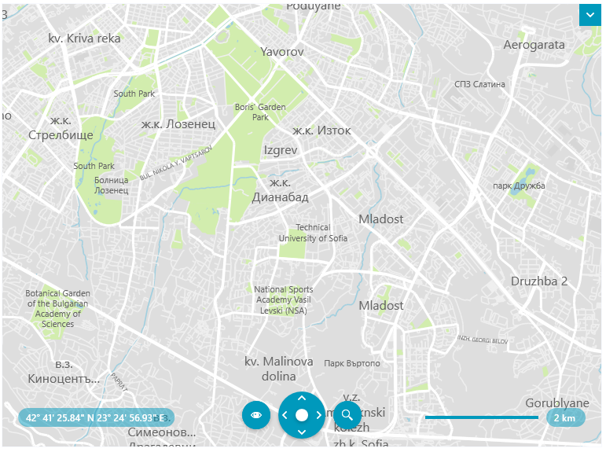
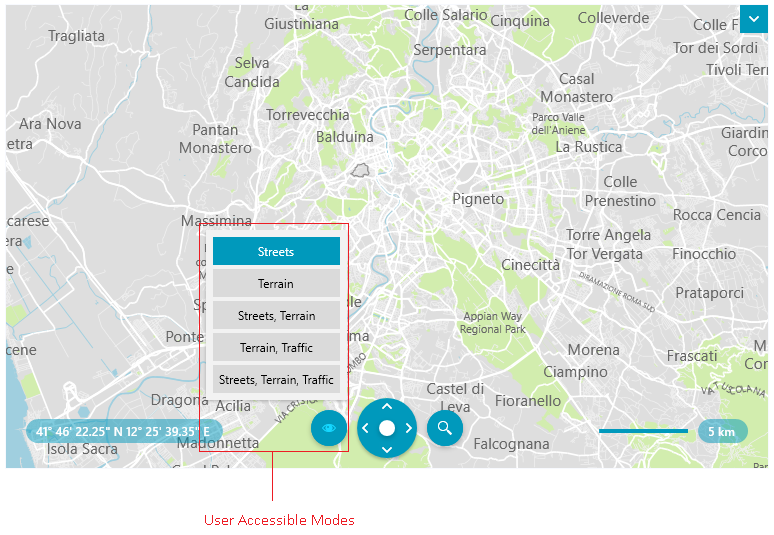

# MapBox Provider

RadMap has a built-in [MapBox vector tile services](https://docs.mapbox.com/data/tilesets/guides/vector-tiles-introduction/) provider that can be easily integrated in the application in order to show a detailed world map.

To use the MapBox services, assign a `MapBoxMapProvider` instance to the `Provider` property of `RadMap`.

In order to download data from the services, the provider needs to assign its `AccessToken` property. An access token can be acquired from the [MapBox tokens API](https://docs.mapbox.com/help/glossary/access-token/). Keep in mind that the token is related to a specific number of requests to the services. Read more on the [MapBox website](https://docs.mapbox.com/accounts/guides/invoices/#details-of-charges).

#### __[XAML] Setting up MapBoxMapProvider__
{{region radmap-features-mapboxprovider-0}}
	<telerik:RadMap>
		<telerik:RadMap.Provider>			
			<telerik:MapBoxMapProvider AccessToken="Your Access Token"/>
		</telerik:RadMap.Provider>
	</telerik:RadMap>
{{endregion}}

## Changing the Tile Set Mode

The MapBox services provide a set of different map layers ([tilesets](https://docs.mapbox.com/studio-manual/reference/tilesets/)). Telerik can make requests to several of the vector tilesets, but the built-in style source supports one of the available sets. To change the mode, set the `Mode` property of `MapBoxMapProvider` or use the UI.

The `Mode` property is a flag enum of type `MapboxVectorTileset` which allows you to set the mode to Streets, Terrain, Traffic or any combination of the modes. Currently, __the default style file source provided by Telerik supports only the `Streets` mode__. To visualize other modes, you should [provide a custom style file](#loading-custom-styles).

#### __[XAML] Setting the Mode property__
{{region radmap-features-mapboxprovider-1}}
	<telerik:RadMap>
		<telerik:RadMap.Provider>			
			<telerik:MapBoxMapProvider AccessToken="Your Access Token"
									   StyleFileSource="C:\MyMapVectorResources\Styles\custom-styles.json"
									   Mode="Streets,Terrain"/>
		</telerik:RadMap.Provider>
	</telerik:RadMap>
{{endregion}}

By default RadMap's navigation UI doesn't display any modes for the `MapBoxMapProvider`. To enable this, set the provider's `UserAccessibleModes` collection property.

#### __[XAML] Setting up the tileset modes__
{{region radmap-features-mapboxprovider-2}}
	<telerik:RadMap>
		<telerik:RadMap.Provider>			
			<telerik:MapBoxMapProvider AccessToken="Your Access Token"
									   StyleFileSource="C:\MyMapVectorResources\Styles\custom-styles.json">
				<telerik:MapBoxMapProvider.UserAccessibleModes>
					<telerik:MapboxVectorTileset>Streets</telerik:MapboxVectorTileset>
					<telerik:MapboxVectorTileset>Terrain</telerik:MapboxVectorTileset>
					<telerik:MapboxVectorTileset>Streets,Terrain</telerik:MapboxVectorTileset>
					<telerik:MapboxVectorTileset>Terrain, Traffic</telerik:MapboxVectorTileset>
					<telerik:MapboxVectorTileset>Streets, Terrain, Traffic</telerik:MapboxVectorTileset>
				</telerik:MapBoxMapProvider.UserAccessibleModes>
			</telerik:MapBoxMapProvider>
		</telerik:RadMap.Provider>
	</telerik:RadMap>
{{endregion}}

## Loading Custom Styles 

To assign a custom [style](https://docs.mapbox.com/mapbox-gl-js/style-spec/) `.json` file, set the `StyleFileSource` property of `MapBoxMapProvider`.

#### __[XAML] Setting custom styles__
{{region radmap-features-mapboxprovider-3}}
	<telerik:RadMap>
		<telerik:RadMap.Provider>
			<telerik:MapBoxMapProvider AccessToken="Your Access Token"\
									   StyleFileSource="C:\MyMapVectorResources\Styles\custom-styles.json"/>
		</telerik:RadMap.Provider>
	</telerik:RadMap>
{{endregion}}

## See Also 
* [Vector Tile Providers]()

