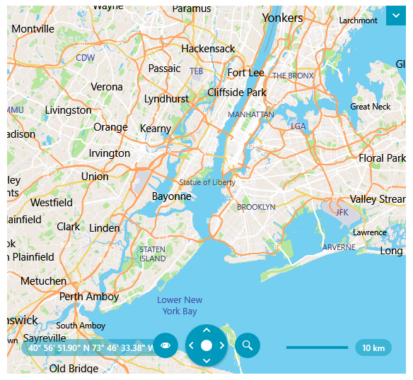

# Vector Tile Providers

The vector tile format allows you to store geospatial geometry data. This information can be combined with special styling data. The Telerik's vector tile provider read this information and based on it, renders tile images.

The vector tiles contain only geometry information that is loaded (or downloaded) on demand when the current viewport changes. The appearance of the geometry is defined in a separate style file. Combining this information, the provider prepares and renders visuals on the client. Compared to this, the raster-based providers, like BingRestMapProvider, OpenStreetMapProvider or UriImageProvider, download a raster image from the associated server, which increases the network traffic.

>important The vector tile providers (`UriVectorTileMapProvider`, `MbTilesMapProvider` and `MapBoxMapProvider`) work with the __Newtonsoft.Json__ framework. To use the provider, add a reference to the corresponding .dll or install the [nuget package](https://www.nuget.org/packages/Newtonsoft.Json/).

## Loading PBF or MVT Data

To load vector data, you should prepare or download a proper source with `.Pbf` or `.Mvt` files for the different viewport areas and zoom levels. The Pbf files contain the vector data. The appearance of the shapes is defined in a corresponding `json` style file. Telerik comes with a built-in style file that is automatically used by the provider, but this can be replaced with a custom style file. 

This type of vector tile data is visualized with the `UriVectorTileMapProvider`. To assign the `.Pbf/.Mvt` source, set the `UriTemplate` property of `UriVectorTileMapProvider`. The `.Pbf/.Mvt` and style sources can be local paths or a URLs to an online service. 

#### __[XAML] Defining UriVectorTileMapProvider__
{{region radmap-features-urivectortilemapprovider-0}}
	<telerik:RadMap>
		<telerik:RadMap.Provider>
			<telerik:UriVectorTileMapProvider UriTemplate="C:\MyMapResources\PbfFiles\{x}-{y}-{level}.pbf"/>
		</telerik:RadMap.Provider>
	</telerik:RadMap>
{{endregion}}

## Loading MBTiles

To load vector data, you should prepare or download a proper `.mbtiles` source file, which contains the map's vector data. The appearance of the shapes is defined in a corresponding `json` style file. Telerik comes with a built-in style file that is automatically used by the provider, but this can be replaced with a custom style file. 

This type of vector tile data is visualized with the `MbTilesMapProvider`. To assign the `.mbtiles` source, set the `Source` property of `UriVectorTileMapProvider`. The `.mbtiles` and style sources can be local paths or a URLs to an online service. 

#### __[XAML] Defining MbTilesMapProvider__
{{region radmap-features-urivectortilemapprovider-1}}
	<telerik:RadMap>
		<telerik:RadMap.Provider>
			<telerik:MbTilesMapProvider Source="C:\MyMapResources\world.mbtiles"/>
		</telerik:RadMap.Provider>
	</telerik:RadMap>
{{endregion}}

Using the `MbTilesProvider` requires to add include an additional reference to the __System.Data.SQLite.Core__ library. You can either, add a reference to the corresponding .dll or install the [nuget package](https://www.nuget.org/packages/System.Data.SQLite.Core/).

The `MbTilesMapProvider` doesn't support raster image files and SVG icons defined in the `.mbtiles` file.

## Loading Custom Styles 

To assign a custom style `.json` file, set the `StyleFileSource` property of `UriVectorTileMapProvider`.

#### __[XAML] Setting custom styles__
{{region radmap-features-urivectortilemapprovider-2}}
	<telerik:RadMap>
		<telerik:RadMap.Provider>
			<telerik:UriVectorTileMapProvider UriTemplate="C:\MyMapVectorResources\PbfFiles\{x}-{y}-{level}.pbf"
											  StyleFileSource="C:\MyMapVectorResources\Styles\custom-styles.json"/>
		</telerik:RadMap.Provider>
	</telerik:RadMap>
{{endregion}}

In case you need to create your own `.json` [style file](https://docs.mapbox.com/mapbox-gl-js/style-spec/) for the vector tiles, here is a list of the [layer properties](https://docs.mapbox.com/mapbox-gl-js/style-spec/layers/) supported by Telerik:

* `minzoom`
* `maxzoom` 
* `layout`    
    * `text-field`
    * `text-font`
    * `text-max-width`
    * `text-size`
    * `text-transform`
	* `visibility`	
* `paint`
	* `background-color`
	* `fill-color`
	* `line-color`
	* `line-opacity`
	* `line-width`
	* `text-color`
* `filter`

## See Also 
* [MapBox Provider]()