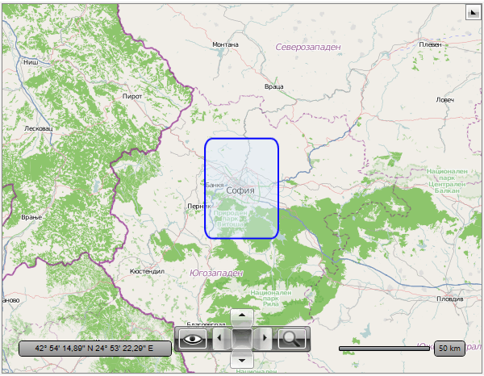
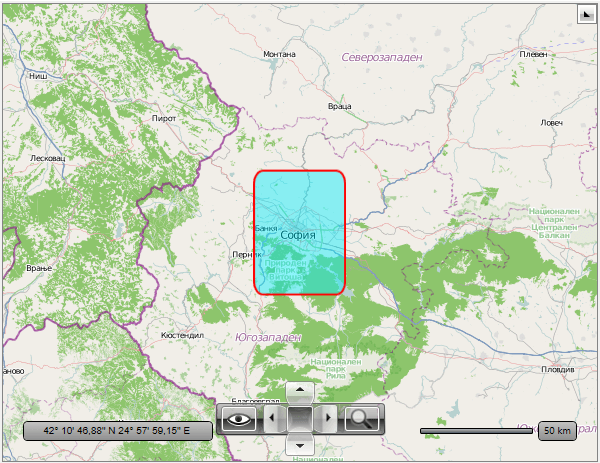
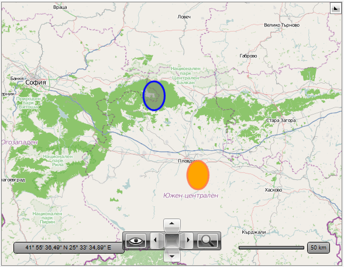

# Shape Appearance

When using map shape data objects (EllipseData, LineData, PathData and so on) there are 2 ways to control their appearance:      

1. Using the MapShapeFill object on shape level.
1. Using the MapShapeFill object on layer level.          

## Using the MapShapeFill object on shape level

The map shape data objects expose three specific properties - __ShapeFill__, __HightlightFill__ and __SelectedFill__.        

The first one is applied to the shapes, when they are in their normal state. The HighlightFill gets applied when the shape is highlighted. The SelectedFill gets applied when the shape is selected. You can apply regular, highlight or selected filling using __UseRegularFill()__, __UseHighlightFill()__ and  __UseSelectedFill()__ methods of the map shape data object.        

The three properties are of type MapShapeFill. The MapShapeFill object allows you not only to specify the Fill color, but also to modify the stroke as well.        

In the following example, the MouseLeftButtonDown event on the shape visualization is used to switch between regular and highlighted fill.        

#### __XAML__
{{region radmap_visualization_layer_shape_appearance_0}}
	<telerik:RadMap x:Name="radMap"
	                ZoomLevel="8"
	                Center="42.6957539183824, 23.3327663758679">
		<telerik:RadMap.Provider>
			<telerik:OpenStreetMapProvider />
		</telerik:RadMap.Provider>
		<telerik:VisualizationLayer x:Name="visualizationLayer"
	                                MapShapeVisualizationCreated="MapShapeVisualizationCreated"
	                                MapShapeVisualizationRemoved="MapShapeVisualizationRemoved">
			<telerik:RectangleData Location="42.9457539183824,23.0827663758679"
			                       Height="0.5"
			                       Width="0.5"
			                       RadiusX="0.05"
			                       RadiusY="0.05">
				<telerik:RectangleData.ShapeFill>
					<telerik:MapShapeFill Fill="#6FDFEFFF"
	                                      Stroke="Blue"
	                                      StrokeThickness="2" />
				</telerik:RectangleData.ShapeFill>
				<telerik:RectangleData.HighlightFill>
					<telerik:MapShapeFill Fill="#6F00EFFF"
	                                      Stroke="Red"
	                                      StrokeThickness="2" />
				</telerik:RectangleData.HighlightFill>
			</telerik:RectangleData>
		</telerik:VisualizationLayer>
	</telerik:RadMap>
{{endregion}}

#### __C#__
{{region radmap_visualization_layer_shape_appearance_0}}
	public partial class HighlightShapeOnMouseClick : UserControl
	{
		public HighlightShapeOnMouseClick()
		{
			InitializeComponent();
		}
	
		private void MapShapeVisualizationCreated(object sender, MapShapeOperationEventArgs e)
		{
			if (e.Visualization != null)
			{
				// Attach mouse events to the map shape visualization.
				e.Visualization.MouseLeftButtonDown += this.Visualization_MouseLeftButtonDown;
			}
		}
	
		private void MapShapeVisualizationRemoved(object sender, MapShapeOperationEventArgs e)
		{
			if (e.Visualization != null)
			{
				// Detach mouse events to the map shape visualization.
				e.Visualization.MouseLeftButtonDown -= this.Visualization_MouseLeftButtonDown;
			}
		}
	
		private void Visualization_MouseLeftButtonDown(object sender, MouseButtonEventArgs e)
		{
			FrameworkElement elt = sender as FrameworkElement;
			if (elt != null)
			{
				MapShapeData data = elt.DataContext as MapShapeData;
				if (data.IsHighlighted)
				{
					data.UseRegularFill();
				}
				else
				{
					data.UseHighlightFill();
				}
			}
	
			e.Handled = true;
		}
	}
{{endregion}}

#### __VB.NET__
{{region radmap_visualization_layer_shape_appearance_0}}
	Partial Public Class HighlightShapeOnMouseClick
		Inherits UserControl
	
		Public Sub New()
			InitializeComponent()
		End Sub
	
		Private Sub MapShapeVisualizationCreated(sender As Object, e As MapShapeOperationEventArgs)
			If e.Visualization IsNot Nothing Then
				' Attach mouse events to the map shape visualization.'
				AddHandler e.Visualization.MouseLeftButtonDown, AddressOf Me.Visualization_MouseLeftButtonDown
			End If
		End Sub
	
		Private Sub MapShapeVisualizationRemoved(sender As Object, e As MapShapeOperationEventArgs)
			If e.Visualization IsNot Nothing Then
				' Detach mouse events to the map shape visualization.'
				RemoveHandler e.Visualization.MouseLeftButtonDown, AddressOf Me.Visualization_MouseLeftButtonDown
			End If
		End Sub
	
		Private Sub Visualization_MouseLeftButtonDown(sender As Object, e As MouseButtonEventArgs)
			Dim elt As FrameworkElement = TryCast(sender, FrameworkElement)
			If elt IsNot Nothing Then
				Dim data As MapShapeData = TryCast(elt.DataContext, MapShapeData)
				If data.IsHighlighted Then
					data.UseRegularFill()
				Else
					data.UseHighlightFill()
				End If
			End If
	
			e.Handled = True
		End Sub
	End Class
{{endregion}}

Here is a snapshot of the result:

## Using the MapShapeFill object on layer level

You are also able to define the appearance of the shapes on the Visualization Layer level. This way every shape, that doesn't have its respective properties explicitly set, will inherit the appearance specified for the layer. For this purpose use the __ShapeFill__, __HighlightFill__ and __SelectedFill__ properties of the __VisualizationLayer__ class. The first one is applied to the shapes, when they are in their normal state. The HighlightFill gets applied when the shape is highlighted.The SelectedFill gets applied when the shape is selected.        

>These values will get applied also on the shapes that are created from KML, ESRI Shapefile or WKT/WKB data and don’t have their appearance explicitly set.          

The three properties are of type MapShapeFill. The MapShapeFill object allows you not only to specify the Fill color, but to modify the stroke as well.        

Here is an example:        

#### __XAML__
{{region radmap_visualization_layer_shape_appearance_1}}
	<telerik:RadMap x:Name="radMap"
	                ZoomLevel="8"
	                Center="42.6957539183824, 23.3327663758679">
		<telerik:RadMap.Provider>
			<telerik:OpenStreetMapProvider />
		</telerik:RadMap.Provider>
		<telerik:VisualizationLayer x:Name="visualizationLayer"
	                                MapShapeVisualizationCreated="MapShapeVisualizationCreated"
	                                MapShapeVisualizationRemoved="MapShapeVisualizationRemoved">
			<telerik:VisualizationLayer.ShapeFill>
				<telerik:MapShapeFill Fill="#80808080"
	                                  Stroke="Blue"
	                                  StrokeThickness="3" />
			</telerik:VisualizationLayer.ShapeFill>
			<telerik:VisualizationLayer.HighlightFill>
				<telerik:MapShapeFill Fill="Orange"
	                                  Stroke="Coral"
	                                  StrokeThickness="3" />
			</telerik:VisualizationLayer.HighlightFill>
			<telerik:EllipseData Location="42.6957539183824, 24.3327663758679"
	                             Width="0.2"
	                             Height="0.2" />
			<telerik:EllipseData Location="42.1429369264591, 24.7498095849434"
	                             Width="0.2"
	                             Height="0.2" />
		</telerik:VisualizationLayer>
	</telerik:RadMap>
{{endregion}}

## Using the AutoHighlightMapShape property      

The VisualizationLayer can highlight a map shape automatically when the mouse pointer is over it and set regular shape fill back when mouse pointer leaves the shape. You can turn on/off this feature using AutoHighlightMapShape property of the VisualizationLayer.