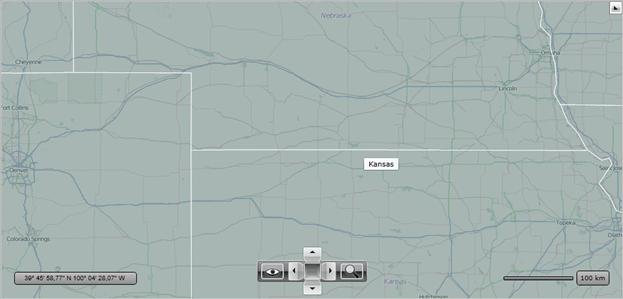
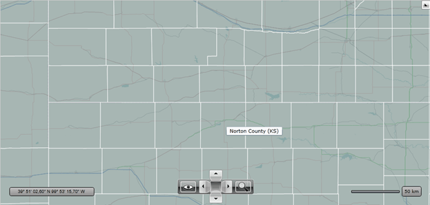

# Map Shapes Virtualization

## Purposes of Map Shapes Virtualization

Many applications operate with collections of the map shapes. The shapes can be retrieved from different sources like ESRI shape-file, KML file or Data Base which contains a geospatial data. Using large data source within the visualization layer can decrease the overall performance of the map control, especially the initial loading and the performance during zooming or panning.

The __RadMap__ control uses standard WPF/Silverlight shapes to render all __Map Shape__ objects. There are two things which affect the WPF/Silverlight rendering engine:        

1. The number of the objects visible in the viewport at the same time.

1. Complexity of the shapes which should be rendered. For example this is a number of points for the polylines and polygons. The WPF/Silverlight rendering engine is very sensitive for the number of points it should render. The solution would be in simplifying the initial shape files (if it is applicable).

To improve the performance with large data sets, you can use the __UI Virtualization__ feature.        

## Using Map Shapes Virtualization

In order to enable the __UI Virtualization__ feature you should configure the __ZoomLevelGridList__ and you should specify the __VirtualizationSource__ property of the Visualization Layer. The __ZoomLevelGridList__ property allows dividing the map to regions. And the __VirtualizationSource__ property allows specifying your own custom class which handles the requests by configured regions and which returns the __Map Shapes__ which will be displayed on the map. The custom class which can be used as the virtualization source must implement the __IMapVirtualizationSource__ interface.


>important If you use the WPF version of RadMap to display Map Shapes, then you must disable the __UseBitmapCache__ property for better performance.


More information about configuring the __ZoomLevelGridList__ you can find in the [Items Virtualization]() article.        

The __RadMap__ contains the __MapShapeDataVirtualizationSource__ class which implements the __IMapVirtualizationSource__ interface. This class can be used in most cases to enable the __UI Virtualization__ feature for the data sources like ESRI shape-file, KML file or SQL geospatial data.        

The __MapShapeDataVirtualizationSource__ exposes the following properties:        

* __BusyIndicator__ - a property of type __RadBusyIndicator__ that gets or sets the busy indicator which changes its state to busy while loading data.            

* __ClearCache__ - a property of type __bool__ that gets or sets a value indicating whether internal cache should be cleaned before reading the new items.            

* __Reader__ - a property of type __AsyncReaderBase__ that gets or sets the reader for loading map shapes.            

* __Resolution__ - a property of type __double__ that gets or sets minimal pixel size of the object. If pixel size of the object is less than this value then object will not be passed to the visualization layer.            

Also the __MapShapeDataVirtualizationSource__ contains the following events:        

* __PreviewReadShapeDataCompleted__ - occurs when the reader completes to read shapes.            

* __ProgressChanged__ - occurs when part of data is read. It can be used for displaying the loading progress percentage.            

* __ReadShapeDataCompleted__ - occurs when the reader completes to read shapes and pass them to target visualization layer.            

## Map Shapes Virtualization Example

The following example demonstrates how to use the __UI Virtualization__ feature for displaying the counties of USA. The example will display the polygons which are contained in the “County” shape-file. You can find it in our [Async Shape File](https://demos.telerik.com/silverlight/#Map/AsyncReadWithVirtualization) demo  application. The file contains over 6000 polygons which contain about 800000 points.        

When you will try to load this file using the shape-file reader directly like the code below then the performance of zooming and panning will be very low.

#### __XAML__
{{region radmap-visualization-layer-shapes-virtualization_6}}	
	<telerik:VisualizationLayer x:Name="visualizationLayer" UseBitmapCache="False">
		<telerik:VisualizationLayer.Reader>
			<telerik:AsyncShapeFileReader Source="/ShapeVirtualization;component/Resources/County.shp" />
		</telerik:VisualizationLayer.Reader>
	</telerik:VisualizationLayer>
{{endregion}}
	
Such performance is a reason to use the __Map Shapes Virtualization__ to improve the performance of rendering.        

If it is acceptable for your application just to restrict the zoom level, then it is possible to use built-in __MapShapeDataVirtualizationSource__. First you need to configure the __ZoomLevelGridList__ property. It can be configured to show counties from the zoom level 8 when the rendering is quite fast. It could be done with the following XAML code:
        
#### __XAML__
{{region radmap-visualization-layer-shapes-virtualization_0}}
    <UserControl x:Class="ShapeVirtualization.MainPage"
                 xmlns="http://schemas.microsoft.com/winfx/2006/xaml/presentation"
                 xmlns:x="http://schemas.microsoft.com/winfx/2006/xaml"
                 xmlns:d="http://schemas.microsoft.com/expression/blend/2008"
                 xmlns:mc="http://schemas.openxmlformats.org/markup-compatibility/2006"
                 xmlns:telerik="http://schemas.telerik.com/2008/xaml/presentation"
                 d:DesignHeight="300"
                 d:DesignWidth="400"
                 mc:Ignorable="d">
        <Grid x:Name="LayoutRoot" Background="White">
            <telerik:RadBusyIndicator x:Name="busyIndicator">
                <telerik:RadMap x:Name="radMap"
                                Center="40,-100"
                                MinZoomLevel="8"
                                ZoomLevel="8">
                    <telerik:RadMap.Provider>
                        <telerik:OpenStreetMapProvider />
                    </telerik:RadMap.Provider>
                    <telerik:VisualizationLayer x:Name="visualizationLayer">
                        <telerik:VisualizationLayer.ZoomLevelGridList>
                            <telerik:ZoomLevelGrid MinZoom="8" />
                            <telerik:ZoomLevelGrid MinZoom="9" />
                            <telerik:ZoomLevelGrid MinZoom="10" />
                        </telerik:VisualizationLayer.ZoomLevelGridList>
                        <telerik:VisualizationLayer.VirtualizationSource>
                            <telerik:MapShapeDataVirtualizationSource x:Name="mapShapeDataVirtualizationSource">
                                <telerik:MapShapeDataVirtualizationSource.Reader>
                                    <telerik:AsyncShapeFileReader Source="/ShapeVirtualization;component/Resources/County.shp" ToolTipFormat="{}{COUNTY} ({STATE})" />
                                </telerik:MapShapeDataVirtualizationSource.Reader>
                            </telerik:MapShapeDataVirtualizationSource>
                        </telerik:VisualizationLayer.VirtualizationSource>
                    </telerik:VisualizationLayer>
                </telerik:RadMap>
            </telerik:RadBusyIndicator>
        </Grid>
    </UserControl>
{{endregion}}

To start loading the shape-file you should invoke the __MapShapeDataVirtualizationSource.ReadAsync__ method:
        
#### __C#__
{{region radmap-visualization-layer-shapes-virtualization_1}}
	using System.Windows;
	using System.Windows.Controls;
	
	namespace ShapeVirtualization
	{
	    public partial class MainPage : UserControl
	    {
	        public MainPage()
	        {
	            InitializeComponent();
	
	            this.Loaded += MainPage_Loaded;
	        }
	
	        private void MainPage_Loaded(object sender, RoutedEventArgs e)
	        {
	            this.mapShapeDataVirtualizationSource.BusyIndicator = this.busyIndicator;
	            this.mapShapeDataVirtualizationSource.ReadAsync();
	        }
	    }
	}
{{endregion}}

#### __VB.NET__
{{region radmap-visualization-layer-shapes-virtualization_2}}	
	Partial Public Class MainPage
		Inherits UserControl
		Public Sub New()
			InitializeComponent()

			AddHandler Me.Loaded, AddressOf MainPage_Loaded
		End Sub

		Private Sub MainPage_Loaded(sender As Object, e As RoutedEventArgs)
			Me.mapShapeDataVirtualizationSource.BusyIndicator = Me.busyIndicator
			Me.mapShapeDataVirtualizationSource.ReadAsync()
		End Sub
	End Class
{{endregion}}

If your application cannot limit zoom level and it requires that some data still be visible on the low zoom levels (1 – 7) then you can use approach which show different sets of shapes for different zoom levels. For example, you can show the map of USA states for lower zoom levels (1-7). In this case you should design your own custom virtualization source class which will show data depend on the zoom level. The sample code below uses the “usa_states” shape-file which is also used in the [United States](https://demos.telerik.com/silverlight/#Map/Shapefile/UnitedStates) demo.
        
#### __C#__
{{region radmap-visualization-layer-shapes-virtualization_3}}
	using System;
	using System.Collections.Generic;
	using System.Linq;
	using Telerik.Windows.Controls.Map;
	
	namespace ShapeVirtualization
	{
	    public class ShapeDataVirtualizer : IMapItemsVirtualizationSource
	    {
	        private List<ExtendedDataProvider> sateData;
	        private List<ExtendedDataProvider> countyData;
	        private bool firstRequest = true;
	        private WeakReference layer = null;
	
	        public ShapeDataVirtualizer()
	        {
	            this.StartRead();
	        }
	
	        /// 

	        /// Gets or sets the layer this virtualization source belongs to.
	        /// 

	        private VisualizationLayer Layer
	        {
	            get
	            {
	                if (this.layer != null
	                    && this.layer.IsAlive)
	                {
	                    return this.layer.Target as VisualizationLayer;
	                }
	                else
	                {
	                    return null;
	                }
	            }
	
	            set
	            {
	                this.layer = value != null ? new WeakReference(value) : null;
	            }
	        }
	
	        public void MapItemsRequest(object sender, MapItemsRequestEventArgs e)
	        {
	            if (this.firstRequest)
	            {
	                this.Layer = e.Layer;
	                this.firstRequest = false;
	            }
	
	            this.QueryItems(e);
	        }
	
	        private void QueryItems(MapItemsRequestEventArgs e)
	        {
	            List<ExtendedDataProvider> shapes = null;
	            if (this.sateData != null && this.countyData != null)
	            {
	                IEnumerable<ExtendedDataProvider> query;
	
	                if (e.MinZoom < 8)
	                {
	                    // Sate zoom level 
	                    query = from ExtendedDataProvider item in this.sateData
	                            where this.ShouldBeAdded(e.Region, item)
	                            select item;
	                }
	                else
	                {
	                    // County zoom level
	                    query = from ExtendedDataProvider item in this.countyData
	                            where this.ShouldBeAdded(e.Region, item)
	                            select item;
	                }
	
	                shapes = query.ToList();
	            }
	
	            e.CompleteItemsRequest(shapes);
	        }
	
	        private bool ShouldBeAdded(LocationRect rect, ExtendedDataProvider item)
	        {
	            MapShapeData shape = item as MapShapeData;
	            if (shape != null)
	            {
	                return rect.Intersect(shape.GeoBounds);
	            }
	
	            return rect.Contains(item.Location);
	        }
	
	        private void StartRead()
	        {
	            AsyncShapeFileReader stateReader = new AsyncShapeFileReader()
	            {
	                Source = new Uri("/ShapeVirtualization;component/Resources/usa_states.shp", UriKind.Relative),
	                ToolTipFormat = "STATE_NAME"
	            };
	
	            stateReader.PreviewReadShapeDataCompleted += this.State_PreviewReadShapeDataCompleted;
	            stateReader.ReadAsync();
	
	            AsyncShapeFileReader cuntyReader = new AsyncShapeFileReader()
	            {
	                Source = new Uri("/ShapeVirtualization;component/Resources/County.shp", UriKind.Relative),
	                ToolTipFormat = "{COUNTY} ({STATE})"
	            };
	
	            cuntyReader.PreviewReadShapeDataCompleted += this.County_PreviewReadShapeDataCompleted;
	            cuntyReader.ReadAsync();
	        }
	
	        private void State_PreviewReadShapeDataCompleted(object sender, PreviewReadShapeDataCompletedEventArgs e)
	        {
	            this.sateData = e.Items;
	            this.RefreshVisualizationLayer();
	        }
	
	        private void County_PreviewReadShapeDataCompleted(object sender, PreviewReadShapeDataCompletedEventArgs e)
	        {
	            this.countyData = e.Items;
	            this.RefreshVisualizationLayer();
	        }
	
	        private void RefreshVisualizationLayer()
	        {
	            if (this.Layer != null)
	            {
	                this.Layer.RefreshVirtualSource();
	            }
	        }
	    }
	}
{{endregion}}

#### __VB.NET__
{{region radmap-visualization-layer-shapes-virtualization_4}}	
	Public Class ShapeDataVirtualizer
		Implements IMapItemsVirtualizationSource
		Private sateData As List(Of ExtendedDataProvider)
		Private countyData As List(Of ExtendedDataProvider)
		Private firstRequest As Boolean = True
		Private m_layer As WeakReference = Nothing

		Public Sub New()
			Me.StartRead()
		End Sub
		
		Private Property Layer() As VisualizationLayer
			Get
				If Me.m_layer IsNot Nothing AndAlso Me.m_layer.IsAlive Then
					Return TryCast(Me.m_layer.Target, VisualizationLayer)
				Else
					Return Nothing
				End If
			End Get

			Set(value As VisualizationLayer)
				Me.m_layer = If(value IsNot Nothing, New WeakReference(value), Nothing)
			End Set
		End Property

		Public Sub MapItemsRequest(sender As Object, e As MapItemsRequestEventArgs)
			If Me.firstRequest Then
				Me.Layer = e.Layer
				Me.firstRequest = False
			End If

			Me.QueryItems(e)
		End Sub

		Private Sub QueryItems(e As MapItemsRequestEventArgs)
			Dim shapes As List(Of ExtendedDataProvider) = Nothing
			If Me.sateData IsNot Nothing AndAlso Me.countyData IsNot Nothing Then
				Dim query As IEnumerable(Of ExtendedDataProvider)

				If e.MinZoom < 8 Then
					' Sate zoom level '
				query = From item In Me.sateData Where Me.ShouldBeAdded(e.Region, item)item
				Else
					' County zoom level'
				query = From item In Me.countyData Where Me.ShouldBeAdded(e.Region, item)item
				End If

				shapes = query.ToList()
			End If

			e.CompleteItemsRequest(shapes)
		End Sub

		Private Function ShouldBeAdded(rect As LocationRect, item As ExtendedDataProvider) As Boolean
			Dim shape As MapShapeData = TryCast(item, MapShapeData)
			If shape IsNot Nothing Then
				Return rect.Intersect(shape.GeoBounds)
			End If

			Return rect.Contains(item.Location)
		End Function

		Private Sub StartRead()
		Dim stateReader As New AsyncShapeFileReader() With { _
			Key .Source = New Uri("/ShapeVirtualization;component/Resources/usa_states.shp", UriKind.Relative), _
			Key .ToolTipFormat = "STATE_NAME" _
		}

			AddHandler stateReader.PreviewReadShapeDataCompleted, AddressOf Me.State_PreviewReadShapeDataCompleted
			stateReader.ReadAsync()

		Dim cuntyReader As New AsyncShapeFileReader() With { _
			Key .Source = New Uri("/ShapeVirtualization;component/Resources/County.shp", UriKind.Relative), _
			Key .ToolTipFormat = "{COUNTY} ({STATE})" _
		}

			AddHandler cuntyReader.PreviewReadShapeDataCompleted, AddressOf Me.County_PreviewReadShapeDataCompleted
			cuntyReader.ReadAsync()
		End Sub

		Private Sub State_PreviewReadShapeDataCompleted(sender As Object, e As PreviewReadShapeDataCompletedEventArgs)
			Me.sateData = e.Items
			Me.RefreshVisualizationLayer()
		End Sub

		Private Sub County_PreviewReadShapeDataCompleted(sender As Object, e As PreviewReadShapeDataCompletedEventArgs)
			Me.countyData = e.Items
			Me.RefreshVisualizationLayer()
		End Sub

		Private Sub RefreshVisualizationLayer()
			If Me.Layer IsNot Nothing Then
				Me.Layer.RefreshVirtualSource()
			End If
		End Sub
	End Class
{{endregion}}

The sample code of the custom virtualization source class is below.

This class can be used in the XAML code like the following way:
#### __XAML__
{{region radmap-visualization-layer-shapes-virtualization_5}}
    <UserControl x:Class="ShapeVirtualization.MainPage"
                 xmlns="http://schemas.microsoft.com/winfx/2006/xaml/presentation"
                 xmlns:x="http://schemas.microsoft.com/winfx/2006/xaml"
                 xmlns:d="http://schemas.microsoft.com/expression/blend/2008"
                 xmlns:local="clr-namespace:ShapeVirtualization"
                 xmlns:mc="http://schemas.openxmlformats.org/markup-compatibility/2006"
                 xmlns:telerik="http://schemas.telerik.com/2008/xaml/presentation"
                 d:DesignHeight="300"
                 d:DesignWidth="400"
                 mc:Ignorable="d">
        <Grid x:Name="LayoutRoot" Background="White">
            <Grid.Resources>
                <local:ShapeDataVirtualizer x:Key="VirtualizationSource" />
            </Grid.Resources>
            <telerik:RadBusyIndicator x:Name="busyIndicator">
                <telerik:RadMap x:Name="radMap"
                                Center="40,-100"
                                ZoomLevel="5">
                    <telerik:RadMap.Provider>
                        <telerik:OpenStreetMapProvider />
                    </telerik:RadMap.Provider>
                    <telerik:VisualizationLayer x:Name="visualizationLayer" VirtualizationSource="{StaticResource VirtualizationSource}">
                        <telerik:VisualizationLayer.ZoomLevelGridList>
                            <telerik:ZoomLevelGrid MinZoom="1" />
                            <telerik:ZoomLevelGrid MinZoom="2" />
                            <telerik:ZoomLevelGrid MinZoom="3" />
                            <telerik:ZoomLevelGrid MinZoom="4" />
                            <telerik:ZoomLevelGrid MinZoom="5" />
                            <telerik:ZoomLevelGrid MinZoom="6" />
                            <telerik:ZoomLevelGrid MinZoom="7" />

                            <telerik:ZoomLevelGrid MinZoom="8" />
                            <telerik:ZoomLevelGrid MinZoom="9" />
                            <telerik:ZoomLevelGrid MinZoom="10" />
                        </telerik:VisualizationLayer.ZoomLevelGridList>
                    </telerik:VisualizationLayer>
                </telerik:RadMap>
            </telerik:RadBusyIndicator>
        </Grid>
    </UserControl>	
{{endregion}}

In the snapshots below you can see how the above example will be displayed with different ZoomLevel settings.

The result at ZoomLevel 7:

The result at ZoomLevel 8:

## See Also
 * [Items Virtualization]()