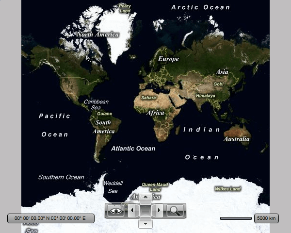
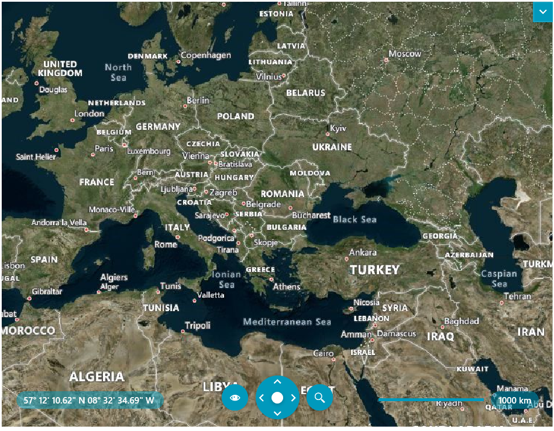

# Getting Started with {{ site.framework_name }} Map

The __RadMap__ control allows you to display rich geographical information from various sources, including Microsoft Bing Maps, as well as to overlay the map with your own custom data. This topic will help you to quickly get started using the control. It will focus on the following:      

## Creating a RadMap

In order to use __RadMap__ in your projects you have to add references to the following assemblies:
* __Telerik.Windows.Controls__
* __Telerik.Windows.Data__
* __Telerik.Windows.Controls.DataVisualization__  

>tip If you use a project that targets, .NET Core 3.1 or later .NET version, you will need to install also the [Microsoft.Windows.Compatibility](https://www.nuget.org/packages/Microsoft.Windows.Compatibility) package manually. This happens automatically if you install the Telerik dlls using [nuget packages]().

After adding references to the aforementioned dlls, you can declare a new __RadMap__ as any normal Silverlight/WPF control.        

#### __[XAML] Example 1: Defining map in XAML__
{{region radmap-getting-started_0}}
   	<UserControl xmlns:telerik="http://schemas.telerik.com/2008/xaml/presentation">
		<Grid x:Name="LayoutRoot">
			<telerik:RadMap x:Name="radMap" />
		</Grid>
	</UserControl> 
{{endregion}}

## Specifying a Provider

The __RadMap__ control doesn't display a map on itself, it needs a map provider from which to consume the required data. Currently the __RadMap__ control supports a few providers out of the box:        

* [Bing Maps]() 

* [OpenStreet Maps](#openstreet-maps) 

* [ArcGIS Online]() 

* [Empty Provider]() 

* [URI Image provider]() 

* __WMS__

This example will use __Bing Maps__ as its provider. In order to do that you have to set the __Provider__ property of the __RadMap__ to the built-in __BingMapProvider__ class.        

#### __[XAML] Example 2: Specifying provider to the RadMap control__
{{region radmap-getting-started_1}}
	<UserControl xmlns:telerik="http://schemas.telerik.com/2008/xaml/presentation">
		<Grid x:Name="LayoutRoot">
			<telerik:RadMap x:Name="radMap">
				<telerik:RadMap.Provider>
					<telerik:BingRestMapProvider ApplicationId="Bing_Map_Key"
											 Mode="Aerial"
											 IsLabelVisible="True"/>
				</telerik:RadMap.Provider>
			</telerik:RadMap>
		</Grid>
	</UserControl> 
{{endregion}}

#### __[C#] Example 3: Setting BingRestMapProvider__
{{region radmap-getting-started_2}}
	this.radMap.Provider = new BingRestMapProvider( MapMode.Aerial, true, "key" );
{{endregion}}

#### __[VB.NET] Example 3: Setting BingRestMapProvider__
{{region radmap-getting-started_3}}
	Me.radMap.Provider = New BingRestMapProvider(MapMode.Aerial, True, "key")
{{endregion}}

Using the third overload of the __BingRestMapProvider's__ constructor, allows you to pass some starting parameters:        

* The starting view mode of the map: Aerial.

* The visibility of the map labels: Visible.

* A __Bing Maps__ specific key.            

>In order to use the __Bing Maps__ with the __RadMap__ control, you have to provide a valid __Bing Maps Key__. To learn how to obtain such a key, read [this topic](https://learn.microsoft.com/en-us/bingmaps/getting-started/bing-maps-dev-center-help/getting-a-bing-maps-key). Note that the __Bing Map won't__ __appear__ in your __RadMap__ control, without supplying the key.          

After specifying the provider, you should be able to see the respective map appear in the __RadMap__ control.

## Displaying Data

You are able to display data on the top of the visualized map. The data may be represented by any framework element or map shape objects. This can be accomplished via the __RadMap's__ layers.        

There are two visualization engines in the RadMap package:

* The old implementation of the map objects' (points and shapes) visualization consists of three layers: __InformationLayer__, __DynamicLayer__ and __VirtualizationLayer__. This visualization engine, however, lacks certain features and has a few performance issues.            

* In the __Q2 2013__ release we introduced a new visualization engine in the RadMap. It has been designed from scratch to have better performance. The new visualization engine replaces all three layers with the new __VisualizationLayer__.            

The major goals of the new engine are:        

* Improve the performance of the data visualization.

* Allow reading map shapes from different sources (KML, ESRI, and SQL Geospatial) in the background thread.

* Integrating clustering and items virtualization into the core. This simplifies the usage of both features.

* Ability to attach/detach almost any input event available for the FrameworkElement to the map shape visualization.

* Support of items selection in the engine core.

To learn more about the layers and how to display the different types of elements in them, please read the [Visualization layer]() section.

## Setting a Theme

The controls from our suite support different themes. You can see how to apply a theme different than the default one in the [Setting a Theme]() help article.

>important Changing the theme using implicit styles will affect all controls that have styles defined in the merged resource dictionaries. This is applicable only for the controls in the scope in which the resources are merged. 

To change the theme, you can follow the steps below:
* Choose between the themes and add reference to the corresponding theme assembly (ex: **Telerik.Windows.Themes.Fluent.dll**). You can see the different themes applied in the **Theming** examples from our [WPF Controls Examples](https://demos.telerik.com/wpf/)[Silverlight Controls Examples](https://demos.telerik.com/silverlight/#Map/Theming) application.

* Merge the ResourceDictionaries with the namespace required for the controls that you are using from the theme assembly. For __RadMap__, you will need to merge the following resources:

	* __Telerik.Windows.Controls__
	* __Telerik.Windows.Controls.DataVisualization__

__Example 4__ demonstrates how to merge the ResourceDictionaries so that they are applied globally for the entire application.

#### __[XAML] Example 4: Merge the ResourceDictionaries__  
{{region radmap-getting-started_04}}
	<Application.Resources>
		<ResourceDictionary>
			<ResourceDictionary.MergedDictionaries>
				<ResourceDictionary Source="/Telerik.Windows.Themes.Fluent;component/Themes/System.Windows.xaml"/>
				<ResourceDictionary Source="/Telerik.Windows.Themes.Fluent;component/Themes/Telerik.Windows.Controls.xaml"/>
				<ResourceDictionary Source="/Telerik.Windows.Themes.Fluent;component/Themes/Telerik.Windows.Controls.DataVisualization.xaml"/>
			</ResourceDictionary.MergedDictionaries>
		</ResourceDictionary>
	</Application.Resources>
{{endregion}}

__Figure 4__ shows __RadMap__ with the **Fluent** theme applied.
	
#### __Figure 4: RadMap with the Fluent theme__

## See Also

 * [Overview]()
 * [Visual Structure]()
 * [Bing Map Rest Provider]()
