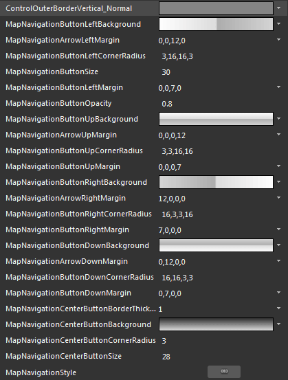

# Styling the MapNavigation

The __MapNavigation__ exposes a __Style__ property which allows you to apply a style to it and modify its appearance.

You have two options:

* To create an empty style and set it up on your own. 

* To copy the default style of the control and modify it.

This topic will show you how to perform the second one.

## Modifying the Default Style

>tip As the __MapNavigation__ control is part of the template of the __RadMap__, you can edit the __RadMap's__ template and directly style that instance of the control. More about styling the __RadMap__ can be found [here]().

To copy the default styles, load your project in Expression Blend and open the User Control that holds the __MapNavigation__. In the 'Objects and Timeline' pane, select the __MapNavigation__ you want to style. From the menu choose *Object -> Edit Style -> Edit a Copy*. You will be prompted for the name of the style and where to be placed.

>tip If you choose to define the style in Application, it would be available for the entire application. This allows you to define a style only once and then reuse it where needed.

After clicking 'OK', Expression Blend will generate the default style of the __MapNavigation__ control in the __Resources__ section of your User Control. The properties available for the style will be loaded in the 'Properties' pane and you will be able to modify their default values. You can also edit the generated XAML in the XAML View or in Visual Studio.


If you go to the 'Resources' pane, you will see an editable list of resources generated together with the style and used by it. In this list you will find the brushes, styles and templates needed to change the visual appearance of the __MapNavigation__. Their names indicate to which part of the __MapNavigation__ appearance they are assigned.


>To change the button's default toggled and hover colors, you have to edit their default styles.





* __ControlOuterBorderVertical_Normal__ - a brush that represents the border color of the buttons inside the __MapNavigation's__ template.

* __MapNavigationButtonLeftBackground__ - a brush that represents the background color of the left navigation button.

* __MapNavigationArrowLeftMargin__ - represents the margin of the arrow icon inside the left navigation button.

* __MapNavigationButtonLeftCornerRadius__ - represents the corner radius of the left navigation button.

* __MapNavigationButtonSize__ - represents the size of the navigation buttons.

* __MapNavigationButtonLeftMargin__ - represents the margin of the left navigation button.

* __MapNavigationButtonOpacity__ - represents the opacity of the navigation buttons.

* __MapNavigationButtonUpBackground__ - a brush that represents the background color of the upper navigation button.

* __MapNavigationArrowUpMargin__ - represents the margin of the arrow icon inside the upper navigation button.

* __MapNavigationButtonUpCornerRadius__ - represents the corner radius of the upper navigation button.

* __MapNavigationButtonUpMargin__ - represents the margin of the upper navigation button.

* __MapNavigationButtonRightBackground__ - a brush that represents the background color of the right navigation button.

* __MapNavigationArrowRightMargin__ - represents the margin of the arrow icon inside the right navigation button.

* __MapNavigationButtonRightCornerRadius__ - represents the corner radius of the right navigation button.

* __MapNavigationButtonRightMargin__ - represents the margin of the right navigation button.

* __MapNavigationButtonDownBackground__ - a brush that represents the background color of the lower navigation button.

* __MapNavigationArrowDownMargin__ - represents the margin of the arrow icon inside the lower navigation button.

* __MapNavigationButtonDownCornerRadius__ - represents the corner radius of the lower navigation button.

* __MapNavigationButtonDownMargin__ - represents the margin of the lower navigation button.

* __MapNavigationCenterButtonBorderThickness__ - represents the thickness of the border of the central navigation button.

* __MapNavigationCenterButtonBackground__ - a brush that represents the background color of the central navigation button.

* __MapNavigationCenterButtonCornerRadius__ - represents the corner radius of the central navigation button.

* __MapNavigationCenterButtonSize__ - represents the size of the central navigation button.

* __MapNavigationStyle__ - represents the __Style__ applied to the __MapNavigaiton__ control.


Here is an example of these resources modified:

And here is a snapshot of the result:



## See Also
 * [Template Structure]()
 * [Styling the RadMap]()
 * [Styling the MapCommandBar]()
 * [Styling the MapZoomBar]()
 * [Styling the MapScale]()
 * [Styling the MapMouseLocationIndicator]()