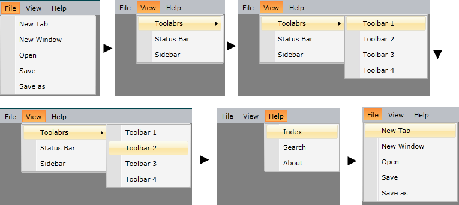

# Keyboard Navigation

Along with its other features, `RadMenu` supports keyboard navigation. You can easily navigate through the items by just pressing the arrow keys on your keyboard or you can use the access key functionality.

## Arrow Keys

When a RadMenuItem is selected you can navigate through its children using the arrow keys of the keyboard. On the image below you can see a demonstration of different key presses and the result of them.

## Access Keys

The Access Keys allows you to reach a specific RadMenuItem inside a RadMenu control by holding down the __Alt__ or __F10__ key and then pressing another key on the keyboard. To define an Access Key of a RadMenuItem you need to place an underscore character before the letter in the Header property of the control. 

#### __[XAML] Setting Access Keys__
{{region radmenu-keyboard-navigation-0}}
	<telerik:RadMenu>
		<telerik:RadMenuItem Header="\_File">
			<telerik:RadMenuItem Header="\_New" />
			<telerik:RadMenuItem Header="\_Options" >
				<telerik:RadMenuItem Header="\_Save" />
				<telerik:RadMenuItem Header="\_Paste" />
			</telerik:RadMenuItem>			
		</telerik:RadMenuItem>
		<telerik:RadMenuItem Header="\_View" >
			<telerik:RadMenuItem Header="\_Code" />
		<telerik:RadMenuItem Header="\_Sizes" >
			<telerik:RadMenuGroupItem Header="Sizes" >
				<telerik:RadMenuItem Header="\_Small" Height="35" />
				<telerik:RadMenuItem Header="\_Medium" Height="45" />
				<telerik:RadMenuItem Header="\_Large" Height="55"/>
			</telerik:RadMenuGroupItem>
		</telerik:RadMenuItem>
	</telerik:RadMenu>
{{endregion}}

Default behavior requires holding the Alt key and pressing the first letter after the underscore character - for example, *Alt+F* to activate the item with Header "New" from the above example. In case, you want to avoid holding the Alt key, you can set the [IsMainMenu]() property of the RadMenu control. This way you can navigate between the RadMenuItems by pressing Alt once, which will display the available access keys. Keep in mind, that in this case, the first RadMenuItem will be focused.

#### __[XAML] Main Menu__
{{region radmenu-keyboard-navigation-1}}
	<telerik:RadMenu IsMainMenu="true">
	 . . . . .
	</telerik:RadMenu>
{{endregion}}

## See Also

 * [Orientation and DropDownPlacement]()

 * [Opening Modes]()

 * [Click Modes]()
