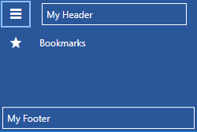

# Header and Footer

The RadNavigationView's header and footer parts are fully customizable. This article will demonstrate how this can be achieved.

## Customizing the Header

RadNavigationView's header can be customized with the following properties: __PaneHeader__, __PaneHeaderTemplate__ and __PaneHeaderHeight__. __Example 1__ demonstrates how you set the RadNavigationView's PaneHeader property.

#### __[XAML] Example 1: Setting the PaneHeader property__
{{region xaml-radnavigationview-header-and-footer-0}}
     <telerik:RadNavigationView PaneHeader="My Header" />
{{endregion}}

#### __Figure 1: Result from Example 1 in the Office 2016 theme__

It is possible to further customize the header by setting the __PaneHeaderTemplate__ property. The DataContext inside the PaneHeaderTemplate will be whatever is set to the PaneHeader property of the RadNavigationView. __Example 2__ demonstrates how you can set this property along with the __PaneHeaderHeight__ property which controls the height of the pane header.

#### __[XAML] Example 2: Setting the PaneHeaderTemplate and PaneHeaderHeight properties__
{{region xaml-radnavigationview-header-and-footer-1}}
    <Grid>
        <Grid.Resources>
            <DataTemplate x:Key="PaneHeaderTemplate">
                <Border BorderBrush="White" BorderThickness="1" Margin="3">
                    <TextBlock Text="{Binding}" Margin="5"/>
                </Border>
            </DataTemplate>
        </Grid.Resources>

        <telerik:RadNavigationView PaneHeader="My Header" PaneHeaderTemplate="{StaticResource PaneHeaderTemplate}" PaneHeaderHeight="35">
            <telerik:RadNavigationView.Items>
                <telerik:RadNavigationViewItem Content="Bookmarks">
                    <telerik:RadNavigationViewItem.Icon>
                        <telerik:RadGlyph Glyph="&#xe303;" FontSize="16"/>
                    </telerik:RadNavigationViewItem.Icon>
                </telerik:RadNavigationViewItem>
            </telerik:RadNavigationView.Items>
        </telerik:RadNavigationView>
    </Grid>
{{endregion}}

#### __Figure 2: Result from Example 2 in the Office 2016 theme__

> The pane header's Background and Foreground can also be changed with the __PaneHeaderBackground__ and __PaneHeaderForeground__ properties.

With the **2019.2.715** [latest internal build](), the RadNavigationView also exposes a **PaneHeaderTemplateSelector** property which allows you to specify a different data template based on the value of the **Header** property.

## Customizing the Footer

RadNavigationView's footer can be customized with the following properties: __PaneFooter__, __PaneFooterTemplate__. The approach for doing so is identical to customizing its header which is described in the previous section.

#### __[XAML] Example 3: Setting the PaneFooter and PaneFooterTemplate properties__
{{region xaml-radnavigationview-header-and-footer-2}}
    <Grid>  
        <Grid.Resources>
            <DataTemplate x:Key="PaneHeaderTemplate">
                <Border BorderBrush="White" BorderThickness="1" Margin="3">
                    <TextBlock Text="{Binding}" Margin="5"/>
                </Border>
            </DataTemplate>

            <DataTemplate x:Key="PaneFooterTemplate">
                <Border BorderBrush="White" BorderThickness="1" Margin="3">
                    <TextBlock Text="{Binding}" Margin="5"/>
                </Border>
            </DataTemplate>
        </Grid.Resources>
    

        <telerik:RadNavigationView PaneHeader="My Header" PaneHeaderTemplate="{StaticResource PaneHeaderTemplate}" PaneFooter="My Footer" PaneFooterTemplate="{StaticResource PaneFooterTemplate}">
            <telerik:RadNavigationView.Items>
                <telerik:RadNavigationViewItem Content="Bookmarks">
                    <telerik:RadNavigationViewItem.Icon>
                        <telerik:RadGlyph Glyph="&#xe303;" FontSize="16"/>
                    </telerik:RadNavigationViewItem.Icon>
                </telerik:RadNavigationViewItem>
            </telerik:RadNavigationView.Items>
        </telerik:RadNavigationView>
    </Grid>
{{endregion}}

#### __Figure 3: Result from Example 3 in the Office 2016 theme__

With the **2019.2.715** [latest internal build](), the RadNavigationView also exposes a **PaneFooterTemplateSelector** property which allows you to specify a different data template based on the value of the **Footer** property.

## Define Items in the Footer

As of **R3 2020**, you can also define RadNavigationViewItems in the footer section of the control. For the items to function as expected and be selectable, however, you need to place them inside of a **NavigationViewSubItemsHost**.

#### __[XAML] Example 4: Place items in the footer__
{{region xaml-radnavigationview-header-and-footer-3}}
    <DataTemplate x:Key="PaneFooterTemplate">
        <telerik:NavigationViewSubItemsHost>
            <telerik:RadNavigationViewItem Content="Footer Item 1" />
            <telerik:RadNavigationViewItem Content="Footer Item 2" />
            <telerik:RadNavigationViewItem Content="Footer Item 3" />
        </telerik:NavigationViewSubItemsHost>
    </DataTemplate>
{{endregion}}

## Customizing the Pane Toggle Button

RadNavigationView has a RadToggleButton next to its header which allows for expanding or closing the navigation pane. This button is specially designed to show [RadGlyphs]() ,since it has a RadGlyph in its ContentTemplate. You can easily change which glyph is displayed by setting the __PaneToggleButtonContent__ property to the desired [glyph string](). __Example 4__ demonstrates how this can be achieved.

#### __[XAML] Example 5: Setting the PaneToggleButtonContent__
{{region xaml-radnavigationview-header-and-footer-4}}
     <telerik:RadNavigationView x:Name="navigationView" PaneHeader="Header" PaneToggleButtonContent="&#xe301;" />
{{endregion}}

#### __Figure 4: Result from Example 4 in the Office 2016 theme__

If do not want to show a RadGlyph as the Content of the toggle button, you can modify the __PaneToggleButtonContentTemplate__ as demosntrated in __Example 5__.

#### __[XAML] Example 6: Setting the PaneToggleButtonContentTemplate__
{{region xaml-radnavigationview-header-and-footer-5}}
    <DataTemplate x:Key="PaneToggleButtonContentTemplate">
        <Rectangle Width="15" Height="15" Fill="White" />
    </DataTemplate>

     <telerik:RadNavigationView x:Name="navigationView" PaneHeader="Header" PaneToggleButtonContentTemplate="{StaticResource PaneToggleButtonContentTemplate}" />
{{endregion}}

#### __Figure 5: Result from Example 5 in the Office 2016 theme__

>The Pane Toggle Button can be customized further by setting the __PaneToggleButtonStyle__ property. It can also be hidden by setting the __PaneToggleButtonVisibility__ property.

## See Also

* [Getting Started]()
* [DataBinding]()
* [Display Mode]()
* [Icon and IconTemplate]()