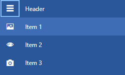

# Icon and IconTemplate

The __RadNavigationViewItem__ allows you to display a custom icon in its template. To show an icon, you can use either the Icon, or the IconTemplate properties.

## Icon

Since the __Icon__ property is of type object, you can set it to an image, glyph or any custom control. __Example 1__ demonstrates how you can set the Icon of __RadNavigationViewItem__ to a [RadGlyph]().

#### __[XAML] Example 1: Setting the Icon of a RadNavigationViewItem__
{{region xaml-radnavigationview-item-icon-0}}
    <telerik:RadNavigationViewItem Content="Bookmarks" Width="200" Height="50" >
        <telerik:RadNavigationViewItem.Icon>
            <telerik:RadGlyph Glyph="&#xe303;" FontSize="16"/>
        </telerik:RadNavigationViewItem.Icon>
    </telerik:RadNavigationViewItem>
{{endregion}}

#### __Figure 1: Result from Example 1 in the Office2016 theme__

## IconTemplate

The __IconTemplate__ property is useful, because a single DataTemplate can be set to many __RadNavigationViewItems__. 
This section will demonstrate how this property can be used in a databinding scenario.

> Note that whatever is set to the Icon property will be the DataContext inside the IconTemplate.

First we will define a model for our items and a viewmodel which will hold a collection of those models. This is demonstrated in __Example 2__.

#### __[C#] Example 2: Defining a model and a viewmodel__
{{region cs-radnavigationview-item-icon-1}}
    public class MainViewModel
    {
        private readonly string[] glyphStrings = new string[] { "&#xe501;", "&#xe13d;", "&#xe500;" };

        public ObservableCollection<NavigationItemModel> Items { get; set; }

        public MainViewModel()
        {
            this.Items = new ObservableCollection<NavigationItemModel>();

            for (int i = 1; i <= 3; i++)
            {
                var glyphString = this.glyphStrings[i - 1];
                this.Items.Add(new NavigationItemModel() {Title = "Item " + i, IconGlyph = glyphString });
            }
        }
    }

    public class NavigationItemModel
    {
        public string Title { get; set; }
        public string IconGlyph { get; set; }
    }
{{endregion}}

#### __[VB.NET] Example 2: Defining a model and a viewmodel__
{{region vb-radnavigationview-item-icon-2}}
    Public Class MainViewModel
		Private ReadOnly glyphStrings() As String = { "&#xe501;", "&#xe13d;", "&#xe500;" }

		Public Property Items() As ObservableCollection(Of NavigationItemModel)

		Public Sub New()
			Me.Items = New ObservableCollection(Of NavigationItemModel)()

			For i As Integer = 1 To 3
				Dim glyphString = Me.glyphStrings(i - 1)
				Me.Items.Add(New NavigationItemModel() With {
					.Title = "Item " & i,
					.IconGlyph = glyphString
				})
			Next i
		End Sub
    End Class

	Public Class NavigationItemModel
		Public Property Title() As String
		Public Property IconGlyph() As String
	End Class
{{endregion}}

After that we can setup our __RadNavigationView__ and set its ItemsSource to an instance of our viewmodel. We also need to create a style targeting __RadNavigationViewItem__ in order to bind the properties of the NavigationItemModel class. Note, that a [StringToGlyphConverter](#stringtoglyphconverter) is used to convert the IconGlyph string property to a glyph. 

#### __[XAML] Example 3: Setting up the view__
{{region xaml-radnavigationview-item-icon-3}}
    <Window.Resources>
        <local:MainViewModel x:Key="ViewModel" />
        <telerik:StringToGlyphConverter x:Key="StringToGlyphConverter" />

        <!-- If you are using the NoXaml binaries, you will have to base the style on the default one for the theme like so:
        
    </Window.Resources>
    <Grid>
        <telerik:RadNavigationView DataContext="{StaticResource ViewModel}" ItemsSource="{Binding Items}" PaneHeader="Header" />
    </Grid>
{{endregion}}

#### __Figure 2: Result from Example 3 in the Office2016 theme__

>For a more extensive databinding example check out the [DataBinding]() article.

## IconTemplateSelector

With the **2019.2.715** [latest internal build]() the RadNavigationViewItem exposes an **IconTemplateSelector** property which allows you to specify a different datatemplate based on the value of the **Icon** property. For example, you may display the icons by using multiple font families as shown in **Examples 4 and 5**. The examples demonstrate how to switch between the [TelerikWebUI]() and **Wingdings** fonts.

>For the purposes of this example, let's assume that the last string of the **glyphStrings** array from **Example 2** is changed to **&#x00fc**.

#### __[C#] Example 4: Defining the IconTemplateSelector__
{{region cs-radnavigationview-item-icon-4}}
    public class IconTemplateSelector : DataTemplateSelector
    {
        public DataTemplate TelerikWebUITemplate { get; set; }
        public DataTemplate WingdingsTemplate { get; set; }

        public override DataTemplate SelectTemplate(object item, DependencyObject container)
        {
            var icon = item.ToString();
            if (icon.StartsWith("&#xe"))
            {
                return this.TelerikWebUITemplate;
            }
            else
            {
                return this.WingdingsTemplate;
            }
        }
    }
{{endregion}}

#### __[VB.NET] Example 4: Defining the IconTemplateSelector__
{{region vb-radnavigationview-item-icon-4}}
    Public Class IconTemplateSelector
        Inherits DataTemplateSelector

            Public Property TelerikWebUITemplate() As DataTemplate
            Public Property WingdingsTemplate() As DataTemplate

            Public Overrides Function SelectTemplate(ByVal item As Object, ByVal container As DependencyObject) As DataTemplate
                Dim icon = item.ToString()
                If icon.StartsWith("&#xe") Then
                    Return Me.TelerikWebUITemplate
                Else
                    Return Me.WingdingsTemplate
                End If
            End Function
    End Class
{{endregion}}

#### __[XAML] Example 5: Using the IconTemplateSelector in XAML__
{{region xaml-radnavigationview-item-icon-5}}
    <Window.Resources>
        <telerik:StringToGlyphConverter x:Key="StringToGlyphConverter" />
        
    </Window.Resources>
{{endregion}}

#### __Figure 3: Result from Example 5 in the Office2016 theme__

## See Also

* [DataBinding]()
* [Display Mode]()
