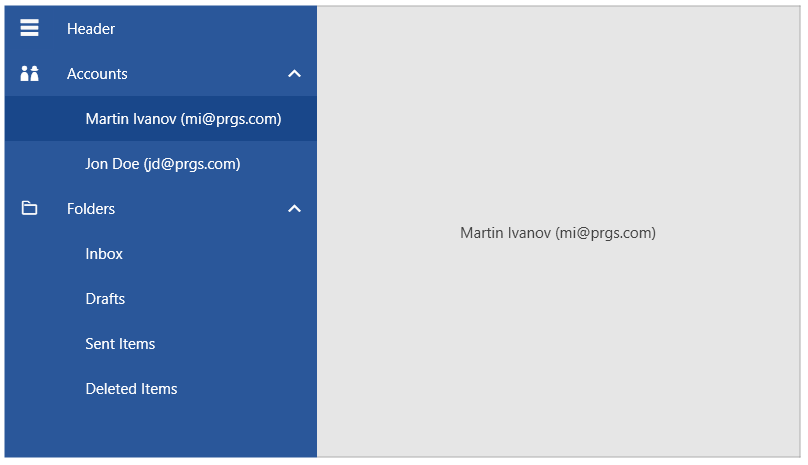

# Hierarchical Data Binding

This article shows how to data bind hierarchical data to RadNavigationView.

The control can be populated with business objects via its __ItemsSource__ property. Then the __DisplayMemberPath__ and __ItemContainerStyle__ properties can be used to further customize the items and allow sub-items.

## Defining the Model

The following model is defining a string property to serve as the content of the items and a collection for the child data items. An additional string property is used for the icon [glyph]().

#### __[C#] Example 1: Creating the model__
{{region radnavigationview-populating-with-data-hierarchical-databinding-0}}
	public class NavigationItemModel
    {
        public string Title { get; set; }
        public string IconGlyph { get; set; }
        public ObservableCollection<NavigationItemModel> Children { get; set; }
    }
{{endregion}}

#### __[C#] Example 2: Populating the collection with data__
{{region radnavigationview-populating-with-data-hierarchical-databinding-1}}
	public MainWindow()
	{
		InitializeComponent();
		
		var source = new ObservableCollection<NavigationItemModel>()
		{
			new NavigationItemModel() 
			{
				Title = "Accounts",
				IconGlyph = "&#xe81b;",
				Children = new ObservableCollection<NavigationItemModel>()
				{
					new NavigationItemModel() { Title = "Martin Ivanov (mi@prgs.com)", IconGlyph = "&#xe801;" },
					new NavigationItemModel() { Title = "Jon Doe (jd@prgs.com)", IconGlyph = "&#xe801;" },
				}
			},
			new NavigationItemModel()
			{
				Title = "Folders",
				IconGlyph = "&#xe900;",
				Children = new ObservableCollection<NavigationItemModel>()
				{
					new NavigationItemModel() { Title = "Inbox", IconGlyph = "&#xe802;" },
					new NavigationItemModel() { Title = "Drafts", IconGlyph = "&#xe906;" },
					new NavigationItemModel() { Title = "Sent Items", IconGlyph = "&#xe101;" },
					new NavigationItemModel() { Title = "Deleted Items", IconGlyph = "&#xe10c;" },
				}
			}
		};
		
		this.DataContext = source;
	}
{{endregion}}

## Defining the View

To assign the data collection to the RadNavigationView control, set its __ItemsSource__ property.

To data bind the content of the RadNavigationViewItem elements set the __DisplayMemberPath__ property of RadNavigationView. Alternatively, you can use the __ItemContainerStyle__ and set the __Content__ property of the RadNavigationViewItems.

To customize the appearance of the RadNavigationViewItems and also allow sub-items to be shown, use an implicit style. This allows to set the __ItemsSource__  and __DisplayMemberPath__ properties of the __RadNavigationViewItems__.

#### __[XAML] Example 3: Setting up the view__
{{region radnavigationview-populating-with-data-hierarchical-databinding-2}}	
	<telerik:RadNavigationView x:Name="radNavigationView" 
							   ItemsSource="{Binding}" 
							   PaneHeader="Header"
							   DisplayMemberPath="Title"
							   DisplayMode="Expanded">
		<telerik:RadNavigationView.Resources>
			<telerik:StringToGlyphConverter x:Key="StringToGlyphConverter" />				
			<!-- If you are using the NoXaml binaries, you will have to base the style on the default one for the theme like so: 
			
		</telerik:RadNavigationView.Resources>
		<telerik:RadNavigationView.Content>
			<ContentControl Content="{Binding SelectedItem, ElementName=radNavigationView}">
				<ContentControl.ContentTemplate>
					 <DataTemplate>
						<TextBlock HorizontalAlignment="Center" VerticalAlignment="Center" Text="{Binding Title}" />
					</DataTemplate>
				</ContentControl.ContentTemplate>
			</ContentControl>
		</telerik:RadNavigationView.Content>
	</telerik:RadNavigationView>
{{endregion}}

#### Figure 1: RadNavigationView with sub items

Note that for every business object from the data bound collection, RadNavigationView will generate a RadNavigationViewItem container representing this object.

## See Also 
* [Getting Started]()
* [Data Binding]()
* [Display Mode]()
