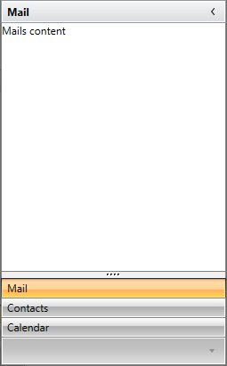
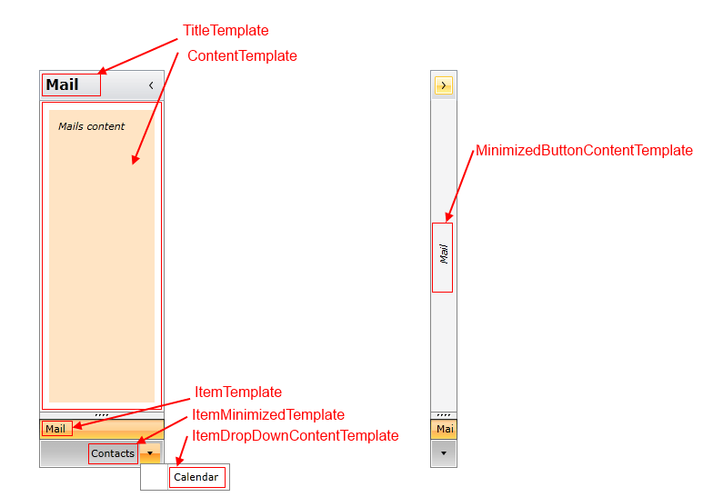

# Data Binding

The goal of this article is to demonstrate how to populate a __RadOutlookBar__ with business objects. Basically the control can be data bound to a collection of objects through its __ItemsSource__ property and dynamically create __RadOutlookBarItems__. 

The __ItemsSource__ property allows __RadOutlookBar__ to be bound to any collection that implements the __IEnumerable__ interface. By default the content of the generated __RadOutlookBarItems__ will be set to the value returned by the __ToString()__ method of the business object.        

In order to bind a __RadOutlookBar__ to a collection of business objects you can perform the following steps:        

* Define a __RadOutlookBar__ in XAML.

	#### __[XAML] Example 1: Defining RadOutlookBar in XAML__
	{{region xaml-radoutlookbar-databinding-0}}
		<telerik:RadOutlookBar x:Name="radOutlookBar"/>
	{{endregion}}

* Create a business object

	#### __[C#] Example 2: The MenuItem class__
	{{region cs-radoutlookbar-databinding-1}}
		public class MenuItem
		{
			public string Header { get; set; }
			public string Content { get; set; }
			public string ImageSourcePath { get; set; }
		}
	{{endregion}}

	#### __[VB.NET] Example 2: The MenuItem class__
	{{region vb-radoutlookbar-databinding-2}}
		Public Class MenuItem
		    Public Property Header() As String
		        Get
		            Return m_Header
		        End Get
		        Set(value As String)
		            m_Header = Value
		        End Set
		    End Property
		    Private m_Header As String
		    Public Property Content() As String
		        Get
		            Return m_Content
		        End Get
		        Set(value As String)
		            m_Content = Value
		        End Set
		    End Property
		    Private m_Content As String
		    Public Property ImageSourcePath() As String
		        Get
		            Return m_ImageSourcePath
		        End Get
		        Set(value As String)
		            m_ImageSourcePath = Value
		        End Set
		    End Property
		    Private m_ImageSourcePath As String
		End Class
	{{endregion}}

* Create a view model class which will contains only a collection business objects

	#### __[C#] Example 3: The MailMenuViewModel class__
	{{region cs-radoutlookbar-databinding-3}}
		public class MailMenuViewModel : ViewModelBase
		{
			public ObservableCollection<MenuItem> MenuItems { get; set; }
		
			private MenuItem selectedItem;
			public MenuItem SelectedItem
			{
				get { return this.selectedItem; }
				set
				{
					if (this.selectedItem != value)
					{
						this.selectedItem = value;
						this.OnPropertyChanged("SelectedItem");
					}
				}
			}
		
			public MailMenuViewModel()
			{
				this.MenuItems = new ObservableCollection<MenuItem>();
				this.MenuItems.Add(new MenuItem() { Content = "Mails content", Header = "Mail", ImageSourcePath = "/images/mailBig.png" });
				this.MenuItems.Add(new MenuItem() { Content = "Contacts content", Header = "Contacts", ImageSourcePath = "/images/contactsBig.png" });
				this.MenuItems.Add(new MenuItem() { Content = "Calendar content", Header = "Calendar", ImageSourcePath = "/images/calendarBig.png" });
		
				this.selectedItem = this.MenuItems[0];
			}
		}
	{{endregion}}

	#### __[VB.NET] Example 3: The MailMenuViewModel class__
	{{region vb-radoutlookbar-databinding-4}}
		Public Class MailMenuViewModel
		    Inherits ViewModelBase
		    Public Property MenuItems() As ObservableCollection(Of MenuItem)
		        Get
		            Return m_MenuItems
		        End Get
		        Set(value As ObservableCollection(Of MenuItem))
		            m_MenuItems = Value
		        End Set
		    End Property
		    Private m_MenuItems As ObservableCollection(Of MenuItem)
		
		    Private m_selectedItem As MenuItem
		    Public Property SelectedItem() As MenuItem
		        Get
		            Return Me.m_selectedItem
		        End Get
		        Set(value As MenuItem)
		            If Me.m_selectedItem <> value Then
		                Me.m_selectedItem = value
		                Me.OnPropertyChanged("SelectedItem")
		            End If
		        End Set
		    End Property
		
		    Public Sub New()
		        Me.MenuItems = New ObservableCollection(Of MenuItem)()
		Me.MenuItems.Add(New MenuItem() With { _
		Key .Content = "Mails content", _
		Key .Header = "Mail", _
		Key .ImageSourcePath = "/images/mailBig.png" _
				})
		Me.MenuItems.Add(New MenuItem() With { _
		Key .Content = "Contacts content", _
		Key .Header = "Contacts", _
		Key .ImageSourcePath = "/images/contactsBig.png" _
				})
		Me.MenuItems.Add(New MenuItem() With { _
		Key .Content = "Calendar content", _
		Key .Header = "Calendar", _
		Key .ImageSourcePath = "/images/calendarBig.png" _
				})
		
		        Me.m_selectedItem = Me.MenuItems(0)
		    End Sub
		End Class
	{{endregion}}

* Set the __DataContext__ of the __RadOutlookBar__ to a new instance of the created view model

	#### __[C#] Example 4: Setting the DataContext of the RadOutlookBar__
	{{region cs-radoutlookbar-databinding-5}}
		public MainWindow()
		{
			InitializeComponent();
			this.radOutlookBar.DataContext = new MailMenuViewModel();
		}
	{{endregion}}

	#### __[VB.NET] Example 4: Setting the DataContext of the RadOutlookBar__

	{{region vb-radoutlookbar-databinding-6}}
		Public Sub New()
		    InitializeComponent()
		    Me.radOutlookBar.DataContext = New MailMenuViewModel()
		End Sub
	{{endregion}}

* Then bind the __ItemsSource__ property to the collection of the view model and set the __ItemTemplate__, __ContentTemplate__ and __TitleTemplate__ to display the proper information.

	#### __[XAML] Example 5: Configure the RadOutlookBar__

	{{region xaml-radoutlookbar-databinding-7}}
		<telerik:RadOutlookBar x:Name="radOutlookBar" ItemsSource="{Binding MenuItems}">
            <telerik:RadOutlookBar.ItemTemplate>
                <DataTemplate>
                    <TextBlock Text="{Binding Header}" />
                </DataTemplate>
            </telerik:RadOutlookBar.ItemTemplate>
            <telerik:RadOutlookBar.ContentTemplate>
                <DataTemplate>
                    <TextBlock Text="{Binding Content}" />
                </DataTemplate>
            </telerik:RadOutlookBar.ContentTemplate>
            <telerik:RadOutlookBar.TitleTemplate>
                <DataTemplate>
                    <TextBlock Text="{Binding Header}" />
                </DataTemplate>
            </telerik:RadOutlookBar.TitleTemplate>
        </telerik:RadOutlookBar>
	{{endregion}}

You can see the end result bellow:

## Using Custom Templates

The __RadOutlookBar__ has few properties of type __DataTemplate__ that can be used in order to control its items appearance.

Each property accepts a DataTemplate as a value that determines the visual appearance of the __RadOutlookBarItems__ and the __RadOutlookBar__ itself. The properties that can be used are the following:

* __ItemTemplate__
* __ItemMinimizedTemplate__
* __ItemDropDownTemplate__
* __TitleTemplate__
* __MinimizedButtonContentTemplate__
* __ContentTemplate__

>There are also template selectors for all of the listed templates except for the __MinimizedButtonContentTemplate__.

In Example 5 we already set the __ItemTemplate__, __ContentTemplate__ and __TitleTemplate__ properties.

To customize the project that we developed so far you can also set the rest of the available templates:

* __ItemMinimizedTemplate__: This is the __DataTemplate__ that describes each __RadOutlookBarItem__ that is placed in the minimized area of the __RadOutlookBar__:

	#### __XAML__
	{{region xaml-radoutlookbar-databinding-9}}
		<DataTemplate x:Key="outlookBarItemMinimizedTemplate">
			<TextBlock Text="{Binding Header}" VerticalAlignment="Center" />
		</DataTemplate>
	{{endregion}}

* __ItemDropDownContentTemplate__: This is the __DataTemplate__ applied to the items in the drop down which contains the minimized items that cannot fit in the minimized area:

	#### __XAML__
	{{region xaml-radoutlookbar-databinding-10}}
		<DataTemplate x:Key="outlookBarItemDropDownTemplate">
		<TextBlock Text="{Binding Header}" />
		</DataTemplate>
	{{endregion}}

* __MinimizedButtonContentTemplate__: This is the __DataTemplate__ that describes the button which is displayed when you minimize the __RadOutlookBar__:

	#### __XAML__
	{{region xaml-radoutlookbar-databinding-12}}
		<DataTemplate x:Key="outlookBarMinimizedBtnTemplate">
			<TextBlock Text="{Binding Header}" FontStyle="Italic" 
					   TextDecorations="Underline" 
					   FontWeight="Bold"/>
		</DataTemplate>
	{{endregion}}

* Let's also extend the __ContentTemplate__ from **Example 5**: This is the __DataTemplate__ that describes the content of the selected item:

	#### __XAML__
	{{region xaml-radoutlookbar-databinding-13}}
		<DataTemplate x:Key="outlookBarContentTemplate">
		    <Grid Background="Bisque" Margin="10">
		        <TextBlock Text="{Binding Content}" 
		                   FontStyle="Italic" 
		                   Margin="10" />
		    </Grid>
		</DataTemplate>
	{{endregion}}

* After you define your templates you can set the appropriate properties of the RadOutlookBar

	#### __XAML__
	{{region xaml-radoutlookbar-databinding-14}}
		 <telerik:RadOutlookBar SelectedItem="{Binding SelectedItem, Mode=TwoWay}"
		                       ItemsSource="{Binding MenuItems}"                               
		                       ItemMinimizedTemplate="{StaticResource outlookBarItemMinimizedTemplate}"
		                       ItemDropDownContentTemplate="{StaticResource outlookBarItemDropDownTemplate}"
		                       ContentTemplate="{StaticResource outlookBarContentTemplate}"
		                       MinimizedButtonContentTemplate="{StaticResource outlookBarMinimizedBtnContentTemplate}"
		                       MinimizedButtonContent="{Binding SelectedItem}">
            <telerik:RadOutlookBar.ItemTemplate>
                <DataTemplate>
                    <TextBlock Text="{Binding Header}" />
                </DataTemplate>
            </telerik:RadOutlookBar.ItemTemplate>
            <telerik:RadOutlookBar.TitleTemplate>
                <DataTemplate>
                    <TextBlock Text="{Binding Header}" />
                </DataTemplate>
            </telerik:RadOutlookBar.TitleTemplate>
        </telerik:RadOutlookBar>

	{{endregion}}
	
>tip Find a runnable project of the previous example in the [WPF Samples GitHub repository](https://github.com/telerik/xaml-sdk/tree/master/OutlookBar/DataBinding).

You can see the end result on the screenshots below.  

## See Also
 * [Visual Structure]()
 * [Templates]()
 * [Icons]()