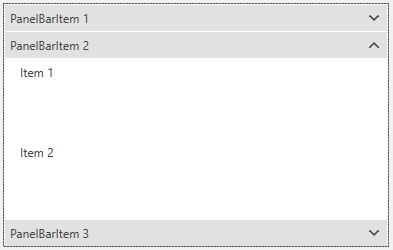

# Getting Started

This tutorial will walk you through the creation of a sample application that contains __RadPanelBar__. 

* [Assembly References](#assembly-references)
* [Adding RadPanelBar to the Project](#adding-radpanelbar-to-the-project)
* [Declaratively populating the RadPanelBar control Items collection](#declaratively-populating-the-radpanelbar-control-items-collection)
* [Databinding the RadPanelBar control](#databinding-the-radpanelbar-control)

## Assembly References

In order to use __RadPanelBar__ control in your projects you have to add references to the following assemblies:



* __Telerik.Windows.Controls__
* __Telerik.Windows.Controls.Navigation__
* __Telerik.Windows.Data__





* __Telerik.Windows.Controls__
* __Telerik.Windows.Controls.Navigation__



## Adding RadPanelBar to the Project

**Example 1** demonstrates how you can add a RadPanelBar in xaml.

#### __[XAML] Example 1: RadPanelBar with statically declared items in xaml__
{{region xaml-radpanelbar-populating_0}}
	<telerik:RadPanelBar>
	    <telerik:RadPanelBarItem Header="Item 1" />
	    <telerik:RadPanelBarItem Header="Item 2" />
	    <telerik:RadPanelBarItem Header="Item 3" />
	</telerik:RadPanelBar>
{{endregion}}

#### __Figure 1: Result from Example 1 in Office2016 Theme__

## Declaratively Populating the Items Collection of the RadPanelBar Control

**Example 2** demonstrates how you can add __RadPanelBarItems__ directly to the __Items__ collection of the RadPanelBar in code behind:			

#### __[C#] Example 2: Adding RadPanelBarItems in code__
{{region cs-radpanelbar-populating_2}}
	RadPanelBar myPanelBar = new RadPanelBar();
	RadPanelBarItem item1 = new RadPanelBarItem() { Header = "Item 1" };
	RadPanelBarItem item2 = new RadPanelBarItem() { Header = "Item 2" };
	RadPanelBarItem item3 = new RadPanelBarItem() { Header = "Item 3" };
	myPanelBar.Items.Add(item1);
	myPanelBar.Items.Add(item2);
	myPanelBar.Items.Add(item3);
{{endregion}}

#### __[VB.NET] Example 2: Adding RadPanelBarItems in code__
{{region vb-radpanelbar-populating_3}}
	Dim myPanelBar As New RadPanelBar()
	Dim item1 As New RadPanelBarItem() With {
	.Header = "Item 1"
			}
	Dim item2 As New RadPanelBarItem() With {
	.Header = "Item 2"
			}
	Dim item3 As New RadPanelBarItem() With {
	.Header = "Item 3"
			}
	myPanelBar.Items.Add(item1)
	myPanelBar.Items.Add(item2)
	myPanelBar.Items.Add(item3)
{{endregion}}

## Databinding the RadPanelBar Control		  

**RadPanelBar** can be also be bound to a collection of objects. You can learn more about this in the [Bind to Object Data]() article in our documentation.

## See Also
* [Events]()
* [How to Display Hierarchical Data]()