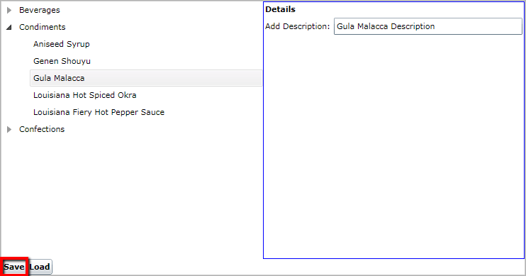
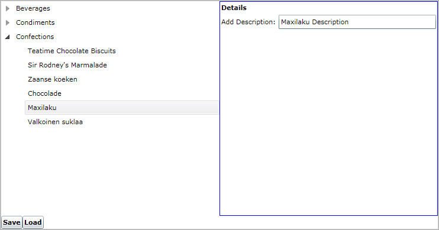
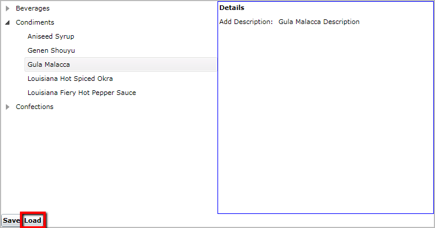

# Isolated Storage

The __PersistenceFramework__ allows you to save the layout of __UIElements__ in [Isolated Storage](https://docs.microsoft.com/en-us/dotnet/standard/io/isolated-storage). For that purpose the __telerik:PersistenceManager.StorageId__ attached property has to be set for each __UIElement__ that needs to be persisted. The property is used to create a file in the isolated storage for each persisted control, where the control's properties will be kept.

#### __[XAML] Example 1: Setting the PersistenceManager.StorageId property__
{{region persistence-framework-isolated-storage_0}}
	<Grid x:Name="LayoutRoot" Background="White">
	    <Grid.ColumnDefinitions>
	        <ColumnDefinition Width="\*" />
	        <ColumnDefinition Width="\*" />
	    </Grid.ColumnDefinitions>
	    <Grid.RowDefinitions>
	        <RowDefinition Height="\*" />
	        <RowDefinition Height="Auto" />
	    </Grid.RowDefinitions>
	    <telerik:RadTreeView x:Name="treeView" telerik:PersistenceManager.StorageId="treeView">
	        <telerik:RadTreeViewItem Header="Beverages">
	            <telerik:RadTreeViewItem Header="Chai" />
	            <telerik:RadTreeViewItem Header="Chang" />
	            <telerik:RadTreeViewItem Header="Ipoh Coffee" />
	            <telerik:RadTreeViewItem Header="Chartreuse verte" />
	            <telerik:RadTreeViewItem Header="Sasquatch Ale" />
	        </telerik:RadTreeViewItem>
	        <telerik:RadTreeViewItem Header="Condiments">
	            <telerik:RadTreeViewItem Header="Aniseed Syrup" />
	            <telerik:RadTreeViewItem Header="Genen Shouyu" />
	            <telerik:RadTreeViewItem Header="Gula Malacca" />
	            <telerik:RadTreeViewItem Header="Louisiana Hot Spiced Okra" />
	            <telerik:RadTreeViewItem Header="Louisiana Fiery Hot Pepper Sauce" />
	        </telerik:RadTreeViewItem>
	        <telerik:RadTreeViewItem Header="Confections">
	            <telerik:RadTreeViewItem Header="Teatime Chocolate Biscuits" />
	            <telerik:RadTreeViewItem Header="Sir Rodney's Marmalade" />
	            <telerik:RadTreeViewItem Header="Zaanse koeken" />
	            <telerik:RadTreeViewItem Header="Chocolade" />
	            <telerik:RadTreeViewItem Header="Maxilaku" />
	            <telerik:RadTreeViewItem Header="Valkoinen suklaa" />
	        </telerik:RadTreeViewItem>
	    </telerik:RadTreeView>
	    <StackPanel Orientation="Horizontal" Grid.Row="1">
	        <Button Content="Save" Click="Save" VerticalAlignment="Bottom" FontWeight="Bold" />
	        <Button Content="Load" Click="Load" VerticalAlignment="Bottom" FontWeight="Bold" />
	    </StackPanel>
	    <Border Grid.Column="1" BorderBrush="Blue" BorderThickness="1">
	        <ContentControl HorizontalContentAlignment="Stretch" telerik:PersistenceManager.StorageId="detailsControl">
	            <Grid>
	                <Grid.ColumnDefinitions>
	                    <ColumnDefinition Width="Auto" />
	                    <ColumnDefinition Width="\*" />
	                </Grid.ColumnDefinitions>
	                <Grid.RowDefinitions>
	                    <RowDefinition Height="Auto" />
	                    <RowDefinition Height="Auto" />
	                </Grid.RowDefinitions>
	                <TextBlock Text="Details" Margin="2" VerticalAlignment="Center" FontWeight="Bold"
	                        Grid.ColumnSpan="2" />
	                <TextBlock Text="Add Description:" Grid.Row="1" Margin="2" VerticalAlignment="Center" />
	                <TextBox Margin="2" Grid.Row="1" Grid.Column="1" VerticalAlignment="Center"
	                        HorizontalAlignment="Stretch" />
	            </Grid>
	        </ContentControl>
	    </Border>
	</Grid>
{{endregion}}

#### __[C#] Example 2: Using the IsolatedStorageProvider methods__
{{region persistence-framework-isolated-storage_1}}
	private void Save(object sender, RoutedEventArgs e)
	{
		IsolatedStorageProvider isoProvider = new IsolatedStorageProvider();
		isoProvider.SaveToStorage();
	}
	private void Load(object sender, RoutedEventArgs e)
	{
		IsolatedStorageProvider isoProvider = new IsolatedStorageProvider();
		isoProvider.LoadFromStorage();
	}
{{endregion}}

#### __[VB.NET] Example 2: Using the IsolatedStorageProvider methods__
{{region persistence-framework-isolated-storage_2}}
	Private Sub Save(sender As Object, e As RoutedEventArgs)
		Dim isoProvider As New IsolatedStorageProvider()
		isoProvider.SaveToStorage()
	End Sub
	Private Sub Load(sender As Object, e As RoutedEventArgs)
		Dim isoProvider As New IsolatedStorageProvider()
		isoProvider.LoadFromStorage()
	End Sub
{{endregion}}

The __IsolatedStorageProvider.SaveToStorage()__ method will save the properties of all controls for which the __telerik:PersistenceManager.StorageId__ attached property is set. In __Example 2__ all properties of the __RadTreeView__ and the __ContentControl__ will be saved:

#### __Figure 1: Result from Example 1__

1. Expand Condiments and select Gula Malacca. Add description for the item in the Details ContentControl. Then hit Save:

2. Now change the layout of the UserControl - for example collapse Condiments and expand Confections. Then Select Maxilaku and add description for it. 

3. If you want to retrieve the previous state of the controls in your page, all you need to do is hit Load:

## IsolatedStorageProvider Members

The __IsolatedStorageProvider__ exposes the following members:		

* __SaveToStorage()__: Saves the __UIElement__ properties in the associated file in the isolated storage.			

* __LoadFromStorage()__: Loads the persisted properties from the __UIElement's__ associated file.

* __DeleteIsolatedStorageFiles()__: Deletes the saved isolated storage files.

* __QuotaRequested event__: When the application requests a larger quota from the isolated storage, the user is prompted to allow or deny the request. The __QuotaRequested__ event is fired when the user makes a choice. The event receives two arguments:			
	* A __sender__ argument that receives the __IsolatedStorageProvider__ that is requesting the additional quota.
	* A __QuotaRequestedEventArgs__ object that gives access to:
        * __FileStreams__: A dictionary that contains the names of the isolated storage files as keys, and the file streams as values.
        * __IsSuccess__: A property of type bool that indicates whether the user has allowed the quota increase.
        * __RequestedBytes__ - A property of type __long__ that represents the size of the requested quota.

* __Manager__: A __protected__ property, which exposes the __PersistenceManager__ instance used by the class. You can inherit the IsolatedStorageProvider in order to access it. 

* __GetIsolatedStoreOverride()__: A __protected__ method, which returns an [IsolatedStorageFile](https://docs.microsoft.com/en-us/dotnet/api/system.io.isolatedstorage.isolatedstoragefile?view=netframework-4.8). It allows you to work with the physical representation of the isolated storage files. You can inherit the IsolatedStorageProvider in order to access it. 

>When you are using the __IsolatedStorageProvider__, you can check the persistence storage and the controls that are persisted using the __PersistenceManager.GetStorage()__ static method. It returns an object of type __ObjectStorage__ that exposes the following properties:	  
>   - __Count__: This property is of type __int__ and it gets the number of persisted objects.  
>   - __Items__: This property gets the collection of persisted objects.  
>   - __Keys__: This property gets the collection of the persisted objects' __StorageId__ values.			  
