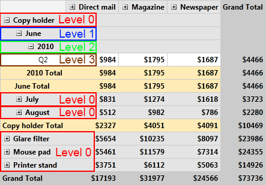

# Expand Behavior

In this article we will show you how to change the initial expand/collapse behavior of __RadPivotGrid__ rows and columns.      

>important *Initial* state is the state of __RadPivotGrid__ after refresh of the used data provider. 

>caution The expand behavior is not supported when the [load on demand feature]() is enabled.

## GroupsExpandBehavior

In order to control the expand / collapse state of rows and columns in __RadPivotGrid__ you have to use an instance of GroupsExpandBehavior class from Telerik.Pivot.Core namespace. It has two properties that you can modify:      

* *Expanded* - bool property which controls the state. When it is __true__ the groups will be expanded. When the value is __false__ the groups will be collapsed.            

* *UpToLevel* - integer property which controls the levels for which to apply the behavior.             

You can combine the two properties to achieve the desired result. The default value of Expanded property is true, so if you don't set it (or if you do not set ExpandBehavior), all groups will be expanded. If you do not set UpToLevel, the behavior will be applied to all groups (which is its default state). For example, if you set Expanded = false and UpToLevel = 2, all levels up to the set one (levels 0 and 1) will be collapsed, all groups with level greater than or equal to 2 will be expanded. So at initial state you will see all groups collapsed, but if you expand the first two levels, all other groups below them will be expanded.

## Set Expand Behavior

__RadPivotGrid__ has two properties to control the expand behavior - *RowGroupsExpandBehavior* and *ColumnGroupsExpandBehavior*. As you can guess, the first one controls the expand behavior of the rows and the second one - columns behavior. If you do not set these properties, all groups in rows and columns will be expanded.

#### __[XAML] Example 1: Set Expand Behavior__

{{region xaml-radpivotgrid-features-expand-behavior-0}}
	<pivot:RadPivotGrid x:Name="pivot" DataProvider="{StaticResource LocalDataProvider}">
	    <pivot:RadPivotGrid.RowGroupsExpandBehavior>
	        <pivot:GroupsExpandBehavior Expanded="False" UpToLevel="2"/>
	    </pivot:RadPivotGrid.RowGroupsExpandBehavior>
	    <pivot:RadPivotGrid.ColumnGroupsExpandBehavior>
	        <pivot:GroupsExpandBehavior Expanded="False"/>
	    </pivot:RadPivotGrid.ColumnGroupsExpandBehavior>
	</pivot:RadPivotGrid>
{{endregion}}

#### __[C#] Example 2: Set Expand Behavior in code__

{{region cs-radpivotgrid-features-expand-behavior-1}}
	RadPivotGrid pivot = new RadPivotGrid();
	pivot.RowGroupsExpandBehavior = new GroupsExpandBehavior() { Expanded = false, UpToLevel = 2 };
	pivot.ColumnGroupsExpandBehavior = new GroupsExpandBehavior() { Expanded = false };
{{endregion}}

#### __[VB.NET] Example 2: Set Expand Behavior in code__

{{region vb-radpivotgrid-features-expand-behavior-2}}
	Dim pivot As New RadPivotGrid()
	pivot.RowGroupsExpandBehavior = New GroupsExpandBehavior() With {.Expanded = False, .UpToLevel = 2}
	pivot.ColumnGroupsExpandBehavior = New GroupsExpandBehavior() With {.Expanded = False}
{{endregion}}

## Change Behavior at Runtime

If you want to collapse all groups in __RadPivotGrid__ you can change the behavior at runtime and refresh the data provider to apply the change immediately. For example, you may add two buttons in your application and handle the click event for each of them in order to expand / collapse the groups. Note that the new behavior will be applied each time when the data provider is refreshed.        

#### __[C#] Example 3: Change Behavior at Runtime__

{{region cs-radpivotgrid-features-expand-behavior-3}}
	public void ExpandGroupsButton_Click(object sender, RoutedEventArgs e)
	{
	    (this.pivot.RowGroupsExpandBehavior as GroupsExpandBehavior).Expanded = true;
	    (this.pivot.ColumnGroupsExpandBehavior as GroupsExpandBehavior).Expanded = true;
	    this.pivot.DataProvider.Refresh();
	}
	
	private void CollapseGroupsButton_Click(object sender, RoutedEventArgs e)
	{
	    (this.pivot.RowGroupsExpandBehavior as GroupsExpandBehavior).Expanded = false;
	    (this.pivot.ColumnGroupsExpandBehavior as GroupsExpandBehavior).Expanded = false;
	    this.pivot.DataProvider.Refresh();
	}
{{endregion}}

#### __[VB.NET] Example 3: Change Behavior at Runtime__

{{region vb-radpivotgrid-features-expand-behavior-4}}
	Public Sub ExpandGroupsButton_Click(ByVal sender As Object, ByVal e As RoutedEventArgs)
		TryCast(Me.pivot.RowGroupsExpandBehavior, GroupsExpandBehavior).Expanded = True
		TryCast(Me.pivot.ColumnGroupsExpandBehavior, GroupsExpandBehavior).Expanded = True
		Me.pivot.DataProvider.Refresh()
	End Sub
	
	Private Sub CollapseGroupsButton_Click(ByVal sender As Object, ByVal e As RoutedEventArgs)
		TryCast(Me.pivot.RowGroupsExpandBehavior, GroupsExpandBehavior).Expanded = False
		TryCast(Me.pivot.ColumnGroupsExpandBehavior, GroupsExpandBehavior).Expanded = False
		Me.pivot.DataProvider.Refresh()
	End Sub
{{endregion}}

> You can download the [ExpandBehavior](https://github.com/telerik/xaml-sdk/tree/master/PivotGrid/ExpandBehavior) demo from our [SDK Samples Browser](https://demos.telerik.com/xaml-sdkbrowser/).
