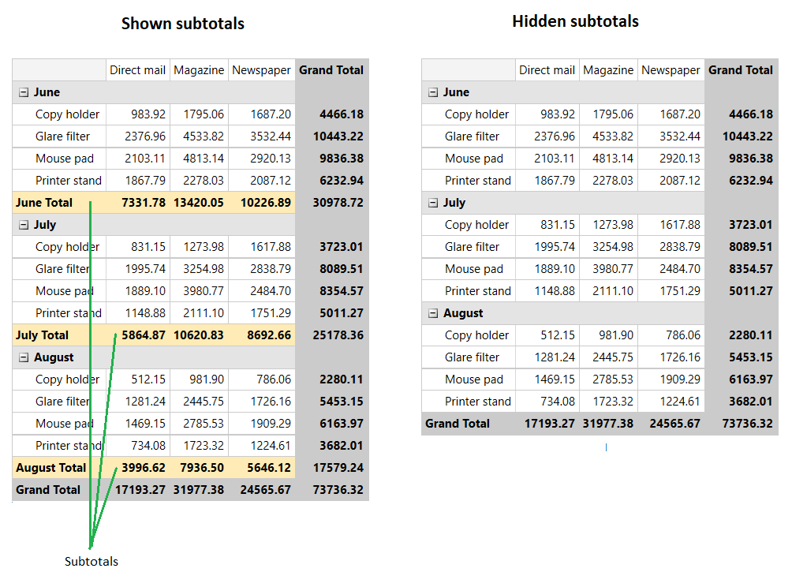
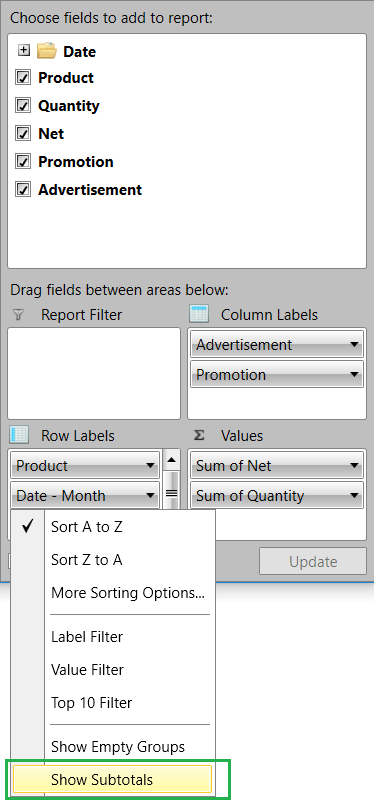

# Layouts

__RadPivotGrid__ supports all of the three most widely used report layouts: Tabular, Outline and Compact.       

## Layout Types

When you create your report with __RadPivotGrid__ you may want to make the data easier for understanding by changing the report layout. With __RadPivotGrid__ you have three different Layouts to format the data in the rows and columns. Each of them can be set separately for Rows and Columns and by combining them you can create many different reports:       

* __Compact__ - with this layout all row headers are in one column and all column headers are in one row. If you have more than one group description in your rows/columns you will notice that there is fixed indent for each group headers. This way there is more space for numeric data:

	

* __Outline__ - with this layout Row and Column Headers are separated based on their level. The indent depends on the length of the Row Headers and on the height of the Column Headers.

	

* __Tabular__ - with this layout you will see only one row/column per item. The hierarchy from the other two layouts is "flattened" here. 

	

## Defining Layout

__RadPivotGrid__ uses two different layouts - horizontal layout(for columns) and vertical layout (for rows). By combining them you can change your generated report to look exactly as you need it. You can set them in your __XAML__ or in code behind:        

#### __[XAML] Example 1: Setting the layout in XAML__  
{{region radpivotgrid-features-layouts_1}}
	<pivot:RadPivotGrid HorizontalLayout="Outline" VerticalLayout="Compact" />
{{endregion}}

#### __[C#] Example 2: Setting the layout in code__  
{{region radpivotgrid-features-layouts_1}}
	RadPivotGrid pivot = new RadPivotGrid();
	pivot.HorizontalLayout = PivotLayoutType.Outline;
	pivot.VerticalLayout = PivotLayoutType.Compact;
{{endregion}}

#### __[VB.NET] Example 2: Setting the layout in code__  
{{region radpivotgrid-features-layouts_1}}
	Dim pivot As New RadPivotGrid()
	pivot.HorizontalLayout = PivotLayoutType.Outline
	pivot.VerticalLayout = PivotLayoutType.Compact
{{endregion}}

## Totals Position

With above mentioned Layouts you can generate different reports and select the best one for your application. But __RadPivotGrid__ gives you the ability to modify it even further. You can select GrandTotals and SubTotals position for both Rows and Columns. You can even remove them if you assess you do not need them. To set the positions you should use the following properties:

* __RowGrandTotalsPosition__ - defines the position of GrandTotals for all rows. You can choose between three options: Bottom (GrandTotals are shown on the last row), Top (GrandTotals are shown on the first row) or None (GrandTotals are not shown for rows).            

* __RowSubTotalsPosition__ - defines the position of SubTotals for each RowGroupDescription. You can choose between three options: Bottom (SubTotals are shown on the last row for each group), Top (SubTotals are shown on the first row for each group) or None (SubTotals are not shown on the rows).            

* __ColumnGrandTotalsPosition__ - defines the position of GrandTotals for all columns. You can choose between three options: Left (GrandTotals are shown in the first column), Right (GrandTotals are shown in the last column), None (GrandTotals are not show on the columns).            

* __ColumnSubTotalsPosition__ - defines the position of SubTotals for each ColumnGroupDescription. You can choose between three options: Left (SubTotals are shown in the first column for each group), Right (SubTotals are shown in the last column for each group), None (SubTotals are not show on the columns).            

Here is __RadPivotGrid__ with the following configuration:        

* HorizontalLayout = "Outline"

* VerticalLayout = "Compact"

* ColumnGrandTotalsPosition="Right"

* ColumnSubTotalsPosition="None"

* RowGrandTotalsPosition="Bottom"

* RowSubTotalsPosition="Top"

## Auto Show Subtotals

When you set the RowSubTotalsPosition property of the group description to a value different than None, the pivot renders the subtotals of the corresponding property group. You can alter this and hide the subtotals for a specific group via the __AutoShowSubTotals__ property of the corresponding group description object.

#### __[XAML] Example 3: Hidding the subtotals in XAML__  
{{region radpivotgrid-features-layouts-2}}	
	<pivot:LocalDataSourceProvider.RowGroupDescriptions>
		<pivot:PropertyGroupDescription PropertyName="Product" />
		<pivot:DateTimeGroupDescription PropertyName="Date" Step="Month" AutoShowSubTotals="False"/>
	</pivot:LocalDataSourceProvider.RowGroupDescriptions>
{{endregion}}

#### __[C#] Example 4: Hidding the subtotals in code__  
{{region radpivotgrid-features-layouts-3}}	
		dataSourceProvider.RowGroupDescriptions.Add(new PropertyGroupDescription() { PropertyName = "Product" });
		dataSourceProvider.RowGroupDescriptions.Add(new DateTimeGroupDescription() { PropertyName = "Date", Step = DateTimeStep.Month, AutoShowSubTotals = false });
{{endregion}}

#### __[VB.NET] Example 4: Hidding the subtotals in code__  
{{region radpivotgrid-features-layouts-4}}
	dataSourceProvider.RowGroupDescriptions.Add(New PropertyGroupDescription() With { .PropertyName = "Product" })
	dataSourceProvider.RowGroupDescriptions.Add(New DateTimeGroupDescription() With {
        .PropertyName = "Date",
        .[Step] = DateTimeStep.Month,
        .AutoShowSubTotals = False
    })
{{endregion}}

The show sub totals option is available also in the context menu of the group descriptions in the RadPivotFieldList control.

## See Also  
 * [RadPivotGrid Getting Started]()
 * [Adding RadPivotFieldList to your project]()
 * [Populating with Data]()
 * [Features]()
