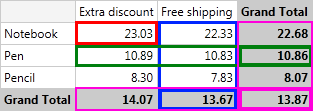
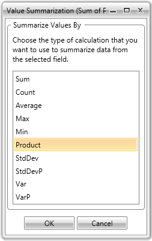

# Aggregate Functions

In this article we will show how to use and change aggregate functions in __RadPivotGrid__ and __RadPivotFieldList__.      

>Different aggregate functions are available only for LocalDataSourceProvider. When your data source is OLAP Cube, the data is already aggregated in it and you cannot apply new aggregate function.        

## Items Source

In our application we will use a very simple ItemsSource for our LocalDataSourceProvider and we will change only the aggregated functions just to show the different result in __RadPivotGrid__.
        
Name	|	Promotion	|	Price
---	|	---	|	---
Pen	|	Extra Discount	|	10.61
Pen	|	Extra Discount	|	10.82
Pen	|	Extra Discount	|	11.24
Pen	|	Free shipping	|	10.47
Pen	|	Free shipping	|	11.14
Pen	|	Free shipping	|	10.89
Pencil	|	Extra Discount	|	8.82
Pencil	|	Extra Discount	|	8.95
Pencil	|	Extra Discount	|	7.12
Pencil	|	Free shipping	|	8.63
Pencil	|	Free shipping	|	7.28
Pencil	|	Free shipping	|	7.59
Notebook	|	Extra Discount	|	22.86
Notebook	|	Extra Discount	|	23.02
Notebook	|	Extra Discount	|	23.22
Notebook	|	Free shipping	|	21.99
Notebook	|	Free shipping	|	22.45
Notebook	|	Free shipping	|	22.56

We will use *Name* as *RowGroupDescription*, *Promotion* as *ColumnGroupDescription* and *Price* as *AggregateDescription*.        

## Aggregate Functions

__RadPivotGrid__ is designed to aggregate data. Aggregated data is shown in the cells. You can set different aggregate functions to change the view of your __RadPivotGrid__. The chosen function is applied on the data in the cells and on the GrandTotals as well:

On the image you can see __RadPivotGrid__ with Price defined as PropertyAggregateDescription with Average function. Note how the data is grouped together and an aggregate function is applied:        

* Data is aggregated in the cells - check the red rectangle - it shows 23.03 which is the average of the values for all Notebooks with Extra Discount promotions.            

* GrandTotals use the same aggregate function - as you can see in the Green and Blue rectangles, GrandTotals for Rows and Columns are using the same aggregate function - average. So in the Blue rectange you can see that the average price of all products with Free shipping promotion is 13.67. In the Green rectangle you can check easily that the average price of all Pens is 10.86.

* The average of GrandTotals for columns is the same as average of GrandTotals for rows. The value in the bottom right corner is calculated with the aggregate function applied on the GrandTotals. There shouldn't be any difference whether you apply the aggregate function on the GrandTotals of the rows or of the columns.            

Here is a full list with the functions you can use:        

* __Average__ - this function will sum all data and then divide it to the number of items. For example we have three products "Pen" with "Extra Discount" promotion. In RadPivotGrid you can see the average price. The calculation is simple - sum the prices of the three products (10.61 + 10.82 + 11.24 = 32.67). Now divide it to the count of items (32.67 / 3 = 10.89).

* __Count__ - this function will count the items - in our example there are three products "Pen" with "Extra Discount" promotion, so in the matching cell you will see number 3:           

* __Max__ - this function will show the highest value of all possible for the current cell - for product "Pen" with "Extra Discount" promotion we have prices 10.61, 10.82, 11.24. The highest value is 11.24 so it will be shown in the cell.            

* __Min__ - this function will show the lowest value of all possible for the current cell - for product "Pen" with "Extra Discount" promotion we have prices 10.61, 10.82, 11.24. The lowest value is
              10.61 so it will be shown in the cell.
            

* __Product__ - this function is doing multiplication of the values - for product "Pen" with "Extra Discount" promotion we have prices 10.61, 10.82, 11.24. So the Product function will be: 10.61 * 10.82 * 11.24 = 1290.35            

* __StdDev__ - this function is calculating the standard deviation based on a sample. The standard deviation is a measure of how widely values are dispersed from the average value. The formula is:

So for product "Pen" in promotion "Extra Discount" the standard deviation is:

* __StdDevP__ - this function is calculating the standard deviation based on the entire population given as arguments. The standard deviation is a measure of how widely values are dispersed from the average value. The formula is:

So for product "Pen" in promotion "Extra Discount" the StdDevP is:

* __Sum__ - this function will sumarize all values. For product "Pen" in promotion "Extra Discount" the value in the cell will be 10.61 + 10.82 + 11.24 = 32.67.            

* __Var__ - estimates variance based on a sample. The formula is:

So for product "Pen" in promotion "Extra Discount" the variance is:

* __VarP__ - calculates variance based on the entire population. The formula is: 

So for product "Pen" in promotion "Extra Discount" the variance is:

## Defining Aggregate Function

You can define Aggregate function in the __XAML__, in code behind or even at runtime by using __RadPivotFieldList__.        

Aggregate Function is defined on PropertyAggregateDescription. There is property AggregateFunction which should be set in one of the following ways:        

#### __XAML__

{{region radpivotgrid-features-aggregates_1}}
	<pivot:PropertyAggregateDescription PropertyName="Price" AggregateFunction="StdDevP" />
{{endregion}}

#### __C#__

{{region radpivotgrid-features-aggregates_1}}
	PropertyAggregateDescription aggregate = new PropertyAggregateDescription();
	aggregate.PropertyName = "Price";
	aggregate.AggregateFunction = AggregateFunctions.StdDevP;
{{endregion}}

#### __VB.NET__

{{region radpivotgrid-features-aggregates_1}}
	Dim aggregate As New PropertyAggregateDescription()
	aggregate.PropertyName = "Price"
	aggregate.AggregateFunction = AggregateFunctions.StdDevP
{{endregion}}

You can change applied Aggregate Function at runtime by using __RadPivotFieldList__. Just find the aggregate description which you want to modify in the "Values" list and click on it - some of the aggregate functions are listed there, but if you don't see the one you need - click on "More aggregate Options..." item and a new dialog __RadWindow__ will open. In it you will find all predefined Aggregate Functions.

## See Also

 * [Getting Started]()

 * [RadPivotFieldList]()

 * [LocalDataSourceProvider]()

 * [Features]()
