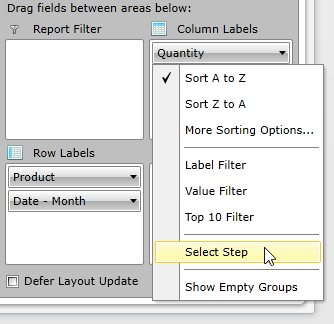
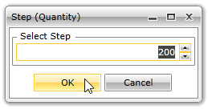

# DoubleGroupDescription

In this article we will show you how to use DoubleGroupDescription with your numeric data.

## DoubleGroupDescription

When using LocalDataSourceProvider you can choose between three types of group description - *PropertyGroupDescription, DoubleGroupDescription* and *DateTimeGroupDescription* (or implement your own group description, which inherits *PropertyGroupDescriptionBase*). 

__DoubleGroupDescription__ is used when you want to group your data by numeric property. __DoubleGroupDescription__ has the following properties:

* __PropertyName__ - defines the name of the property by which the data will be grouped. It is mandatory to set a value.            

* __Step__ - defines the grouping interval. It is a double property with default value 100.

#### __XAML__

{{region radpivotgrid-features-doublegroupstep_1}}
	<pivot:LocalDataSourceProvider.ColumnGroupDescriptions>
	    <pivot:DoubleGroupDescription PropertyName="Quantity" />
		<pivot:DoubleGroupDescription PropertyName="Quantity" Step="200" />
	</pivot:LocalDataSourceProvider.ColumnGroupDescriptions>
{{endregion}}

#### __C#__

{{region radpivotgrid-features-doublegroupstep_1}}
	DoubleGroupDescription doubleGroupDescription1 = new DoubleGroupDescription();
	doubleGroupDescription1.PropertyName = "Quantity";

	DoubleGroupDescription doubleGroupDescription2 = new DoubleGroupDescription();
	doubleGroupDescription2.PropertyName = "Quantity";
	doubleGroupDescription2.Step = 200;

	var dataProvider = new LocalDataSourceProvider();
	dataProvider.ColumnGroupDescriptions.Add(doubleGroupDescription1);
	dataProvider.ColumnGroupDescriptions.Add(doubleGroupDescription2);
{{endregion}}

#### __VB.NET__

{{region radpivotgrid-features-doublegroupstep_1}}
	Dim doubleGroupDescription1 As New DoubleGroupDescription()
	doubleGroupDescription1.PropertyName = "Quantity"
	
	Dim doubleGroupDescription2 As New DoubleGroupDescription()
	doubleGroupDescription2.PropertyName = "Quantity"
	doubleGroupDescription2.Step = 200
	
	Dim dataProvider = New LocalDataSourceProvider()
	dataProvider.ColumnGroupDescriptions.Add(doubleGroupDescription1)
	dataProvider.ColumnGroupDescriptions.Add(doubleGroupDescription2)
{{endregion}}

>You may also create a *PropertyGroupDescription* instead of *DoubleGroupDescription* - this way the numeric data will be treated as a string and will be grouped and sorted as such. However by using *PropertyGroupDescription* you will loose the grouping interval feature of the *DoubleGroupDescription* (the *Step* property).

## Change Step at Run Time

With the Q1 2015 release version of UI for WPFSilverlight, the __Step__ of each __DoubleGroupDescription__ can be also customized through a dedicated UI dialog. The dialog is accessible through the context menu of each __DoubleGroupDescription__. 

## See Also

 * [Getting Started]()

 * [RadPivotFieldList]()

 * [LocalDataSourceProvider]()

 * [Features]()
 
 * [DateTimeGroupDescription]()
