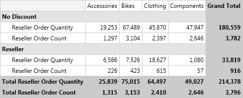
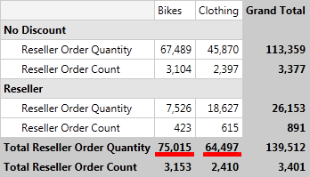
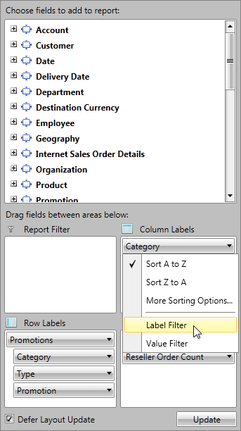
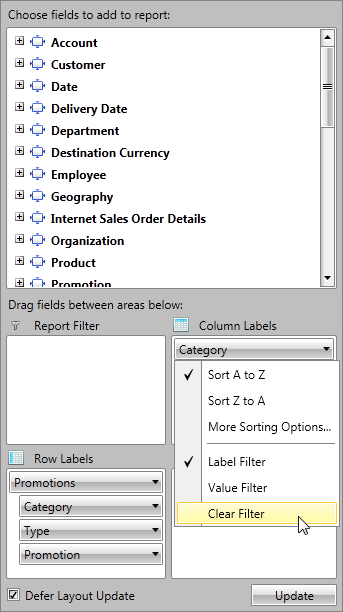

# Group Filtering

In this article we will show you how to apply different filters on your RowGroupDescriptions and ColumnGroupDescriptions when your data is from OLAP Cube.

## Filter Types

The Data in __RadPivotGrid__ can be filtered based on several conditions to give you a view on specific details or just to make the report shorter. There are two types of filters you may use on your __RowGroupDescriptions__/__ColumnGroupDescriptions__.        

* __Label filter__ - filters the report based on the Header name.            

* __Value filter__ - filters the report based on one of the aggregates used.            

Here is the initial state of __RadPivotGrid__ that we will use to show how different filters will change the report.

## Label Filter

The __LabelFilter__ is used for filtering the data based on the Headers (row or column). The LabelFilter is using one of the following conditions:        

* __equals__ - showing only groups which header fully match the parameter we pass.            

* __does not equal__ - showing all groups which header does NOT match the parameter we pass.
            
* __contains__ - showing only groups which header contains the parameter we pass.            

* __does not contain__ - showing only groups which header does NOT contain the parameter we pass.            

>important*Equals* and *does not equal* are case sensitive and are using string comparison between the unique name of the member (defined in the Cube itself) and the passed parameters. *Contains* and *does not contain* are not case sensitive.        

So if we apply a __LabelFilter__ on the Category ColumnGroupDescription with condition *contains* and parameter *"C"* we will receive the following result:

### Defining Label Filter

__Label Filter__ can be defined in the __XAML__, code behind or even at runtime by using __RadPivotFieldList__. To apply Label Filter you should set it to the *GroupFilter* property of *XmlaGroupDescription* / *AdomdGroupDescription*. To define Label Filter, use the __OlapLabelGroupFilter__ class from __Telerik.Pivot.Core.Filtering__ namespace. Each __OlapLabelGroupFilter__ must have a *Condition* defined. The *Condition* can be:             

* __OlapComparisonCondition__ - used to compare the Header with the value set in the *Than* property based on the *Condition* property. *OlapComparisonCondition* is used for "equals" and "does not equal" comparison. The value in *Than* property is case-sensitive.                 

* __OlapTextCondition__ - used when you want to filter the data based on a string value defined in *Pattern* property. The *Comparison* property can have the values "contains" or "does not contain". The value of *Pattern* property is not case-sensitive.                

#### __XAML__

{{region radpivotgrid-features-filter-olap_1}}
	<pivot:XmlaGroupDescription MemberName="[Promotion].[Promotion Category]">
	    <pivot:XmlaGroupDescription.GroupFilter>
	        <pivot:OlapLabelGroupFilter>
	            <pivot:OlapLabelGroupFilter.Condition>
	                <pivot:OlapTextCondition Comparison="Contains" Pattern="C"/>
	            </pivot:OlapLabelGroupFilter.Condition>
	        </pivot:OlapLabelGroupFilter>
	    </pivot:XmlaGroupDescription.GroupFilter>
	</pivot:XmlaGroupDescription>
	<pivot:XmlaGroupDescription MemberName="[Product].[Category]">
	    <pivot:XmlaGroupDescription.GroupFilter>
	        <pivot:OlapLabelGroupFilter>
	            <pivot:OlapLabelGroupFilter.Condition>                                
	                <!--[Product].[Category].&[3] = Clothing-->
	                <pivot:OlapComparisonCondition Condition="Equals">
	                    <pivot:OlapComparisonCondition.Than>
	                        <sys:String>[Product].[Category].&amp;[3]</sys:String>
	                    </pivot:OlapComparisonCondition.Than>
	                </pivot:OlapComparisonCondition>
	            </pivot:OlapLabelGroupFilter.Condition>
	        </pivot:OlapLabelGroupFilter>
	    </pivot:XmlaGroupDescription.GroupFilter>
	</pivot:XmlaGroupDescription>
{{endregion}}

#### __C#__

{{region radpivotgrid-features-filter-olap_1}}
	XmlaGroupDescription groupDescription1 = new XmlaGroupDescription();
	groupDescription1.MemberName = "[Promotion].[Promotion Category]";
	OlapLabelGroupFilter labelGroupFilter1 = new OlapLabelGroupFilter();
	labelGroupFilter1.Condition = new OlapTextCondition() { Comparison = TextComparison.Contains, Pattern = "C" };
	groupDescription1.GroupFilter = labelGroupFilter1;
	
	XmlaGroupDescription groupDescription2 = new XmlaGroupDescription();
	groupDescription2.MemberName = "[Product].[Category]";
	OlapLabelGroupFilter labelGroupFilter2 = new OlapLabelGroupFilter();
	labelGroupFilter2.Condition = new OlapComparisonCondition() { Condition = Comparison.Equals, Than = "[Product].[Category].&[3]" };
	groupDescription2.GroupFilter = labelGroupFilter2;
{{endregion}}

#### __VB.NET__

{{region radpivotgrid-features-filter-olap_1}}
	Dim groupDescription1 As New XmlaGroupDescription()
	groupDescription1.MemberName = "[Promotion].[Promotion Category]"
	Dim labelGroupFilter1 As New OlapLabelGroupFilter()
	labelGroupFilter1.Condition = New OlapTextCondition() With {.Comparison = TextComparison.Contains, .Pattern = "C"}
	groupDescription1.GroupFilter = labelGroupFilter1
	
	Dim groupDescription2 As New XmlaGroupDescription()
	groupDescription2.MemberName = "[Product].[Category]"
	Dim labelGroupFilter2 As New OlapLabelGroupFilter()
	labelGroupFilter2.Condition = New OlapComparisonCondition() With {.Condition = Comparison.Equals, .Than = "[Product].[Category].&[3]"}
	groupDescription2.GroupFilter = labelGroupFilter2
{{endregion}}


If you use __AdomdDataProvider__:                

#### __XAML__

{{region radpivotgrid-features-filter-olap_2}}
	<pivot:AdomdGroupDescription MemberName="[Promotion].[Promotion Category]">
	    <pivot:AdomdGroupDescription.GroupFilter>
	        <pivot:OlapLabelGroupFilter>
	            <pivot:OlapLabelGroupFilter.Condition>
	                <pivot:OlapTextCondition Comparison="Contains" Pattern="C"/>
	            </pivot:OlapLabelGroupFilter.Condition>
	        </pivot:OlapLabelGroupFilter>
	    </pivot:AdomdGroupDescription.GroupFilter>
	</pivot:AdomdGroupDescription>
	<pivot:AdomdGroupDescription MemberName="[Product].[Category]">
	    <pivot:AdomdGroupDescription.GroupFilter>
	        <pivot:OlapLabelGroupFilter>
	            <pivot:OlapLabelGroupFilter.Condition>
	                <!--[Product].[Category].&[3] = Clothing-->
	                <pivot:OlapComparisonCondition Condition="Equals">
	                    <pivot:OlapComparisonCondition.Than>
	                        <sys:String>[Product].[Category].&amp;[3]</sys:String>
	                    </pivot:OlapComparisonCondition.Than>
	                </pivot:OlapComparisonCondition>
	            </pivot:OlapLabelGroupFilter.Condition>
	        </pivot:OlapLabelGroupFilter>
	    </pivot:AdomdGroupDescription.GroupFilter>
	</pivot:AdomdGroupDescription>
{{endregion}}

#### __C#__

{{region radpivotgrid-features-filter-olap_2}}
	AdomdGroupDescription groupDescription1 = new AdomdGroupDescription();
	groupDescription1.MemberName = "[Promotion].[Promotion Category]";
	OlapLabelGroupFilter labelGroupFilter1 = new OlapLabelGroupFilter();
	labelGroupFilter1.Condition = new OlapTextCondition() { Comparison = TextComparison.Contains, Pattern = "C" };
	groupDescription1.GroupFilter = labelGroupFilter1;
	
	AdomdGroupDescription groupDescription2 = new AdomdGroupDescription();
	groupDescription2.MemberName = "[Product].[Category]";
	OlapLabelGroupFilter labelGroupFilter2 = new OlapLabelGroupFilter();
	labelGroupFilter2.Condition = new OlapComparisonCondition() { Condition = Comparison.Equals, Than = "[Product].[Category].&[3]" };
	groupDescription2.GroupFilter = labelGroupFilter2;
{{endregion}}

#### __VB.NET__

{{region radpivotgrid-features-filter-olap_2}}
	Dim groupDescription1 As New AdomdGroupDescription()
	groupDescription1.MemberName = "[Promotion].[Promotion Category]"
	Dim labelGroupFilter1 As New OlapLabelGroupFilter()
	labelGroupFilter1.Condition = New OlapTextCondition() With {.Comparison = TextComparison.Contains, .Pattern = "C"}
	groupDescription1.GroupFilter = labelGroupFilter1
	
	Dim groupDescription2 As New AdomdGroupDescription()
	groupDescription2.MemberName = "[Product].[Category]"
	Dim labelGroupFilter2 As New OlapLabelGroupFilter()
	labelGroupFilter2.Condition = New OlapComparisonCondition() With {.Condition = Comparison.Equals, .Than = "[Product].[Category].&[3]"}
	groupDescription2.GroupFilter = labelGroupFilter2
{{endregion}}


### Label Filters for user-defined hierarchies

OLAP dimensions consist of attribute hierarchies and user-defined hierarchies. User-defined hierarchies have different levels and with __RadPivotGrid__ you can apply LabelFilter on each of the levels. To do this you should use *Levels* property of __XmlaGroupDescription__ / __AdomdGroupDescription__. *Levels* property is collection of __XmlaLevelGroupDescriptions__ / __AdomdGroupDescriptions__. Each of the LevelGroupDescriptions has its own *MemberName* and *GroupFilter* properties:              

#### __XAML__

{{region radpivotgrid-features-filter-olap_5}}
	<pivot:XmlaGroupDescription MemberName="[Promotion].[Promotions]">
	    <pivot:XmlaGroupDescription.Levels>
	        <pivot:XmlaLevelGroupDescription MemberName="[Promotion].[Promotions].[Category]">
	            <pivot:XmlaLevelGroupDescription.GroupFilter>
	                <pivot:OlapLabelGroupFilter>
	                    <pivot:OlapLabelGroupFilter.Condition>
	                        <pivot:OlapTextCondition Comparison="Contains" Pattern="E"/>
	                    </pivot:OlapLabelGroupFilter.Condition>
	                </pivot:OlapLabelGroupFilter>
	            </pivot:XmlaLevelGroupDescription.GroupFilter>
	        </pivot:XmlaLevelGroupDescription>
	
	        <pivot:XmlaLevelGroupDescription MemberName="[Promotion].[Promotions].[Type]">
	            <pivot:XmlaLevelGroupDescription.GroupFilter>
	                <pivot:OlapLabelGroupFilter>
	                    <pivot:OlapLabelGroupFilter.Condition>
	                        <pivot:OlapComparisonCondition Condition="Equals">
	                            <pivot:OlapComparisonCondition.Than>
	                                <sys:String>[Promotion].[Promotions].[Category].&amp;[Reseller].&amp;[Excess Inventory]</sys:String>
	                            </pivot:OlapComparisonCondition.Than>
	                        </pivot:OlapComparisonCondition>
	                    </pivot:OlapLabelGroupFilter.Condition>
	                </pivot:OlapLabelGroupFilter>
	            </pivot:XmlaLevelGroupDescription.GroupFilter>
	        </pivot:XmlaLevelGroupDescription>
	    </pivot:XmlaGroupDescription.Levels>
	</pivot:XmlaGroupDescription>
{{endregion}}

#### __C#__

{{region radpivotgrid-features-filter-olap_5}}
	XmlaGroupDescription groupDescription = new XmlaGroupDescription();
	groupDescription.MemberName = "[Promotion].[Promotions]";
	
	XmlaLevelGroupDescription levelGroupDescription1 = new XmlaLevelGroupDescription();
	levelGroupDescription1.MemberName = "[Promotion].[Promotions].[Category]";
	OlapLabelGroupFilter labelGroupFilter1 = new OlapLabelGroupFilter();
	labelGroupFilter1.Condition = new OlapTextCondition() { Comparison = TextComparison.Contains, Pattern = "E" };
	levelGroupDescription1.GroupFilter = labelGroupFilter1;
	groupDescription.Levels.Add(levelGroupDescription1);
	
	XmlaLevelGroupDescription levelGroupDescription2 = new XmlaLevelGroupDescription();
	levelGroupDescription2.MemberName = "[Promotion].[Promotions].[Type]";
	OlapLabelGroupFilter labelGroupFilter2 = new OlapLabelGroupFilter();
	labelGroupFilter2.Condition = new OlapComparisonCondition() { Condition = Comparison.Equals, Than = "[Promotion].[Promotions].[Category].&[Reseller].&[Excess Inventory]" };
	levelGroupDescription2.GroupFilter = labelGroupFilter2;
	groupDescription.Levels.Add(levelGroupDescription2);
{{endregion}}

#### __VB.NET__

{{region radpivotgrid-features-filter-olap_5}}
	Dim groupDescription As New XmlaGroupDescription()
	groupDescription.MemberName = "[Promotion].[Promotions]"
	
	Dim levelGroupDescription1 As New XmlaLevelGroupDescription()
	levelGroupDescription1.MemberName = "[Promotion].[Promotions].[Category]"
	Dim labelGroupFilter1 As New OlapLabelGroupFilter()
	labelGroupFilter1.Condition = New OlapTextCondition() With {.Comparison = TextComparison.Contains, .Pattern = "E"}
	levelGroupDescription1.GroupFilter = labelGroupFilter1
	groupDescription.Levels.Add(levelGroupDescription1)
	
	Dim levelGroupDescription2 As New XmlaLevelGroupDescription()
	levelGroupDescription2.MemberName = "[Promotion].[Promotions].[Type]"
	Dim labelGroupFilter2 As New OlapLabelGroupFilter()
	labelGroupFilter2.Condition = New OlapComparisonCondition() With {.Condition = Comparison.Equals, .Than = "[Promotion].[Promotions].[Category].&[Reseller].&[Excess Inventory]"}
	levelGroupDescription2.GroupFilter = labelGroupFilter2
	groupDescription.Levels.Add(levelGroupDescription2)
{{endregion}}


If you use __AdomdDataProvider:__

#### __XAML__

{{region radpivotgrid-features-filter-olap_6}}
	<pivot:AdomdGroupDescription MemberName="[Promotion].[Promotions]">
	    <pivot:AdomdGroupDescription.Levels>
	        <pivot:AdomdLevelGroupDescription MemberName="[Promotion].[Promotions].[Category]">
	            <pivot:AdomdLevelGroupDescription.GroupFilter>
	                <pivot:OlapLabelGroupFilter>
	                    <pivot:OlapLabelGroupFilter.Condition>
	                        <pivot:OlapTextCondition Comparison="Contains" Pattern="E"/>
	                    </pivot:OlapLabelGroupFilter.Condition>
	                </pivot:OlapLabelGroupFilter>
	            </pivot:AdomdLevelGroupDescription.GroupFilter>
	        </pivot:AdomdLevelGroupDescription>
	
	        <pivot:AdomdLevelGroupDescription MemberName="[Promotion].[Promotions].[Type]">
	            <pivot:AdomdLevelGroupDescription.GroupFilter>
	                <pivot:OlapLabelGroupFilter>
	                    <pivot:OlapLabelGroupFilter.Condition>
	                        <pivot:OlapComparisonCondition Condition="Equals">
	                            <pivot:OlapComparisonCondition.Than>
	                                <sys:String>[Promotion].[Promotions].[Category].&amp;[Reseller].&amp;[Excess Inventory]</sys:String>
	                            </pivot:OlapComparisonCondition.Than>
	                        </pivot:OlapComparisonCondition>
	                    </pivot:OlapLabelGroupFilter.Condition>
	                </pivot:OlapLabelGroupFilter>
	            </pivot:AdomdLevelGroupDescription.GroupFilter>
	        </pivot:AdomdLevelGroupDescription>
	    </pivot:AdomdGroupDescription.Levels>
	</pivot:AdomdGroupDescription>
{{endregion}}

#### __C#__

{{region radpivotgrid-features-filter-olap_6}}
	AdomdGroupDescription groupDescription = new AdomdGroupDescription();
	groupDescription.MemberName = "[Promotion].[Promotions]";
	
	AdomdLevelGroupDescription levelGroupDescription1 = new AdomdLevelGroupDescription();
	levelGroupDescription1.MemberName = "[Promotion].[Promotions].[Category]";
	OlapLabelGroupFilter labelGroupFilter1 = new OlapLabelGroupFilter();
	labelGroupFilter1.Condition = new OlapTextCondition() { Comparison = TextComparison.Contains, Pattern = "E" };
	levelGroupDescription1.GroupFilter = labelGroupFilter1;
	groupDescription.Levels.Add(levelGroupDescription1);
	
	AdomdLevelGroupDescription levelGroupDescription2 = new AdomdLevelGroupDescription();
	levelGroupDescription2.MemberName = "[Promotion].[Promotions].[Type]";
	OlapLabelGroupFilter labelGroupFilter2 = new OlapLabelGroupFilter();
	labelGroupFilter2.Condition = new OlapComparisonCondition() { Condition = Comparison.Equals, Than = "[Promotion].[Promotions].[Category].&[Reseller].&[Excess Inventory]" };
	levelGroupDescription2.GroupFilter = labelGroupFilter2;
	groupDescription.Levels.Add(levelGroupDescription2);
{{endregion}}

#### __VB.NET__

{{region radpivotgrid-features-filter-olap_6}}
	Dim groupDescription As New AdomdGroupDescription()
	groupDescription.MemberName = "[Promotion].[Promotions]"
	
	Dim levelGroupDescription1 As New AdomdLevelGroupDescription()
	levelGroupDescription1.MemberName = "[Promotion].[Promotions].[Category]"
	Dim labelGroupFilter1 As New OlapLabelGroupFilter()
	labelGroupFilter1.Condition = New OlapTextCondition() With {.Comparison = TextComparison.Contains, .Pattern = "E"}
	levelGroupDescription1.GroupFilter = labelGroupFilter1
	groupDescription.Levels.Add(levelGroupDescription1)
	
	Dim levelGroupDescription2 As New AdomdLevelGroupDescription()
	levelGroupDescription2.MemberName = "[Promotion].[Promotions].[Type]"
	Dim labelGroupFilter2 As New OlapLabelGroupFilter()
	labelGroupFilter2.Condition = New OlapComparisonCondition() With {.Condition = Comparison.Equals, .Than = "[Promotion].[Promotions].[Category].&[Reseller].&[Excess Inventory]"}
	levelGroupDescription2.GroupFilter = labelGroupFilter2
	groupDescription.Levels.Add(levelGroupDescription2)
{{endregion}}


>tipThe value of "Than" property is the unique name of the member (defined in OLAP Cube). As you are unable to use & in XAML, you have to use &amp; which will be parsed to &. You have to define *sys* namespace: __xmlns:sys="clr-namespace:System;assembly=mscorlib"__.                

## Value Filter

__Value Filter__ is applied on __RowGroupDescriptions__/__ColumnGroupDescriptions__ based on the *GrandTotals* of one of the Aggregation descriptions used in the application. To apply value filter you have to use one of the predefined conditions:        

* __equals__ - show only members for which the selected measure fully matches the passed parameter.            

* __does not equal__ - show all members for which the selected measure does NOT match the passed parameter.            

* __is greater than__ - show only members for which the selected measure is greater than the passed parameter.            

* __is greater than or equal to__ - show only members for which the selected measure is greater or equal to the passed parameter.            

* __is less than__ - show only members for which the selected measure is smaller than the parameter we pass.            

* __is less than or equal to__ - show only members for which the selected measure is smaller or equal to the passed parameter.            

* __is between__ - show only members for which the selected measure is between the two passed parameters.            

* __is not between__ - show only members for which the selected measure is NOT between the two passed parameters.            

>important__Value Filter__ is filtering the groups by number comparison between the *GrandTotals* of the groups and the parameters we pass, while __Label Filter__ is a string filter.          

So if we apply a __Value Filter__ on the *Category* ColumnGroupDescription, set condition *"is greater than"* for the AggregateDescription Reseller Order Quantity  and pass as parameter value 50000 we will notice that two of the groups are missing because their *GrandTotal* is less than 50 000.

### Defining Value Filter

__Value Filter__ can be defined in __XAML__, code behind or at runtime by using __RadPivotFieldList__. Defining in the code is using *ValueGroupFilter* class from __Telerik.Pivot.Core__ namespace. Each object of this type must have *Condition* defined. *Condition* can be any of these:              

* __ComparisonCondition__ - used to compare the Header with the value set in the *Than* property based on the *Condition* property.                  

* __IntervalCondition__ - used when you want to show only data that is (not) between two values set in the *From* and *To* properties based on the *Condition* property.                  

#### __XAML__

{{region radpivotgrid-features-filter-olap_3}}
	<pivot:XmlaGroupDescription MemberName="[Promotion].[Promotion Category]">
	    <pivot:XmlaGroupDescription.GroupFilter>
	        <pivot:OlapValueGroupFilter AggregateIndex="1">
	            <pivot:OlapValueGroupFilter.Condition>
	                <pivot:OlapIntervalCondition Condition="IsBetween" From="1000" To="5000"/>
	            </pivot:OlapValueGroupFilter.Condition>
	        </pivot:OlapValueGroupFilter>
	    </pivot:XmlaGroupDescription.GroupFilter>
	</pivot:XmlaGroupDescription>
	<pivot:XmlaGroupDescription MemberName="[Product].[Category]">
	    <pivot:XmlaGroupDescription.GroupFilter>
	        <pivot:OlapValueGroupFilter AggregateIndex="0">
	            <pivot:OlapValueGroupFilter.Condition>
	                <pivot:OlapComparisonCondition Condition="IsGreaterThan" Than="50000"/>
	            </pivot:OlapValueGroupFilter.Condition>
	        </pivot:OlapValueGroupFilter>
	    </pivot:XmlaGroupDescription.GroupFilter>
	</pivot:XmlaGroupDescription>
{{endregion}}

#### __C#__

{{region radpivotgrid-features-filter-olap_3}}
	XmlaGroupDescription groupDescription1 = new XmlaGroupDescription();
	groupDescription1.MemberName = "[Promotion].[Promotion Category]";
	OlapValueGroupFilter valueGroupFilter1 = new OlapValueGroupFilter();
	valueGroupFilter1.AggregateIndex = 1;
	valueGroupFilter1.Condition = new OlapIntervalCondition() { Condition = IntervalComparison.IsBetween, From = 1000, To = 5000 };
	groupDescription1.GroupFilter = valueGroupFilter1;
	
	XmlaGroupDescription groupDescription2 = new XmlaGroupDescription();
	groupDescription2.MemberName = "[Product].[Category]";
	OlapValueGroupFilter valueGroupFilter2 = new OlapValueGroupFilter();
	valueGroupFilter2.AggregateIndex = 0;
	valueGroupFilter2.Condition = new OlapComparisonCondition() { Condition = Comparison.IsGreaterThan, Than = 50000 };
	groupDescription2.GroupFilter = valueGroupFilter2;
{{endregion}}

#### __VB.NET__

{{region radpivotgrid-features-filter-olap_3}}
	groupDescription1.MemberName = "[Promotion].[Promotion Category]"
	Dim valueGroupFilter1 As New OlapValueGroupFilter()
	valueGroupFilter1.AggregateIndex = 1
	valueGroupFilter1.Condition = New OlapIntervalCondition() With {.Condition = IntervalComparison.IsBetween, .From = 1000, .To = 5000}
	groupDescription1.GroupFilter = valueGroupFilter1
	
	Dim groupDescription2 As New XmlaGroupDescription()
	groupDescription2.MemberName = "[Product].[Category]"
	Dim valueGroupFilter2 As New OlapValueGroupFilter()
	valueGroupFilter2.AggregateIndex = 0
	valueGroupFilter2.Condition = New OlapComparisonCondition() With {.Condition = Comparison.IsGreaterThan, .Than = 50000}
	groupDescription2.GroupFilter = valueGroupFilter2
{{endregion}}


If you use __AdomdDataProvider__:                

#### __XAML__

{{region radpivotgrid-features-filter-olap_4}}
	<pivot:AdomdGroupDescription MemberName="[Promotion].[Promotion Category]">
	    <pivot:AdomdGroupDescription.GroupFilter>
	        <pivot:OlapValueGroupFilter AggregateIndex="1">
	            <pivot:OlapValueGroupFilter.Condition>
	                <pivot:OlapIntervalCondition Condition="IsBetween" From="1000" To="5000"/>
	            </pivot:OlapValueGroupFilter.Condition>
	        </pivot:OlapValueGroupFilter>
	    </pivot:AdomdGroupDescription.GroupFilter>
	</pivot:AdomdGroupDescription>
	<pivot:AdomdGroupDescription MemberName="[Product].[Category]">
	    <pivot:AdomdGroupDescription.GroupFilter>
	        <pivot:OlapValueGroupFilter AggregateIndex="0">
	            <pivot:OlapValueGroupFilter.Condition>
	                <pivot:OlapComparisonCondition Condition="IsGreaterThan" Than="50000"/>
	            </pivot:OlapValueGroupFilter.Condition>
	        </pivot:OlapValueGroupFilter>
	    </pivot:AdomdGroupDescription.GroupFilter>
	</pivot:AdomdGroupDescription>
{{endregion}}

#### __C#__

{{region radpivotgrid-features-filter-olap_4}}
	AdomdGroupDescription groupDescription1 = new AdomdGroupDescription();
	groupDescription1.MemberName = "[Promotion].[Promotion Category]";
	OlapValueGroupFilter valueGroupFilter1 = new OlapValueGroupFilter();
	valueGroupFilter1.AggregateIndex = 1;
	valueGroupFilter1.Condition = new OlapIntervalCondition() { Condition = IntervalComparison.IsBetween, From = 1000, To = 5000 };
	groupDescription1.GroupFilter = valueGroupFilter1;
	
	AdomdGroupDescription groupDescription2 = new AdomdGroupDescription();
	groupDescription2.MemberName = "[Product].[Category]";
	OlapValueGroupFilter valueGroupFilter2 = new OlapValueGroupFilter();
	valueGroupFilter2.AggregateIndex = 0;
	valueGroupFilter2.Condition = new OlapComparisonCondition() { Condition = Comparison.IsGreaterThan, Than = 50000 };
	groupDescription2.GroupFilter = valueGroupFilter2;
{{endregion}}

#### __VB.NET__

{{region radpivotgrid-features-filter-olap_4}}
	Dim groupDescription1 As New AdomdGroupDescription()
	groupDescription1.MemberName = "[Promotion].[Promotion Category]"
	Dim valueGroupFilter1 As New OlapValueGroupFilter()
	valueGroupFilter1.AggregateIndex = 1
	valueGroupFilter1.Condition = New OlapIntervalCondition() With {.Condition = IntervalComparison.IsBetween, .From = 1000, .To = 5000}
	groupDescription1.GroupFilter = valueGroupFilter1
	
	Dim groupDescription2 As New AdomdGroupDescription()
	groupDescription2.MemberName = "[Product].[Category]"
	Dim valueGroupFilter2 As New OlapValueGroupFilter()
	valueGroupFilter2.AggregateIndex = 0
	valueGroupFilter2.Condition = New OlapComparisonCondition() With {.Condition = Comparison.IsGreaterThan, .Than = 50000}
	groupDescription2.GroupFilter = valueGroupFilter2
	{{endregion}}



### Value Filters for user-defined hierarchies

OLAP dimensions consist of attribute hierarchies and user-defined hierarchies. User-defined hierarchies have different levels and with __RadPivotGrid__ you can apply Value Filter on each of the levels. To do this you should use *Levels* property of __XmlaGroupDescription__ / __AdomdGroupDescription__. *Levels* property is collection of __XmlaLevelGroupDescriptions__ / __AdomdGroupDescriptions__. Each of the LevelGroupDescriptions has its own *MemberName* and *GroupFilter* properties:              

#### __XAML__

{{region radpivotgrid-features-filter-olap_7}}
	<pivot:XmlaGroupDescription MemberName="[Promotion].[Promotions]">
	    <pivot:XmlaGroupDescription.Levels>
	        <pivot:XmlaLevelGroupDescription MemberName="[Promotion].[Promotions].[Category]">
	            <pivot:XmlaLevelGroupDescription.GroupFilter>
	                <pivot:OlapValueGroupFilter AggregateIndex="1">
	                    <pivot:OlapValueGroupFilter.Condition>
	                        <pivot:OlapIntervalCondition Condition="IsBetween" From="900" To="1000"/>
	                    </pivot:OlapValueGroupFilter.Condition>
	                </pivot:OlapValueGroupFilter>
	            </pivot:XmlaLevelGroupDescription.GroupFilter>
	        </pivot:XmlaLevelGroupDescription>
	
	        <pivot:XmlaLevelGroupDescription MemberName="[Promotion].[Promotions].[Type]">
	            <pivot:XmlaLevelGroupDescription.GroupFilter>
	                <pivot:OlapValueGroupFilter AggregateIndex="0">
	                    <pivot:OlapValueGroupFilter.Condition>
	                        <pivot:OlapComparisonCondition Condition="IsGreaterThan" Than="300"/>
	                    </pivot:OlapValueGroupFilter.Condition>
	                </pivot:OlapValueGroupFilter>
	            </pivot:XmlaLevelGroupDescription.GroupFilter>
	        </pivot:XmlaLevelGroupDescription>
	    </pivot:XmlaGroupDescription.Levels>
	</pivot:XmlaGroupDescription>
{{endregion}}

#### __C#__

{{region radpivotgrid-features-filter-olap_7}}
	XmlaGroupDescription groupDescription = new XmlaGroupDescription();
	groupDescription.MemberName = "[Promotion].[Promotions]";
	
	XmlaLevelGroupDescription levelGroupDescription1 = new XmlaLevelGroupDescription();
	levelGroupDescription1.MemberName = "[Promotion].[Promotions].[Category]";
	OlapValueGroupFilter valueGroupFilter1 = new OlapValueGroupFilter();
	valueGroupFilter1.AggregateIndex = 1;            
	valueGroupFilter1.Condition = new OlapIntervalCondition() { Condition = IntervalComparison.IsBetween, From = 900, To = 1000 };
	levelGroupDescription1.GroupFilter = valueGroupFilter1;
	groupDescription.Levels.Add(levelGroupDescription1);
	
	XmlaLevelGroupDescription levelGroupDescription2 = new XmlaLevelGroupDescription();
	levelGroupDescription2.MemberName = "[Promotion].[Promotions].[Type]";
	OlapValueGroupFilter valueGroupFilter2 = new OlapValueGroupFilter();
	valueGroupFilter2.AggregateIndex = 0;
	valueGroupFilter2.Condition = new OlapComparisonCondition() { Condition = Comparison.IsGreaterThan, Than = 300 };
	levelGroupDescription2.GroupFilter = valueGroupFilter2;
	groupDescription.Levels.Add(levelGroupDescription2);
{{endregion}}

#### __VB.NET__

{{region radpivotgrid-features-filter-olap_7}}
	Dim groupDescription As New XmlaGroupDescription()
	groupDescription.MemberName = "[Promotion].[Promotions]"
	
	Dim levelGroupDescription1 As New XmlaLevelGroupDescription()
	levelGroupDescription1.MemberName = "[Promotion].[Promotions].[Category]"
	Dim valueGroupFilter1 As New OlapValueGroupFilter()
	valueGroupFilter1.AggregateIndex = 1
	valueGroupFilter1.Condition = New OlapIntervalCondition() With {.Condition = IntervalComparison.IsBetween, .From = 900, .To = 1000}
	levelGroupDescription1.GroupFilter = valueGroupFilter1
	groupDescription.Levels.Add(levelGroupDescription1)
	
	Dim levelGroupDescription2 As New XmlaLevelGroupDescription()
	levelGroupDescription2.MemberName = "[Promotion].[Promotions].[Type]"
	Dim valueGroupFilter2 As New OlapValueGroupFilter()
	valueGroupFilter2.AggregateIndex = 0
	valueGroupFilter2.Condition = New OlapComparisonCondition() With {.Condition = Comparison.IsGreaterThan, .Than = 300}
	levelGroupDescription2.GroupFilter = valueGroupFilter2
	groupDescription.Levels.Add(levelGroupDescription2)
{{endregion}}


If you use __AdomdDataProvider:__

#### __XAML__

{{region radpivotgrid-features-filter-olap_8}}
	<pivot:AdomdGroupDescription MemberName="[Promotion].[Promotions]">
	    <pivot:AdomdGroupDescription.Levels>
	        <pivot:AdomdLevelGroupDescription MemberName="[Promotion].[Promotions].[Category]">
	            <pivot:AdomdLevelGroupDescription.GroupFilter>
	                <pivot:OlapValueGroupFilter AggregateIndex="1">
	                    <pivot:OlapValueGroupFilter.Condition>
	                        <pivot:OlapIntervalCondition Condition="IsBetween" From="900" To="1000"/>
	                    </pivot:OlapValueGroupFilter.Condition>
	                </pivot:OlapValueGroupFilter>
	            </pivot:AdomdLevelGroupDescription.GroupFilter>
	        </pivot:AdomdLevelGroupDescription>
	
	        <pivot:AdomdLevelGroupDescription MemberName="[Promotion].[Promotions].[Type]">
	            <pivot:AdomdLevelGroupDescription.GroupFilter>
	                <pivot:OlapValueGroupFilter AggregateIndex="0">
	                    <pivot:OlapValueGroupFilter.Condition>
	                        <pivot:OlapComparisonCondition Condition="IsGreaterThan" Than="300"/>
	                    </pivot:OlapValueGroupFilter.Condition>
	                </pivot:OlapValueGroupFilter>
	            </pivot:AdomdLevelGroupDescription.GroupFilter>
	        </pivot:AdomdLevelGroupDescription>
	    </pivot:AdomdGroupDescription.Levels>
	</pivot:AdomdGroupDescription>
{{endregion}}

#### __C#__

{{region radpivotgrid-features-filter-olap_8}}
	AdomdGroupDescription groupDescription = new AdomdGroupDescription();
	groupDescription.MemberName = "[Promotion].[Promotions]";
	
	AdomdLevelGroupDescription levelGroupDescription1 = new AdomdLevelGroupDescription();
	levelGroupDescription1.MemberName = "[Promotion].[Promotions].[Category]";
	OlapValueGroupFilter valueGroupFilter1 = new OlapValueGroupFilter();
	valueGroupFilter1.AggregateIndex = 1;            
	valueGroupFilter1.Condition = new OlapIntervalCondition() { Condition = IntervalComparison.IsBetween, From = 900, To = 1000 };
	levelGroupDescription1.GroupFilter = valueGroupFilter1;
	groupDescription.Levels.Add(levelGroupDescription1);
	
	AdomdLevelGroupDescription levelGroupDescription2 = new AdomdLevelGroupDescription();
	levelGroupDescription2.MemberName = "[Promotion].[Promotions].[Type]";
	OlapValueGroupFilter valueGroupFilter2 = new OlapValueGroupFilter();
	valueGroupFilter2.AggregateIndex = 0;
	valueGroupFilter2.Condition = new OlapComparisonCondition() { Condition = Comparison.IsGreaterThan, Than = 300 };
	levelGroupDescription2.GroupFilter = valueGroupFilter2;
	groupDescription.Levels.Add(levelGroupDescription2);
{{endregion}}

#### __VB.NET__

{{region radpivotgrid-features-filter-olap_8}}
	Dim groupDescription As New AdomdGroupDescription()
	groupDescription.MemberName = "[Promotion].[Promotions]"
	
	Dim levelGroupDescription1 As New AdomdLevelGroupDescription()
	levelGroupDescription1.MemberName = "[Promotion].[Promotions].[Category]"
	Dim valueGroupFilter1 As New OlapValueGroupFilter()
	valueGroupFilter1.AggregateIndex = 1
	valueGroupFilter1.Condition = New OlapIntervalCondition() With {.Condition = IntervalComparison.IsBetween, .From = 900, .To = 1000}
	levelGroupDescription1.GroupFilter = valueGroupFilter1
	groupDescription.Levels.Add(levelGroupDescription1)
	
	Dim levelGroupDescription2 As New AdomdLevelGroupDescription()
	levelGroupDescription2.MemberName = "[Promotion].[Promotions].[Type]"
	Dim valueGroupFilter2 As New OlapValueGroupFilter()
	valueGroupFilter2.AggregateIndex = 0
	valueGroupFilter2.Condition = New OlapComparisonCondition() With {.Condition = Comparison.IsGreaterThan, .Than = 300}
	levelGroupDescription2.GroupFilter = valueGroupFilter2
	groupDescription.Levels.Add(levelGroupDescription2)
{{endregion}}


## Applying filter at runtime

You can apply any of the filters at runtime by using __RadPivotFieldList__. When you click on any of the RowGroupDescriptions or ColumnGroupDescriptions you will see a menu with several options. Two of them are used for filtering: *"Label Filter"* and *"Value Filter"*:

When you choose any of them a new Dialog window will help you to adjust the needed attributes. Note that you can always remove applied filters by using the additional option from the drop-down content:

## See Also

 * [XmlaDataProvider]()

 * [RadPivotFieldList]()

 * [Features]()
