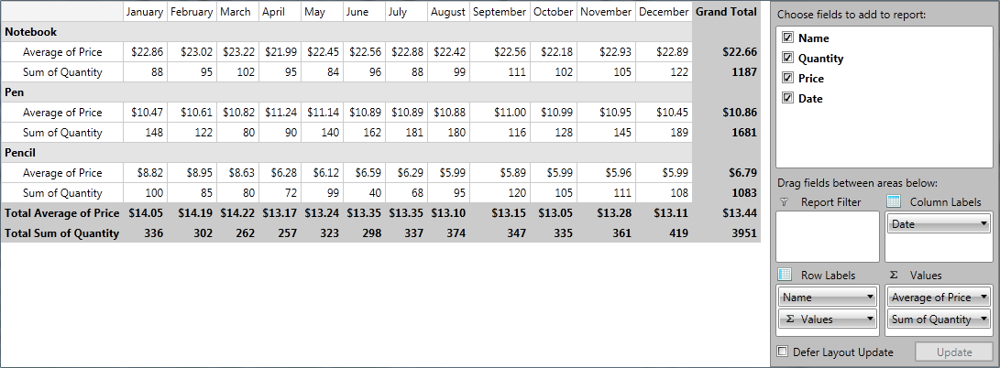

# PivotFieldList

__RadPivotFieldList__ is an integral part of __RadPivotGrid__. It gives the users the power to modify __RadPivotGrid__ and generate many different reports with the current data.

The control provides the following **key features**:

* Automatically change __RadPivotGrid__ generated report when the "Defer Layout Update" is unchecked.

* Using CheckBoxes to mark the data you want to include in the __RadPivotGrid__.

* Using __RadContextMenu__ to apply modifications on __RadPivotGrid__ runtime:

	* Sorting ascending and descending

	* Apply Number Format from the predefined formats or create your own

	* Change currently used Aggregate function

	* Applying different filters - Label, Value, Top10 filter

	* Using different Calculations for GrandTotals

	* Using percent of GrandTotal instead showing the whole number.

We will now demonstrate how to integrate __RadPivotFieldList__ with __RadPivotGrid__. We will extend our project from the [Getting Started]() article for __RadPivotGrid__.

## Adding RadPivotFieldList

>__RadPivotFieldList__ can be used after adding reference to the following assemblies:

>	* Telerik.Windows.Controls
>	* Telerik.Windows.Controls.PivotFieldList
>	* Telerik.Windows.Controls.Navigation
>	* Telerik.Windows.Controls.Input
>	* Telerik.Windows.Controls.Data
>	* Telerik.Windows.Controls.Pivot
>	* Telerik.Pivot.Core


>	* Telerik.Windows.Controls
>	* Telerik.Windows.Controls.PivotFieldList
>	* Telerik.Windows.Controls.Navigation
>	* Telerik.Windows.Controls.Input
>	* Telerik.Windows.Controls.Pivot
>	* Telerik.Pivot.Core
>	* System.Runtime.Serialization


You can add your __RadPivotFieldList__ directly in the XAML. First step is to define __pivot__ namespace: __xmlns:pivot="http://schemas.telerik.com/2008/xaml/presentation/pivot"__. After that add the code below:        	

#### __XAML__  
{{region radpivotgrid-fieldlist-getting-started_1}}
	<pivot:RadPivotFieldList Name="radPivotFieldList1" Grid.Column="1" />
{{endregion}}

Now the only thing you have to set is the DataProvider:        	

#### __XAML__  
{{region radpivotgrid-fieldlist-getting-started_2}}
	<pivot:RadPivotFieldList Name="radPivotFieldList1" Grid.Column="1"  DataProvider="{StaticResource LocalDataProvider}"/>
{{endregion}}

Here's the result of the modified application from [Getting Started]() article:

Now by using __RadPivotFieldList__ you are able to modify __RadPivotGrid__ at runtime and to generate reports with entire new structure and information. For example, you can transpose the grid by switching the rows and columns of the field list:

>tip The OlapDataProviders (AdomdDataProvider and XmlaDataProvider) have a default distinct values limit of 1000 records. This is why if you have more distinct values in your database you won't see them all in the pivot field list control. To alter this number, set the [DistinctValuesLimit]() property of the provider.

## See Also 
 * [RadPivotFieldList]()
 * [RadPivotGrid Getting Started]()
 * [Populating with Data]()
