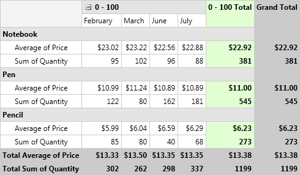
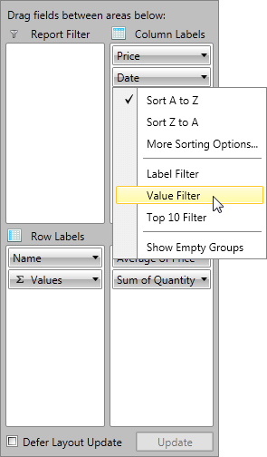
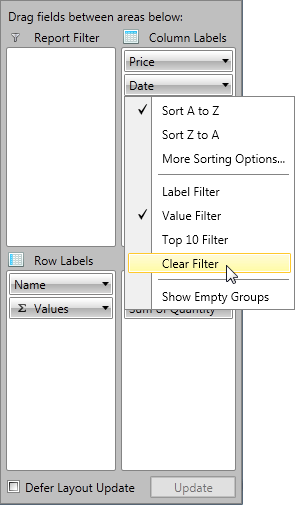

# Group Filtering

In this article we will show you how to apply different filters on your RowGroupDescriptions and ColumnGroupDescriptions.      

## Filter Types

The Data in __RadPivotGrid__ can be filtered based on several conditions to give you a view on specific details or just to make the report shorter. There are three types of filters you may use on your __RowGroupDescriptions__/__ColumnGroupDescriptions__.        

* __Label filter__ - filters the report based on the Header name.            

* __Value filter__ - filters the report based on one of the aggregates used.            

* __Top 10 filter__ - filters the report based on one of the aggregates used, but shows top/bottom results of applied filter.            

>Groups Filtering of QueryableDataProvider, for the first grouping aggregate, will be performed on the server. Every other Groups Filtering will be executed on the local data.        

## Label Filter

The __LabelFilter__ is used for filtering the data based on the Headers (row or column). The LabelFilter is using one of the following conditions:        

* __equals__ - showing only groups which header fully match the parameter we pass.            

* __does not equal__ - showing all groups which header does NOT match the parameter we pass.            

* __is greater than__ - show only groups which header is greater than the parameter we pass. Note that you should put in the whole header value which has to be matched. For example if you have headers *"Data1"*, *"Data2"*, *"Data3"* and you set this condition with parameter *"Data1"* you will see only *"Data2"* and *"Data3"* in __RadPivotGrid__, but if you set the parameter of the condition to *"Data"* then all of the groups will show as all of them *are greater than* "Data" by string comparison.            

* __is greater than or equal to__ - showing only groups which header is greater or equal of the parameter we pass.            

* __is less than__ - show only groups which header is smaller than the parameter we pass.            

* __is less than or equal to__ - showing only groups which header is smaller is or equal of the parameter we pass. Note that the full header text has to match in order to apply the equal comparison.            

* __begins with__ - showing only groups which header starts with the parameter we pass.            

* __does not begin with__ - showing only groups which header does NOT start with the parameter we pass.            

* __ends with__ - showing only groups which header ends with the parameter we pass.            

* __does not end with__ - showing only groups which header does NOT end with the parameter we pass.            

* __contains__ - showing only groups which header contains the parameter we pass.            

* __does not contain__ - showing only groups which header does NOT contain the parameter we pass.            

* __is between__ - showing only groups which header is between the two parameters we pass.            

* __is not between__ - showing only groups which header is NOT between the two parameters we pass.            

>importantAll conditions are using string comparison between the headers of the groups and the passed parameters. The case-sensitivity depends on the field in the table (if data is in database).

### Defining Label Filter

__Label Filter__ can be defined in the __XAML__, code behind or even at runtime by using __RadPivotFieldList__. To apply Label Filter you should set it to the *GroupFilter* property of the QueryablePropertyGroupDescription/QueryableDoubleGroupDescription/QueryableDateTimeGroupDescription. To define Label Filter, use the __LabelGroupFilter__ class from __Telerik.Pivot.Core.Filtering__ namespace. Each __LabelGroupFilter__ must have a *Condition* defined. The *Condition* can be:             

* __ComparisonCondition__ - used to compare the Header with the value set in the *Than* property based on the *Condition* property.                  

* __IntervalCondition__ - used when you want to show only data that is (not) between two values set in the *From* and *To* properties based on the *Condition* property.                  

* __SetCondition__ - used when you want to show only particular items that include/does not include particular items defined in the *Items* property based on the *Comparison* property.                  

* __TextCondition__ - used when you want to filter the data based on a string value defined in *Pattern* property. The *Comparison* property gives different options for the comparison method.                  

* __ItemsFilterCondition__ - used when you want to apply to conditions simultaneously (it is mandatory one of them to be SetCondition). *ItemsFilterCondition* has property Condition where you can set an instance of Comparison, Interval or Text conditions. The property DistinctCondition needs an instance of SetCondition.                  

#### __XAML__

{{region radpivotgrid-features-queryable-group-filter_1}}
	<pivot:QueryablePropertyGroupDescription PropertyName="ShipCountry">
	    <pivot:QueryablePropertyGroupDescription.GroupFilter>
	        <pivot:LabelGroupFilter>
	            <pivot:LabelGroupFilter.Condition>
	                <pivot:TextCondition Comparison="Contains" Pattern="C"/>
	            </pivot:LabelGroupFilter.Condition>
	        </pivot:LabelGroupFilter>
	    </pivot:QueryablePropertyGroupDescription.GroupFilter>
	</pivot:QueryablePropertyGroupDescription>
{{endregion}}

#### __C#__

{{region radpivotgrid-features-queryable-group-filter_1}}
	var shipCountryGroupDescription = new QueryableDoubleGroupDescription();
	shipCountryGroupDescription.PropertyName = "ShipCountry";
	var labelGroupFilter = new LabelGroupFilter();
	var textCondition = new TextCondition();
	textCondition.Comparison = TextComparison.Contains;
	textCondition.Pattern = "C";
	labelGroupFilter.Condition = textCondition;
	shipCountryGroupDescription.GroupFilter = labelGroupFilter;
{{endregion}}

#### __VB.NET__

{{region radpivotgrid-features-queryable-group-filter_1}}
	Dim shipCountryGroupDescription = New QueryableDoubleGroupDescription()
	shipCountryGroupDescription.PropertyName = "ShipCountry"
	Dim labelGroupFilter = New LabelGroupFilter()
	Dim textCondition = New TextCondition()
	textCondition.Comparison = TextComparison.Contains
	textCondition.Pattern = "C"
	labelGroupFilter.Condition = textCondition
	shipCountryGroupDescription.GroupFilter = labelGroupFilter
{{endregion}}

And here is how to apply ItemsFilterCondition:             

#### __XAML__

{{region radpivotgrid-features-queryable-group-filter_4}}
	<pivot:QueryablePropertyGroupDescription PropertyName="ShipCountry">
	    <pivot:QueryablePropertyGroupDescription.GroupFilter>
	        <pivot:LabelGroupFilter>
	            <pivot:LabelGroupFilter.Condition>
	                <pivot:ItemsFilterCondition>
	                    <pivot:ItemsFilterCondition.DistinctCondition>
	                        <pivot:SetCondition Comparison="Includes">
	                            <pivot:SetCondition.Items>
	                                <sys:String>Brazil</sys:String>
	                                <sys:String>Canada</sys:String>
	                                <sys:String>Denmark</sys:String>
	                            </pivot:SetCondition.Items>
	                        </pivot:SetCondition>
	                    </pivot:ItemsFilterCondition.DistinctCondition>
	                    <pivot:ItemsFilterCondition.Condition>
	                        <pivot:TextCondition Comparison="Contains" Pattern="n" />
	                    </pivot:ItemsFilterCondition.Condition>
	                </pivot:ItemsFilterCondition>
	            </pivot:LabelGroupFilter.Condition>
	        </pivot:LabelGroupFilter>
	    </pivot:QueryablePropertyGroupDescription.GroupFilter>
	</pivot:QueryablePropertyGroupDescription>
{{endregion}}

#### __C#__

{{region radpivotgrid-features-queryable-group-filter_4}}
	var shipCountryGroupDescription = new QueryablePropertyGroupDescription();
	shipCountryGroupDescription.PropertyName = "ShipCountry";
	
	var textCondition = new TextCondition();
	textCondition.Comparison = TextComparison.Contains;
	textCondition.Pattern = "n";
	
	var distinctCondition = new SetCondition();
	distinctCondition.Comparison = SetComparison.Includes;
	distinctCondition.Items.Add("Brazil");
	distinctCondition.Items.Add("Canada");
	distinctCondition.Items.Add("Denmark");
	
	var itemsFilterCondition = new ItemsFilterCondition();
	itemsFilterCondition.Condition = textCondition;
	itemsFilterCondition.DistinctCondition = distinctCondition;
	
	var labelGroupFilter = new LabelGroupFilter();
	labelGroupFilter.Condition = itemsFilterCondition;
	shipCountryGroupDescription.GroupFilter = labelGroupFilter;
{{endregion}}

#### __VB.NET__

{{region radpivotgrid-features-queryable-group-filter_4}}
	Dim shipCountryGroupDescription = New QueryablePropertyGroupDescription()
	shipCountryGroupDescription.PropertyName = "ShipCountry"
	
	Dim textCondition = New TextCondition()
	textCondition.Comparison = TextComparison.Contains
	textCondition.Pattern = "n"
	
	Dim distinctCondition = New SetCondition()
	distinctCondition.Comparison = SetComparison.Includes
	distinctCondition.Items.Add("Brazil")
	distinctCondition.Items.Add("Canada")
	distinctCondition.Items.Add("Denmark")
	
	Dim itemsFilterCondition = New ItemsFilterCondition()
	itemsFilterCondition.Condition = textCondition
	itemsFilterCondition.DistinctCondition = distinctCondition
	
	Dim labelGroupFilter = New LabelGroupFilter()
	labelGroupFilter.Condition = itemsFilterCondition
	shipCountryGroupDescription.GroupFilter = labelGroupFilter
{{endregion}}

This way the only visible items will be Canada and Denmark as they are part of the SetCondition and also have "n" in their names which satisfies the text condition.

## Value Filter

__Value Filter__ is applied on __RowGroupDescriptions__/__ColumnGroupDescriptions__ based on the *GrandTotals* of one of the Aggregation descriptions used in the application. To apply value filter you have to use one of the predefined conditions:        

* __equals__ - showing only groups which header fully matches the parameter we pass.            

* __does not equal__ - showing all groups which header does NOT match the parameter we pass.            

* __is greater than__ - show only groups which header is greater than the parameter we pass.            

* __is greater than or equal to__ - showing only groups which header is greater or equal of the parameter we pass.            

* __is less than__ - show only groups which header is smaller than the parameter we pass.            

* __is less than or equal to__ - showing only groups which header is smaller is or equal of the parameter we pass.            

* __is between__ - showing only groups which header is between the two parameters we pass.            

* __is not between__ - showing only groups which header is NOT between the two parameters we pass.            

>important__Value Filter__ is filtering the groups by number comparison between the *GrandTotals* of the groups and the parameters we pass, while __Label Filter__ is a string filter.          

__RadPivotGrid__ without __Value Filter__:

__RadPivotGrid__ after __Value Filter__ is applied:

Defining Value Filter

__Value Filter__ can be defined in __XAML__, code behind or at runtime by using __RadPivotFieldList__. Defining in the code is using *ValueGroupFilter* class from __Telerik.Pivot.Core__ namespace. Each object of this type must have *Condition* defined. *Condition* can be any of these:              

* __ComparisonCondition__ - used to compare the Header with the value set in the *Than* property based on the *Condition* property.                  

* __IntervalCondition__ - used when you want to show only data that is (not) between two values set in the *From* and *To* properties based on the *Condition* property.                  

#### __XAML__

{{region radpivotgrid-features-queryable-group-filter_2}}
	<pivot:QueryablePropertyGroupDescription PropertyName="ShipCountry">
	    <pivot:QueryablePropertyGroupDescription.GroupFilter>
	        <pivot:ValueGroupFilter AggregateIndex="0">
	            <pivot:ValueGroupFilter.Condition>
	                <pivot:IntervalCondition Condition="IsBetween" From="50" To="70"/>
	            </pivot:ValueGroupFilter.Condition>
	        </pivot:ValueGroupFilter>
	    </pivot:QueryablePropertyGroupDescription.GroupFilter>
	</pivot:QueryablePropertyGroupDescription>
{{endregion}}

#### __C#__

{{region radpivotgrid-features-queryable-group-filter_2}}
	var shipCountryGroupDescription = new QueryablePropertyGroupDescription();
	shipCountryGroupDescription.PropertyName = "ShipCountry";
	var intervalCondition = new IntervalCondition();
	intervalCondition.Condition = IntervalComparison.IsBetween;
	intervalCondition.From = 50;
	intervalCondition.To = 70;
	
	var valueGroupFilter = new ValueGroupFilter();
	valueGroupFilter.AggregateIndex = 0;
	valueGroupFilter.Condition = intervalCondition;
	shipCountryGroupDescription.GroupFilter = valueGroupFilter;
{{endregion}}

#### __VB.NET__

{{region radpivotgrid-features-queryable-group-filter_2}}
	Dim shipCountryGroupDescription = New QueryablePropertyGroupDescription()
	shipCountryGroupDescription.PropertyName = "ShipCountry"
	Dim intervalCondition = New IntervalCondition()
	intervalCondition.Condition = IntervalComparison.IsBetween
	intervalCondition.From = 50
	intervalCondition.To = 70
	
	Dim valueGroupFilter = New ValueGroupFilter()
	valueGroupFilter.AggregateIndex = 0
	valueGroupFilter.Condition = intervalCondition
	shipCountryGroupDescription.GroupFilter = valueGroupFilter
{{endregion}}

## Top 10 filter

__Top 10 filter__ is used when you want to show only the top/bottom items based on some criteria. The criteria is one of the Aggregate Descriptions used in the application. You can show the exact count of top/bottom items to show based on the selected aggregate description, the top items which sum is near the one you set as parameter or the top/bottom items which sum presents percent of the GrandTotal (you choose the percent).        

For example if you have the following RadPivotGrid:

And you apply a Top 10 filter on the Date columns to show the top 4 items based on the Average Price Aggregate Description the result will be:

Defining Top 10 filter

You can define *Top 10 filter* in the __XAML__, in the code behind or at runtime by using __RadPivotFieldList__. When defining this filter you have to note that __PropertyGroupDescription__, __DoubleGroupDescription__ and __DateTimeGroupDescription__ all have *GroupFilter* property. To apply *Top 10 filter* you can set as *GroupFilter* any of the following: __GroupsCountFilter__, __GroupsPercentFilter__, __GroupsSumFilter__.              

* __GroupsCountFilter__ - selects a specific number of groups sorted by a given criteria. It is important to define the *Count* property which indicates the number of groups that will be shown, *Selection* property, which defines if the Top or Bottom groups will be shown and *AggregateIndex* property which defines which Aggregate Description will be used for the filter.                  

* __GroupsPercentFilter__ - selects groups until the sum of their aggregates reaches a given percent of their total. It is important to define the *Percent* property which indicates the percentage of GrandTotal that selected groups should reach, *Selection* property, which defines if the Top or Bottom groups will be shown and *AggregateIndex* property which defines which Aggregate Description will be used for the filter.                  

>The *Percent* property is of type double. If you define value higher than 1.00 it will represent it as 100%.

* __GroupsSumFilter__ - selects from the groups until sum of their GrandTotals reaches a given number. It is important to define the *Sum* property which indicates the Sum of GrandTotal that selected groups should reach, *Selection* property, which defines if the Top or Bottom groups will be shown and *AggregateIndex* property which defines which Aggregate Description will be used for the filter.                  

#### __XAML__

{{region radpivotgrid-features-queryable-group-filter_3}}
	<pivot:QueryablePropertyGroupDescription PropertyName="ShipCountry">
	    <pivot:QueryablePropertyGroupDescription.GroupFilter>
	        <pivot:GroupsCountFilter AggregateIndex="0" Count="4" Selection="Top"/>
	    </pivot:QueryablePropertyGroupDescription.GroupFilter>
	</pivot:QueryablePropertyGroupDescription>
{{endregion}}

#### __C#__

{{region radpivotgrid-features-queryable-group-filter_3}}
	var shipCountryGroupDescription = new QueryablePropertyGroupDescription();
	shipCountryGroupDescription.PropertyName = "ShipCountry";
	var countFilter = new GroupsCountFilter();
	countFilter.AggregateIndex = 0;
	countFilter.Count = 4;
	countFilter.Selection = SortedListSelection.Top;
	shipCountryGroupDescription.GroupFilter = countFilter;
{{endregion}}

#### __VB.NET__

{{region radpivotgrid-features-queryable-group-filter_3}}
	Dim shipCountryGroupDescription = New QueryablePropertyGroupDescription()
	shipCountryGroupDescription.PropertyName = "ShipCountry"
	Dim countFilter = New GroupsCountFilter()
	countFilter.AggregateIndex = 0
	countFilter.Count = 4
	countFilter.Selection = SortedListSelection.Top
	shipCountryGroupDescription.GroupFilter = countFilter
{{endregion}}

## Applying filter at runtime

You can apply any of the filters at runtime by using __RadPivotFieldList__. When you click on any of the RowGroupDescriptions or ColumnGroupDescriptions you will see a menu with several options. Three of them are used for filtering: *"Label Filter"*, *"Value Filter"*,* "Top 10 filter"*:

When you choose any of them a new Dialog window will help you to adjust the needed attributes. Note that you can always remove applied filters by using the additional option from the drop-down content:

## See Also

 * [Getting Started]()

 * [RadPivotFieldList]()

 * [QueryableDataProvider]()

 * [Populating with Data]()

 * [QueryableDataProvider Overview]()
