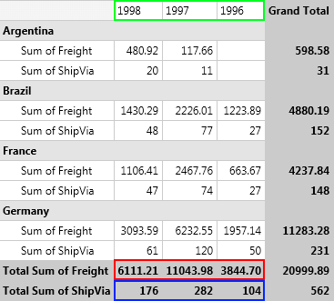
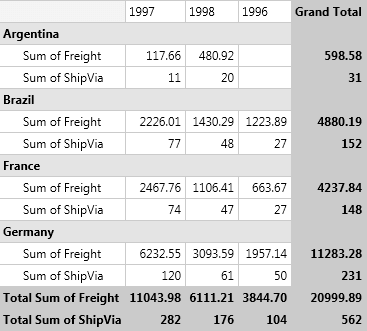
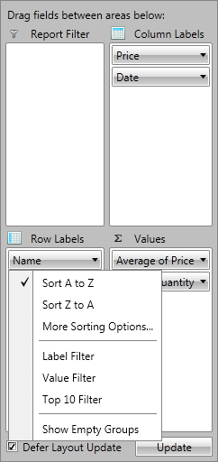
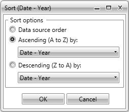

# Sorting

In this article you will find out how to sort your data based on the header names or the totals.

## Understanding Sorting Mechanism

__RadPivotGrid__ provides different sorting capabilities. You can sort your *RowGroupDescriptions* and *ColumnGroupDescriptions* ascending (from A to Z) and descending (from Z to A) based on the names of the properties they are showing or based on the aggregated description.        

With the __Q1 2014 SP1__ version of __Telerik UI for__ __RadPivotGrid__ provides an additional option. The data can be shown the way it was received from the data source using the __SortOrder__ property set to __None__.        

We will explain this with a simple __RadPivotGrid__:

The __ColumnGroupDescription__ in this __RadPivotGrid__ is the *OrderDate*. By default the sorting of the columns is ascending (from A to Z) based on the headers: *1996*, *1997*, *1998*. You can easily change the sorting of the *OrderDate* ColumnGroupDescription and set it to descending (from Z to A). This will lead to the following result:

The columns are reordered based on their names (check the green rectangle on the top of the image). You can apply sorting based on some of the __QueryablePropertyAggregateDescription__ you are using. In the example above you can apply sorting of the *OrderDate* ColumnGroupDescription in ascending (from A to Z) or descending (from Z to A) format based on the *Total Sum of Freight* (red rectangle) or *Total Sum of ShipVia* (blue rectangle). Here is the new view of __RadPivotGrid__ when the *OrderDate* ColumnGroupDescription is sorted in descending format based on the *Total Sum of Freight*:

>importantThe sorting is set on the __ColumnGroupDescriptions__ or __RowGroupDescriptions__. You cannot set sorting on the __AggregateDescriptions__, but you can sort the columns or rows based on the aggregated values.          

## Sort the data

The sorting can be applied in the __XAML__, in the code behind or even at runtime with the help of __RadPivotFieldList__.

* Sorting based on the GroupName (header) can be *Ascending (from A to Z)* or *Descending (from Z to A*). The default value is *Ascending*, but you can change it by using __SortOrder__ property:            

#### __XAML__

{{region radpivotgrid-features-queryable-sort_1}}
	<pivot:QueryablePropertyGroupDescription PropertyName="ShipCountry" SortOrder="Ascending"/>
	<pivot:QueryableDoubleGroupDescription PropertyName="Freight" SortOrder="Descending"/>
	<pivot:QueryableDateTimeGroupDescription PropertyName="OrderDate" SortOrder="Ascending"/>
{{endregion}}

#### __C#__

{{region radpivotgrid-features-queryable-sort_1}}
	var shipCountryGroupDescription = new QueryablePropertyGroupDescription();
	shipCountryGroupDescription.PropertyName = "ShipCountry";
	shipCountryGroupDescription.SortOrder = Telerik.Pivot.Core.SortOrder.Ascending;
	
	var freightCountryGroupDescription = new QueryableDoubleGroupDescription();
	freightCountryGroupDescription.PropertyName = "ShipCountry";
	freightCountryGroupDescription.SortOrder = Telerik.Pivot.Core.SortOrder.Descending;
	
	var orderDateCountryGroupDescription = new QueryableDateTimeGroupDescription();
	orderDateCountryGroupDescription.PropertyName = "OrderDate";
	orderDateCountryGroupDescription.SortOrder = Telerik.Pivot.Core.SortOrder.Ascending;
{{endregion}}

#### __VB.NET__

{{region radpivotgrid-features-queryable-sort_1}}
	Dim shipCountryGroupDescription = New QueryablePropertyGroupDescription()
	shipCountryGroupDescription.PropertyName = "ShipCountry"
	shipCountryGroupDescription.SortOrder = Telerik.Pivot.Core.SortOrder.Ascending
	
	Dim freightCountryGroupDescription = New QueryableDoubleGroupDescription()
	freightCountryGroupDescription.PropertyName = "ShipCountry"
	freightCountryGroupDescription.SortOrder = Telerik.Pivot.Core.SortOrder.Descending
	
	Dim orderDateCountryGroupDescription = New QueryableDateTimeGroupDescription()
	orderDateCountryGroupDescription.PropertyName = "OrderDate"
	orderDateCountryGroupDescription.SortOrder = Telerik.Pivot.Core.SortOrder.Ascending
{{endregion}}

* If you need to avoid the data to be sorted anyhow, you can set the __SortOrder__ property to __None__. This way the data will appear the way it is was received from the data source:            

#### __XAML__

{{region radpivotgrid-features-queryable-sort_3}}
	<pivot:QueryablePropertyGroupDescription PropertyName="ShipCountry" SortOrder="None"/>
	<pivot:QueryableDoubleGroupDescription PropertyName="Freight" SortOrder="None"/>
	<pivot:QueryableDateTimeGroupDescription PropertyName="OrderDate" SortOrder="None"/>
{{endregion}}

#### __C#__

{{region radpivotgrid-features-queryable-sort_3}}
	var shipCountryGroupDescription = new QueryablePropertyGroupDescription();
	shipCountryGroupDescription.PropertyName = "ShipCountry";
	shipCountryGroupDescription.SortOrder = Telerik.Pivot.Core.SortOrder.None;
	
	var freightCountryGroupDescription = new QueryableDoubleGroupDescription();
	freightCountryGroupDescription.PropertyName = "ShipCountry";
	freightCountryGroupDescription.SortOrder = Telerik.Pivot.Core.SortOrder.None;
	
	var orderDateCountryGroupDescription = new QueryableDateTimeGroupDescription();
	orderDateCountryGroupDescription.PropertyName = "OrderDate";
	orderDateCountryGroupDescription.SortOrder = Telerik.Pivot.Core.SortOrder.None;
{{endregion}}

#### __VB.NET__

{{region radpivotgrid-features-queryable-sort_3}}
	Dim shipCountryGroupDescription = New QueryablePropertyGroupDescription()
	shipCountryGroupDescription.PropertyName = "ShipCountry"
	shipCountryGroupDescription.SortOrder = Telerik.Pivot.Core.SortOrder.None
	
	Dim freightCountryGroupDescription = New QueryableDoubleGroupDescription()
	freightCountryGroupDescription.PropertyName = "ShipCountry"
	freightCountryGroupDescription.SortOrder = Telerik.Pivot.Core.SortOrder.None
	
	Dim orderDateCountryGroupDescription = New QueryableDateTimeGroupDescription()
	orderDateCountryGroupDescription.PropertyName = "OrderDate"
	orderDateCountryGroupDescription.SortOrder = Telerik.Pivot.Core.SortOrder.None
{{endregion}}

>Note that the __SortOrder None__ property is available with the __Q1 2014 SP1__ version of Telerik UI for WPFSilverlight.              

* Sorting based on the GrandTotals can be *Ascending* or *Descending*. To set such sort mechanism you have to use the __SortOrder__ and __GroupComparer__ properties:            

#### __XAML__

{{region radpivotgrid-features-queryable-sort_2}}
	<pivot:QueryablePropertyGroupDescription PropertyName="ShipCountry" SortOrder="Ascending">
	    <pivot:QueryablePropertyGroupDescription.GroupComparer>
	        <pivot:GrandTotalComparer AggregateIndex="0"/>
	    </pivot:QueryablePropertyGroupDescription.GroupComparer>
	</pivot:QueryablePropertyGroupDescription>
	<pivot:QueryableDoubleGroupDescription PropertyName="Freight" SortOrder="Descending">
	    <pivot:QueryablePropertyGroupDescription.GroupComparer>
	        <pivot:GrandTotalComparer AggregateIndex="1"/>
	    </pivot:QueryablePropertyGroupDescription.GroupComparer>
	</pivot:QueryableDoubleGroupDescription>
	<pivot:QueryableDateTimeGroupDescription PropertyName="OrderDate" SortOrder="Ascending">
	    <pivot:QueryablePropertyGroupDescription.GroupComparer>
	        <pivot:GrandTotalComparer AggregateIndex="0"/>
	    </pivot:QueryablePropertyGroupDescription.GroupComparer>
	</pivot:QueryableDateTimeGroupDescription>
{{endregion}}

#### __C#__

{{region radpivotgrid-features-queryable-sort_2}}
	var shipCountryGroupDescription = new QueryablePropertyGroupDescription();
	shipCountryGroupDescription.PropertyName = "ShipCountry";
	shipCountryGroupDescription.SortOrder = Telerik.Pivot.Core.SortOrder.Ascending;
	shipCountryGroupDescription.GroupComparer = new GrandTotalComparer() { AggregateIndex = 0 };
	
	var freightCountryGroupDescription = new QueryableDoubleGroupDescription();
	freightCountryGroupDescription.PropertyName = "Freight";
	freightCountryGroupDescription.SortOrder = Telerik.Pivot.Core.SortOrder.Descending;
	freightCountryGroupDescription.GroupComparer = new GrandTotalComparer() { AggregateIndex = 1 };
	
	var orderDateCountryGroupDescription = new QueryableDateTimeGroupDescription();
	orderDateCountryGroupDescription.PropertyName = "OrderDate";
	orderDateCountryGroupDescription.SortOrder = Telerik.Pivot.Core.SortOrder.Ascending;
	orderDateCountryGroupDescription.GroupComparer = new GrandTotalComparer() { AggregateIndex = 0 };
{{endregion}}

#### __VB.NET__

{{region radpivotgrid-features-queryable-sort_2}}
	Dim shipCountryGroupDescription = New QueryablePropertyGroupDescription()
	shipCountryGroupDescription.PropertyName = "ShipCountry"
	shipCountryGroupDescription.SortOrder = Telerik.Pivot.Core.SortOrder.Ascending
	shipCountryGroupDescription.GroupComparer = New GrandTotalComparer() With {.AggregateIndex = 0}
	
	Dim freightCountryGroupDescription = New QueryableDoubleGroupDescription()
	freightCountryGroupDescription.PropertyName = "Freight"
	freightCountryGroupDescription.SortOrder = Telerik.Pivot.Core.SortOrder.Descending
	freightCountryGroupDescription.GroupComparer = New GrandTotalComparer() With {.AggregateIndex = 1}
	
	Dim orderDateCountryGroupDescription = New QueryableDateTimeGroupDescription()
	orderDateCountryGroupDescription.PropertyName = "OrderDate"
	orderDateCountryGroupDescription.SortOrder = Telerik.Pivot.Core.SortOrder.Ascending
	orderDateCountryGroupDescription.GroupComparer = New GrandTotalComparer() With {.AggregateIndex = 0}
{{endregion}}

>The __AggregateIndex__ property is set based on the count of your aggregate descriptions. If you have two aggregates the first one will have __AggregateIndex = 0__ and the second - __AggregateIndex = 1__.

## Changing the Sorting at runtime

__RadPivotFieldList__ gives you the ability to change the sorting of a description at runtime. When you click on RowGroupDescription or ColumnGroupDescription a new popup opens with several sorting options. If you want to save the current sorting, but only change its order (for example the above __RadPivotGrid__ is sorted based on the Total Sum of Quantity in Descending order, and you want to change it to Ascending) you can use the first two options which are doing exactly this - just changing the __SortOrder__:

If you want to change the property based on which the sort is applied, then you can use the third option - More Sorting Options. A new RadWindow will be opened in which you can choose Ascending or Descending order of the sort. When you click the dropdown button you'll see a full list of the possible sorting basis:

## See Also

 * [Getting Started]()

 * [RadPivotFieldList]()

 * [QueryableDataProvider]()

 * [Populating with Data]()

 * [QueryableDataProvider Overview]()
