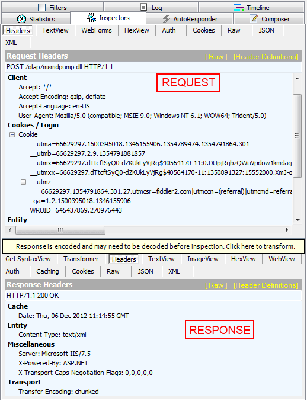
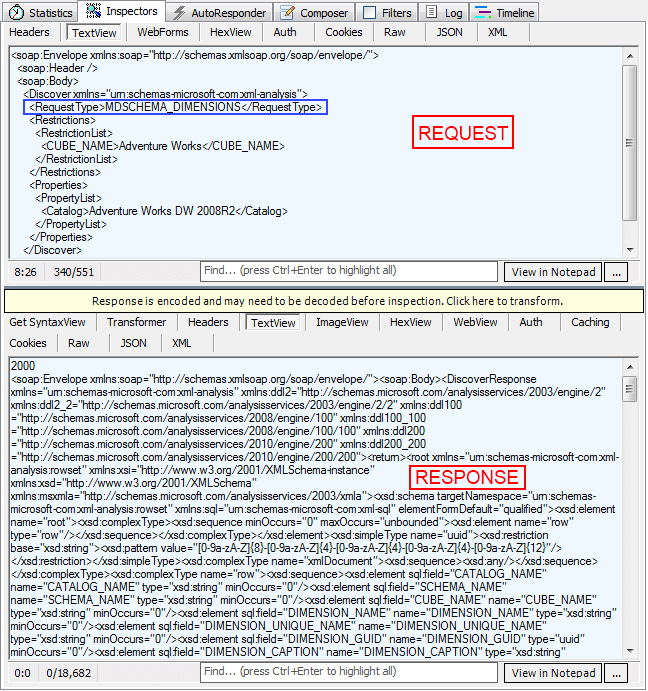
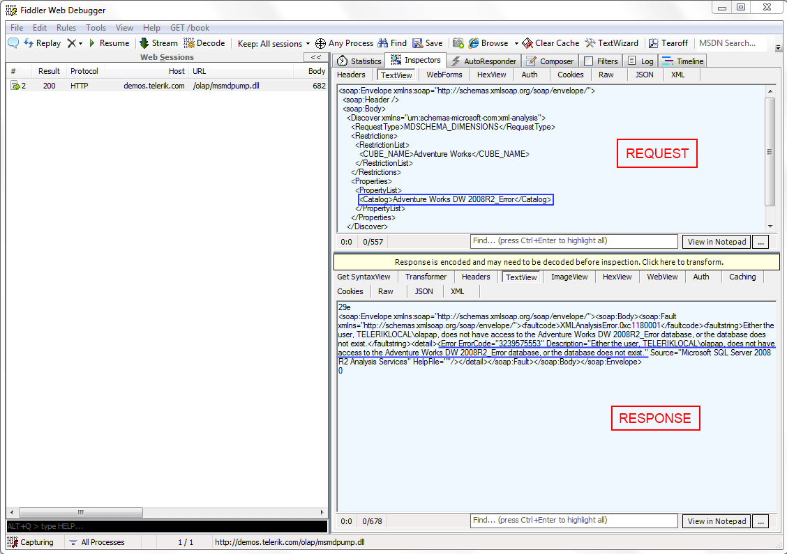

# Debugging XMLA problems

With __RadPivotGrid__ you have the ability to connect to OLAP Cube through http protocol by using XmlaDataProvider. This is great but at some point you may face different errors dedicated to the specifics of this protocol. For example your RadPivotGrid may be empty if there are some network connectivity issues. In this article we will explain how to "debug" such situations to check where the problem is.      

## Fiddler

You can use any http tracing utility, but Telerik recommends you to use [Fiddler](http://www.fiddler2.com/Fiddler2/version.asp). Fiddler is a Web Debugging Proxy which logs all HTTP(S) traffic between your computer and the Internet. Fiddler allows you to inspect traffic, set breakpoints, and "fiddle" with incoming or outgoing data. For our purposes we will use Fiddler to trace the traffic between our application and OLAP Cube. So after you have installed it it is time to run Fiddler and start debugging.        

## Fiddler Interface and debugging application

After you have started Fiddler it is time to run your application and connect to OLAP Cube. Fiddler automatically tracess all traffic and when your application is started you should see something simillar to this:

As you can see the protocol is HTTP. The Host is server where your OLAP Cube is deployed. The URL points to the virtual directory which is defined in your Internet Information Service (IIS). More information about this directory can be found in our article [Set Http access to OLAP Cube]().        

Select one of the rows on the left and lets take a look at the right part of the screen. You can see different menus and windows there. Lets go to "Inspectors" menu.

>If you cannot see "Inspectors" menu, go to View and Select "Inspectors" from there. Another option is to press F8 on your keyboard.

The top part of "Inspectors" shows the request that has been sent. The botton part shows the answer received from the server. As you can see you can check the whole request and response - their headers, Raw View, Text View, etc. Lets take a closer look at TextView option - you can see here the request that __RadPivotGrid__ sends and what is the response.

If everything is working fine you should have several requests with different Request Type (blue rectangle above): MDSCHEMA_DIMENSIONS, MDSCHEMA_HIERARCHIES, MDSCHEMA_LEVELS, MDSCHEMA_MEASURES, MDSCHEMA_SETS, MDSCHEMA_KPIS, etc. For each of them you should receive valid response from the server.        

If you see less requests in the left side of Fiddler, most probably there is some kind of problem. How can we figure out what it is? Lets see what is happening when we have set incorrect "Database name" in our XmlaDataProvider:

As you can see there is only one request in the left panel. So lets "Inspect" it. The request seems okay (in the blue rectangle you can check the incorrect name). In the response you can see the "Error" tag and its value. It is pretty easy to understand that there is mistake in the Database name so when you fix it in your application everything should work fine.       

So if your __RadPivotGrid__ doesn't show data from OLAP Cube, try tracing the requests and responses with Fiddler.        

## See Also

 * [RadPivotGrid Getting Started]()

 * [Set HTTP access to SQL Server]()

 * [Using XmlaDataProvider]()
