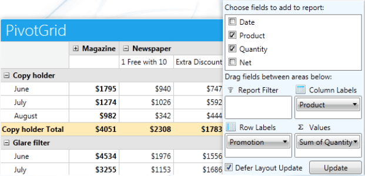
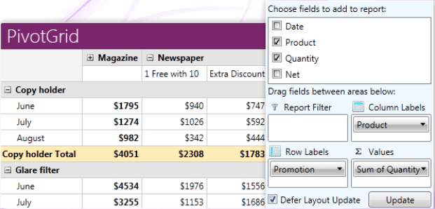

# Overview



Telerik __RadPivotGrid__ is a control used to aggregate millions of records in a concise tabular format. The data can be easily grouped, filtered, sorted and manipulated to create different reports.







__Key features__ list includes:

* __RadPivotGrid__ control provides features for filtering and sorting the data, so you can work with a small part of it.
      			

* __RadPivotGrid__ provides support for multiple datasources:
      			

	* Support for XMLA access to OLAP Cube.

	* Support for ADOMD access to OLAP Cube.

	* LocalDataSourceProvider with *ItemsSource* that implements *IEnumerable* interface.

	* QueryableDataProvider gives you the ability to execute all aggregations and calculations on the database server.
                

	* Support for XMLA access to OLAP Cube.

	* LocalDataSourceProvider with *ItemsSource* that implements *IEnumerable* interface.

* Built-in Aggregates: *Sum, Min, Max, Average, Count, etc.*

* Grouping and showing hierarchical structure.

* Applying visual represenation (string formats) to the data: currency, numbers after the decimal point, etc.

* Parallel asynchronous data processing.

* Different Pivot UI Layouts:  Compact, Outline, Tabular.

* Built-in runtime configuration control - [RadPivotFieldList]().

* Export to different formats - xlsx, docx, pdf, HTML.

* Serialization of the DataProviders, so you can save the current state and load it later.

You can check __RadPivotGrid__ demos at:
     	[RadPivotGrid FirstLook](https://demos.telerik.com/silverlight/#PivotGrid/FirstLook)[RadPivotGrid FirstLook](https://demos.telerik.com/wpf/#PivotGrid/FirstLook)

## See Also

 * [Getting Started]()

 * [RadPivotFieldList]()

 * [Populating with Data]()
