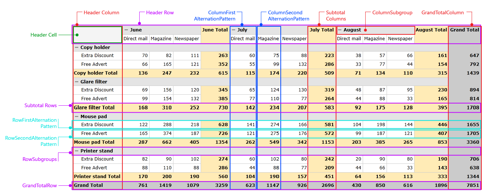

# QuickStyle

__RadPivotGrid__ provides easy styling method out of the box called __QuickStyle__. By using a custom __QuickStyle__ you can achieve a totally different visual representation with very little effort. This article will you help you to get familiar with the __QuickStyle__ and its customization potential.      

## QuickStyle Properties

The __QuickStyle__ is a property of __RadPivotGrid__ that accepts object of type __QuickStyle__. The __QuickStyle__ object contains many properties which affect different parts of __RadPivotGrid__. For example you could easily modify only the background of the header rows or change the altering colors of the columns using a custom __QuickStyle__. Each of the __QuickStyle__ properties accepts objects of type __ElementProperties__ or __AlternationElementProperties__ that should be configured as required. You can find below a list with all of the available __QuickStyle__ properties and their usage:
        
QuickStyle Property	|	Usage
---	|	---
HeaderColumn	|	Accepts object of type __ElementProperties__, affects the header columns at the left side of __RadPivotGrid__.
HeaderRow	|	Accepts object of type __ElementProperties__, affects the header rows at the top of __RadPivotGrid__.
HeaderCell	|	Accepts object of type __ElementProperties__, affects the header cell at the very top left side of __RadPivotGrid__.
RowSubgroups	|	Accepts object of type __ElementProperties__, affects the sub groups of each row.
ColumnSubgroups	|	Accepts object of type __ElementProperties__, affects the sub groups of each column.
GrandTotalRow	|	Accepts object of type __ElementProperties__, affects the grand total row at the very bottom of __RadPivotGrid__.
GrandTotalColumn	|	Accepts object of type __ElementProperties__, affects the grand total column at the very right side of __RadPivotGrid__.
SubtotalRows	|	Accepts object of type __ElementProperties__, affects each of the subtotal rows.
SubtotalColumns	|	Accepts object of type __ElementProperties__, affects each of the subtotal columns.
ColumnFirstAlternationPattern	|	Accepts object of type __AlternationElementProperties__, defines the first alternation pattern of the columns.
ColumnSecondAlternationPattern	|	Accepts object of type __AlternationElementProperties__, defines the second alternation pattern of the columns.
RowFirstAlternationPattern	|	Accepts object of type __AlternationElementProperties__, defines the first alternation pattern of the rows.
RowSecondAlternationPattern	|	Accepts object of type __AlternationElementProperties__, defines the second alternation pattern of the rows.

On __Figure 1__ you can see the parts of __RadPivotGrid__ that can be separately styled using __QuickStyle__.

Figure 1: QuickStyle styling options

>Note that each of the __QuickStyle__ properties has a specific priority. When same cell is styled through a few properties, the style with higher priority will be placed on the top and will be the visible one.          

__RadPivotGrid__ relays on the __QuickStyle__ in order to get visualized correctly. When applying a custom __QuickStyle__ it is highly recommended that the default one is extracted from the theme, modified as desired and applied afterwards. For example, you can see below the default __QuickStyle__ of __RadPivotGrid__ for Office Black Theme:        

#### __XAML__

{{region radpivotgrid-styles-and-templates-quickstyles_1}}
	<pivot:QuickStyle x:Key="PivotGridQuickStyle">
		<pivot:QuickStyle.HeaderRow>
			<pivot:ElementProperties BorderThickness="1" BorderBrush="{StaticResource CellLines}"/>
		</pivot:QuickStyle.HeaderRow>
		<pivot:QuickStyle.HeaderColumn>
			<pivot:ElementProperties BorderThickness="1" BorderBrush="{StaticResource CellLines}"/>
		</pivot:QuickStyle.HeaderColumn>
		<pivot:QuickStyle.HeaderCell>
			<pivot:ElementProperties Background="{StaticResource HeaderCellFill}" BorderThickness="1" BorderBrush="{StaticResource CellLines}"/>
		</pivot:QuickStyle.HeaderCell>
		<pivot:QuickStyle.RowSubgroups>
			<pivot:ElementProperties
					FontWeight="Bold"
					Background="{StaticResource SubHeadersFill}"
					BorderThickness="1"
					BorderBrush="{StaticResource CellLines}"
					Foreground="{StaticResource CellsForeground}"/>
		</pivot:QuickStyle.RowSubgroups>
		<pivot:QuickStyle.ColumnSubgroups>
			<pivot:ElementProperties
					FontWeight="Bold"
					Background="{StaticResource SubHeadersFill}"
					BorderThickness="1"
					BorderBrush="{StaticResource CellLines}"
					Foreground="{StaticResource CellsForeground}"/>
		</pivot:QuickStyle.ColumnSubgroups>
		<pivot:QuickStyle.ColumnFirstAlternationPattern>
			<pivot:AlternationElementProperties AlternationCount="1" BorderThickness="1" 
	                                            BorderBrush="{StaticResource CellLines}" 
	                                            Foreground="{StaticResource CellsForeground}" />
		</pivot:QuickStyle.ColumnFirstAlternationPattern>
		<pivot:QuickStyle.ColumnSecondAlternationPattern>
			<pivot:AlternationElementProperties AlternationCount="1" BorderThickness="1" 
	                                            BorderBrush="{StaticResource CellLines}" 
	                                            Foreground="{StaticResource CellsForeground}" />
		</pivot:QuickStyle.ColumnSecondAlternationPattern>
		<pivot:QuickStyle.RowFirstAlternationPattern>
			<pivot:AlternationElementProperties AlternationCount="1" BorderThickness="1" 
	                                            BorderBrush="{StaticResource CellLines}" 
	                                            Foreground="{StaticResource CellsForeground}" />
		</pivot:QuickStyle.RowFirstAlternationPattern>
		<pivot:QuickStyle.RowSecondAlternationPattern>
			<pivot:AlternationElementProperties AlternationCount="1" BorderThickness="1" 
	                                            BorderBrush="{StaticResource CellLines}" 
	                                            Foreground="{StaticResource CellsForeground}" />
		</pivot:QuickStyle.RowSecondAlternationPattern>
		<pivot:QuickStyle.SubtotalRows>
			<pivot:ElementProperties
					FontWeight="Bold"
					BorderThickness="1"
					BorderBrush="{StaticResource CellLines}"
					Background="{StaticResource RowSubTotalsFill}"
					Foreground="{StaticResource CellsForeground}"/>
		</pivot:QuickStyle.SubtotalRows>
		<pivot:QuickStyle.SubtotalColumns>
			<pivot:ElementProperties
					FontWeight="Bold"
					BorderThickness="1"
					BorderBrush="{StaticResource CellLines}"
					Background="{StaticResource ColumnSubTotalsFill}"
					Foreground="{StaticResource CellsForeground}"/>
		</pivot:QuickStyle.SubtotalColumns>
		<pivot:QuickStyle.GrandTotalRow>
			<pivot:ElementProperties
					FontWeight="Bold"
					Background="{StaticResource GrandTotalsFill}"
					BorderThickness="1"
					BorderBrush="{StaticResource CellLines}"
					Foreground="{StaticResource CellsForeground}"/>
		</pivot:QuickStyle.GrandTotalRow>
		<pivot:QuickStyle.GrandTotalColumn>
			<pivot:ElementProperties
					FontWeight="Bold"
					Background="{StaticResource GrandTotalsFill}"
					BorderThickness="1"
					BorderBrush="{StaticResource CellLines}"
					Foreground="{StaticResource CellsForeground}"/>
		</pivot:QuickStyle.GrandTotalColumn>
	</pivot:QuickStyle>
{{endregion}}

>importantWhen applying a custom __QuickStyle__ all of the properties of the default style should be included in order to have a correct appearance. If there are missing properties, the corresponding elements will appear without any styling.

<!-- -->

>importantIf the __QuickStyle__ property is set to *null* __RadPivotGrid__ will loose all of its styling.          

Afterwards the custom __QuickStyle__ should be applied the following way:        

#### __XAML__

{{region radpivotgrid-styles-and-templates-quickstyles_2}}
	<pivot:RadPivotGrid x:Name="pivot" QuickStyle="{StaticResource PivotGridQuickStyle}" />
{{endregion}}

>tipYou can download a runnable sample project demonstrating how to implement a custom __QuickStyle__ from our online SDK repository [here](https://github.com/telerik/xaml-sdk), the example is listed as __PivotGrid / PivotGridQuickStyles__.          

## See Also

 * [Layouts]()

 * [Understanding RadPivotGrid]()
