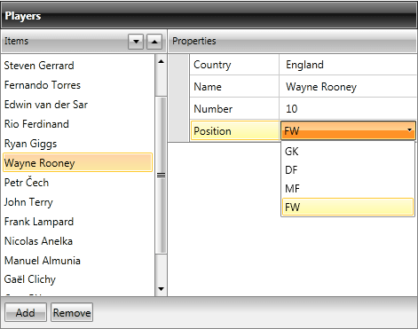
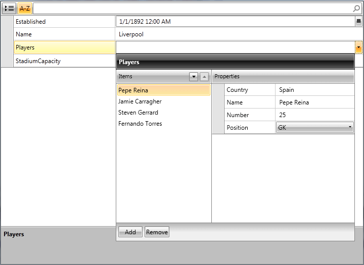
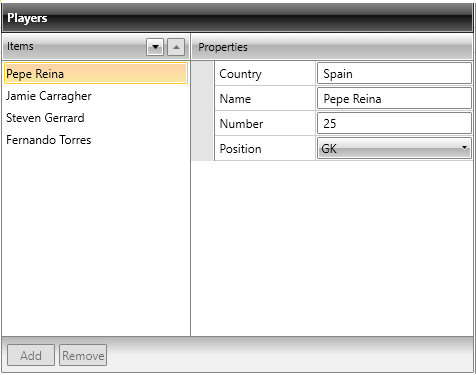

# CollectionEditors

__CollectionEditor__ and __CollectionEditorPicker__ are editor controls that provide UI for editing collections and their items. Currently they are used in the domain of RadPropertyGrid as default editors for **IEnumerable** type-compatible properties, but they can be successfully used out of this context as standalone editors:

#### __[XAML] Example 1: Defining CollectionEditor__

	{{region xaml-radpropertygrid-collectioneditor_0}}
	<Grid xmlns:telerik="http://schemas.telerik.com/2008/xaml/presentation">
	    <telerik:CollectionEditor Source="{Binding Players}" 
	                          Header="Players" />
	</Grid>
{{endregion}}

>importantIf you want CollectionEditor to work with a __custom collection__, then the edited collection type should implement __ICollectionView__ and __IEditableCollectionView__ interfaces.

## Dependencies

Both of them are located in the __Telerik.Windows.Controls.Data__ assembly (Telerik.Windows.Controls.Data.PropertyGrid namespace) and depend on the following assemblies:
        
* __Telerik.Windows.Data__

* __Telerik.Windows.Controls__

* __Telerik.Windows.Controls.Data__

* __Telerik.Windows.Control.Input__

## Internal Structure

CollectionEditor relies on the **IEditableCollectionView** interface. In case that the edited collection type implements ICollectionView and IEditableCollectionView, its custom implementation is utilized and if it does not, an instance of QueryableCollectionView is used instead.
        

The following listed commands, defined in the CollectionEditorCommands class, invoke their IEditableCollectionView method counterparts, when they are executed:

* __MoveCurrentToNext__

* __MoveCurrentToPrevious__

* __AddNew__

* __Delete__

## Customizing Commands

It is possible to customize the default commands for the CollectionEditor and the CollectionEditorPicker in a MVVM-friendly way. The following examples are using the CollectionEditor control but the same changes can be applied for the CollectionEditorPicker as well.

“Execute logic” methods

The methods listed below identify the logic that is executed when a certain command’s invocation takes place.

#### __[C#] Example 3: CollectionEditor's executable commands__

{{region cs-radpropertygrid-collectioneditor_1}}
	void MoveCurrentToNext();
	void MoveCurrentToPrevious();
	void Delete();
	void AddNew();
{{endregion}}

#### __[VB.NET] Example 3: CollectionEditor's executable commands__

{{region vb-radpropertygrid-collectioneditor_1}}
	Sub MoveCurrentToNext()
	Sub MoveCurrentToPrevious()
	Sub Delete()
	Sub AddNew()
{{endregion}}

“Can-execute logic” methods

With the help of those methods you can identify whether a certain command can be executed or not.

#### __[C#] Example 4: CollectionEditor's "can-execute" methods__

{{region cs-radpropertygrid-collectioneditor_2}}
	bool CanMoveCurrentToNextExecute();
	bool CanMoveCurrentToPreviousExecute();
	bool CanDeleteExecute();
	bool CanAddNewExecute();
{{endregion}}

#### __[VB.NET] Example 4: CollectionEditor's "can-execute" methods__

{{region vb-radpropertygrid-collectioneditor_2}}
	Function CanMoveCurrentToNextExecute() As Boolean
	Function CanMoveCurrentToPreviousExecute() As Boolean
	Function CanDeleteExecute() As Boolean
	Function CanAddNewExecute() As Boolean
{{endregion}}

## Designing a custom CommandProvider

The first step is to create your own class that inherits from **CollectionNavigatorBaseCommandProvider**:

#### __[C#] Example 5: Creating a class that provides the custom commands__

{{region cs-radpropertygrid-collectioneditor_3}}
	public class CustomCommandProvider : CollectionNavigatorBaseCommandProvider
	{
	    public CustomCommandProvider() : base(null)
	    {
	    }
	    public CustomCommandProvider(CollectionNavigatorBase collectionEditor)
	        : base(collectionEditor)
	    {
	        this.CollectionNavigator = collectionEditor;
	    }
	}
{{endregion}}

#### __[VB.NET] Example 5: Creating a class that provides the custom commands__

{{region vb-radpropertygrid-collectioneditor_3}}
	Public Class CustomCommandProvider
	    Inherits CollectionNavigatorBaseCommandProvider
	    Public Sub New()
	        MyBase.New(Nothing)
	    End Sub
	    Public Sub New(ByVal collectionEditor As CollectionNavigatorBase)
	        MyBase.New(collectionEditor)
	        Me.CollectionNavigator = collectionEditor
	    End Sub
	End Class
{{endregion}}

Those commands, which logic is up to get customized, should have their corresponding methods overridden. In the following example we will customize: MoveCurrentToNext, MoveCurrentToPrevious.

## MoveCurrentToNext and MoveCurrentToPrevious

In case you have a requirement to ask for the customer`s approval when moving through items, you need to update the commands as in the following examples:

#### __[C#] Example 6: Overriding the default commands__

{{region cs-radpropertygrid-collectioneditor_4}}
	public override void MoveCurrentToNext()
	{
	    MessageBoxResult result = MessageBox.Show("MoveCurrentToNext ?", "MoveCurrentToNext", MessageBoxButton.OKCancel);
	    if (result == MessageBoxResult.OK)
	    {
	        this.CollectionNavigator.MoveCurrentToNext();
	    }
	}
	public override void MoveCurrentToPrevious()
	{
	    MessageBoxResult result = MessageBox.Show("MoveCurrentToPrevious ?", "MoveCurrentToPrevious", MessageBoxButton.OKCancel);
	    if (result == MessageBoxResult.OK)
	    {
	        this.CollectionNavigator.MoveCurrentToPrevious();
	    }
	}
{{endregion}}

#### __[VB.NET] Example 6: Overriding the default commands__

{{region vb-radpropertygrid-collectioneditor_4}}
	Public Overrides Sub MoveCurrentToNext()
	    Dim result As MessageBoxResult = MessageBox.Show("MoveCurrentToNext ?", "MoveCurrentToNext", MessageBoxButton.OKCancel)
	    If result = MessageBoxResult.OK Then
	        Me.CollectionNavigator.MoveCurrentToNext()
	    End If
	End Sub
	Public Overrides Sub MoveCurrentToPrevious()
	    Dim result As MessageBoxResult = MessageBox.Show("MoveCurrentToPrevious ?", "MoveCurrentToPrevious", MessageBoxButton.OKCancel)
	    If result = MessageBoxResult.OK Then
	        Me.CollectionNavigator.MoveCurrentToPrevious()
	    End If
	End Sub
{{endregion}}

The last thing to be done is to set CommandProvider Property of the CollectionEditor to be the newly-created CustomCommandProvider class:

#### __[XAML] Example 7: Assigning the CommandProvider__

{{region xaml-radpropertygrid-collectioneditor_5}}
	<telerik:CollectionEditor x:Name="CollectionEditor"
	              	  Source="{Binding Employees}"/>
{{endregion}}

#### __[C#] Example 8: Assigning the CommandProvider__

{{region cs-radpropertygrid-collectioneditor_6}}
	this.CollectionEditor.CommandProvider = new CustomCommandProvider(this.CollectionEditor);
{{endregion}}

#### __[VB.NET] Example 8: Assigning the CommandProvider__

{{region vb-radpropertygrid-collectioneditor_6}}
	Me.CollectionEditor.CommandProvider = New CustomCommandProvider(Me.CollectionEditor)
{{endregion}}

Modifying the methods will result in the following action when trying to move to the next item:

## Add/Remove Items 

**CollectionEditor** allows you to add and remove items to the underlying collection through the **Add** and **Remove** buttons. The availability of this functionality relies on the type of the bound collection and whether it supports such operations. **Figure 1** and **Figure 2** show the state of the buttons when the **CollectionEditor** is bound to an **ObservableCollection** and an **Array** respectively.

>important **The business object should expose a default constructor in order to have the "Add" button enabled.**

#### **Figure 1: CollectionEditor bound to a collection that supports add/remove functionalities**

#### **Figure 2: CollectionEditor bound to a collection that does not support add/remove functionalities**

## See Also

* [Nested Properties]()

* [Data Annotations]()

* [Defining Property Sets]()