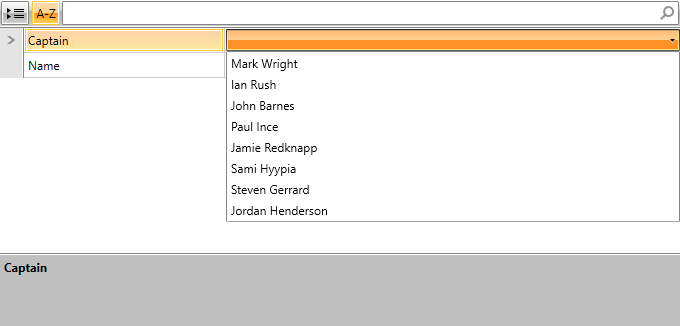
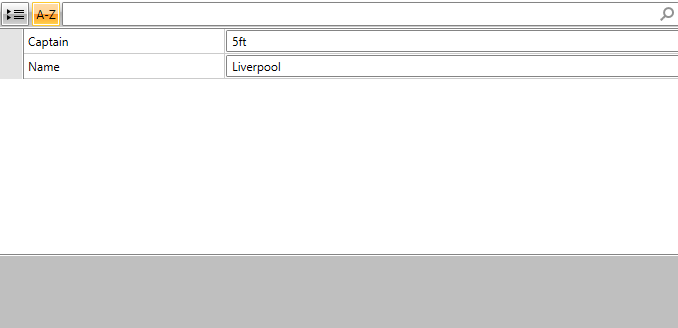

# TypeConverter Support

In certain cases, __RadPropertyGrid__ is used for displaying and editing properties of custom data type. By default, in such scenarios the control will display the custom type as a string. RadPropertyGrid provides __TypeConverter__ support, meaning that this behavior can be modified by defining a custom __TypeConverter__. The main methods that are usually utilized when implementing a custom __TypeConverter__ are listed below.

* Override the __CanConvertFrom__ method that specifies which type the converter can convert from.

* Override the __ConvertFrom__ method that implements the conversion.

* Override the __CanConvertTo__ method that specifies which type the converter can convert to.

* Override the __ConvertTo__ method that implements the conversion.

> More information on implementing a **TypeConverter** can be found in MSDN: [How to: Implement a Type Converter](https://msdn.microsoft.com/en-us/library/ayybcxe5.aspx).

* [Defining the Business Object](#defining-the-business-object)

 
* [Display a Predefined List of Values for a Property with TypeConverter](#display-a-predefined-list-of-values-for-a-property-with-typeconverter)


* [Culture-aware TypeConverter](#culture-aware-typeconverter)

## Defining the Business Object 

Demonstrating the __TypeConverter__ mechanism in the scope of RadPropertyGrid will require an object which has a property of custom data type. This section will cover the process of defining them.

The example will use a __Club__ object which has a __Captain__ property of type __Player__.

#### __[C#] Example 1: Defining the business object__

{{region cs-radpropertygrid-typeconverter-support_0}}
	 public class Club 
	{
	    private string name;
	    private Player captain; 
	
	    public string Name
	    {
	        get { return this.name; }
	        set
	        {
	            if (value != this.name)
	            {
	                this.name = value;
	            }
	        }
	    }
	
	    [TypeConverter(typeof(PlayerTypeConverter))]
	    public Player Captain
	    {
	        get { return captain;}
	        set 
	        { 
	            captain = value;
	        }
	    }
		
	
	    public Club()
	    {
	
	    }
	
	    public Club(string name, Player captain)
	    {
	        this.name = name;
	        this.captain = captain;
	    }
	}
	
	 public class Player
	 {
	     private string name;
	     private double height;
	
	     public string Name
	     {
	         get { return this.name; }
	         set
	         {
	             if (value != this.name)
	             {
	                 this.name = value;
	             }
	         }
	     }
	
	     public double Height
	     {
	         get { return this.height; }
	         set
	         {
	             if (value != this.height)
	             {
	                 this.height = value;
	             }
	         }
	     }
	
	     public Player()
	     {
	
	     }
	
	     public Player(string name, double height)
	     {
	         this.name = name;
	         this.height = height;
	     }
	 }
{{endregion}}

#### __[VB.NET] Example 1: Defining the business object__

{{region vb-radpropertygrid-typeconverter-support_0}}
	Public Class Club
	
	    Private m_name As String
	    Private m_captain As Player
	
	    Public Property Name() As String
	        Get
	            Return Me.m_name
	        End Get
	        Set(value As String)
	            If value <> Me.m_name Then
	                Me.m_name = value
	            End If
	        End Set
	    End Property
	
	    <TypeConverter(GetType(PlayerTypeConverter))> _
	    Public Property Captain() As Player
	        Get
	            Return m_captain
	        End Get
	        Set(value As Player)
	            m_captain = value
	        End Set
	    End Property
	
	    Public Sub New()
	    End Sub
	
	    Public Sub New(name As String, captain As Player)
	        Me.m_name = name
	        Me.m_captain = captain
	    End Sub
	End Class
	
	
	Public Class Player
	    
	    Private m_name As String
	    Private m_height As Double
	
	    Public Property Name() As String
	        Get
	            Return Me.m_name
	        End Get
	        Set(value As String)
	            If value <> Me.m_name Then
	                Me.m_name = value
	            End If
	        End Set
	    End Property
	
	    Public Property Height() As Double
	        Get
	            Return Me.m_height
	        End Get
	        Set(value As Double)
	            If value <> Me.m_height Then
	                Me.m_height = value
	            End If
	        End Set
	    End Property
	
	    Public Sub New()
	    End Sub
	
	    Public Sub New(name As String, height As Double)
	        Me.m_name = name
	        Me.m_height = height
	    End Sub
	End Class
{{endregion}}

 
## Display a Predefined List of Values for a Property with TypeConverter

As of __R1 2017__, the TypeConverter mechanism of RadPropertyGrid provides support for a standard set of values that can be picked from a predefined list. This can be done through overriding the __GetStandardValuesSupported__ method.

#### __[C#] Example 2: Defining a TypeConverter providing a default set of values__
{{region cs-radpropertygrid-typeconverter-support_2}}
	 public class PlayerTypeConverter : TypeConverter
	 {
	     public override bool GetStandardValuesSupported(ITypeDescriptorContext context)
	     {
	         return true;
	     }
	
	     public override bool GetStandardValuesExclusive(ITypeDescriptorContext context)
	     {
	         return true;
	     }
	
	     public override StandardValuesCollection GetStandardValues(ITypeDescriptorContext context)
	     {
	
	         return new StandardValuesCollection(new string[] { "Mark Wright", "Ian Rush", "John Barnes",
	                "Paul Ince", "Jamie Redknapp", "Sami Hyypia", "Steven Gerrard ", "Jordan Henderson" });
	     }
	 }
{{endregion}}

#### __[VB.NET] Example 2: Defining a TypeConverter providing a default set of values__

{{region vb-radpropertygrid-typeconverter-support_2}}
	Public Class PlayerTypeConverter
	    Inherits TypeConverter
	    Public Overrides Function GetStandardValuesSupported(context As ITypeDescriptorContext) As Boolean
	        Return True
	    End Function
	
	    Public Overrides Function GetStandardValuesExclusive(context As ITypeDescriptorContext) As Boolean
	        Return True
	    End Function
	
	    Public Overrides Function GetStandardValues(context As ITypeDescriptorContext) As StandardValuesCollection
	
	        Return New StandardValuesCollection(New String() {"Mark Wright", "Ian Rush", "John Barnes", "Paul Ince", "Jamie Redknapp", "Sami Hyypia", _
	            "Steven Gerrard ", "Jordan Henderson"})
	    End Function
	End Class
{{endregion}}

> If __EditorAttribute__ is set to a specific property with a set __TypeConverter__ the __EditorAttribute__ is with lower priority - a default set of values will be visualized if the __GetStandardValuesSupported__ is overridden instead of an editor.

#### __Figure 1: TypeConverter providing a default set of values__



## Culture-aware TypeConverter

In this section, the definition of a culture aware TypeConverter will be demonstrated. The support for it is added as of __R1 2017__. For this purpose, the __Height__ property of the __Player__ object  will be used.

#### __[C#] Example 3: Defining a culture aware TypeConverter__

{{region cs-radpropertygrid-typeconverter-support_3}}
	 public class PlayerTypeConverter1 : TypeConverter
	 {
	     private const double inchesToCentimetres = 2.54;
	     private const double centimetresToInches = 0.3937008;
	
	     public override bool CanConvertFrom(ITypeDescriptorContext context, Type sourceType)
	     {
	         if (sourceType == typeof(string))
	         {
	             return true;
	         }
	
	         return base.CanConvertFrom(context, sourceType);
	     }
	
	     public override bool CanConvertTo(ITypeDescriptorContext context, Type destinationType)
	     {
	         if (destinationType == typeof(string))
	         {
	             return true;
	         }
	
	         return base.CanConvertTo(context, destinationType);
	     }
	
	     public override object ConvertFrom(ITypeDescriptorContext context, CultureInfo culture, object value)
	     {
	         if (!(value is string))
	         {
	             return base.ConvertFrom(context, culture, value);
	         }
	
	         string val = (string)value;
	
	         string measure = val.Substring(val.Length - 2, 2).ToLower();
	         string dispValue = val.Substring(0, val.Length - 2);
	         double disp = double.Parse(dispValue);
	
	         if (measure.ToLower() == "ft")
	         {
	             return disp;
	         }
	         else
	         {
	             return disp * centimetresToInches;
	         }
	     }
	
	     public override object ConvertTo(ITypeDescriptorContext context, CultureInfo culture, object value, Type destinationType)
	     {
	         if (!(destinationType == typeof(string)))
	         {
	             return base.ConvertTo(context, culture, value, destinationType);
	         }
	
	         RegionInfo regionInfo = new RegionInfo(culture.LCID);
	         bool metric = regionInfo.IsMetric;
	
	         if (metric)
	         {
	             return string.Format("{0:F0}cm", (value as Player).Height);
	         }
	         else
	         {
	             double inches = (value as Player).Height * inchesToCentimetres;
	
	             return string.Format("{0:F0}ft", inches);
	         }
	     }
	 }
{{endregion}}

#### __[VB.NET] Example 3: Defining a culture-aware TypeConverter__

{{region vb-radpropertygrid-typeconverter-support_3}}
	Public Class PlayerTypeConverter1
	    Inherits TypeConverter
	    Private Const inchesToCentimetres As Double = 2.54
	    Private Const centimetresToInches As Double = 0.3937008
	
	    Public Overrides Function CanConvertFrom(context As ITypeDescriptorContext, sourceType As Type) As Boolean
	        If sourceType = GetType(String) Then
	            Return True
	        End If
	
	        Return MyBase.CanConvertFrom(context, sourceType)
	    End Function
	
	    Public Overrides Function CanConvertTo(context As ITypeDescriptorContext, destinationType As Type) As Boolean
	        If destinationType = GetType(String) Then
	            Return True
	        End If
	
	        Return MyBase.CanConvertTo(context, destinationType)
	    End Function
	
	    Public Overrides Function ConvertFrom(context As ITypeDescriptorContext, culture As CultureInfo, value As Object) As Object
	        If Not (TypeOf value Is String) Then
	            Return MyBase.ConvertFrom(context, culture, value)
	        End If
	
	        Dim val As String = DirectCast(value, String)
	
	        Dim measure As String = val.Substring(val.Length - 2, 2).ToLower()
	        Dim dispValue As String = val.Substring(0, val.Length - 2)
	        Dim disp As Double = Double.Parse(dispValue)
	
	        If measure.ToLower() = "ft" Then
	            Return disp
	        Else
	            Return disp * centimetresToInches
	        End If
	    End Function
	
	    Public Overrides Function ConvertTo(context As ITypeDescriptorContext, culture As CultureInfo, value As Object, destinationType As Type) As Object
	        If Not (destinationType = GetType(String)) Then
	            Return MyBase.ConvertTo(context, culture, value, destinationType)
	        End If
	
	        Dim regionInfo As New RegionInfo(culture.LCID)
	        Dim metric As Boolean = regionInfo.IsMetric
	
	        If metric Then
	            Return String.Format("{0:N2}cm", TryCast(value, Player).Height)
	        Else
	            Dim inches As Double = TryCast(value, Player).Height * inchesToCentimetres
	
	            Return String.Format("{0:F1}ft", inches)
	        End If
	    End Function
	End Class
{{endregion}}

#### __Figure 2: Culture-aware TypeConverter__

 

## See also

* [Data Annotations]()

* [Editor Attribute]()

