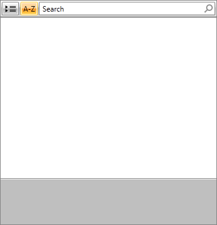
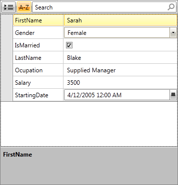
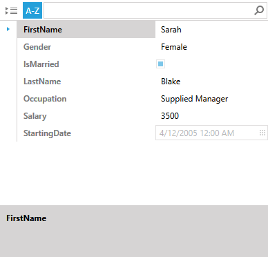

# Getting Started with RadPropertyGrid

This tutorial will walk you through the creation of a sample application that contains **RadPropertyGrid**.

## Assembly References

>In order to use **RadPropertyGrid** in your projects, you have to add references to the following assemblies:
>* __Telerik.Windows.Controls__
>* __Telerik.Windows.Controls.Data__
>* __Telerik.Windows.Data__
>* __Telerik.Windows.Controls.Input__

## Add RadPropertyGrid to Your Project

Before proceeding with adding **RadPropertyGrid** to your project, make sure the required assembly references are added to the project.

You can add **RadPropertyGrid** manually by writing the XAML code in **Example 1**. You can also add the control by dragging it from the **Visual Studio Toolbox** and dropping it over the XAML view.

#### __[XAML] Example 1: Adding RadPropertyGrid__

{{region xaml-radpropertygrid-getting-started-getting-started_0}}
	<Grid xmlns:telerik="http://schemas.telerik.com/2008/xaml/presentation">
	    <telerik:RadPropertyGrid x:Name="PropertyGrid1" />
	</Grid>
{{endregion}}

Now, if you run your application, you will see an empty RadPropertyGrid similarly to **Figure 1**.

#### __Figure 1: The empty RadPropertyGrid generated by the code in Example 1__

## Bind RadPropertyGrid to a Single Item

You may bind RadPropertyGrid to a single data item. Thus, you will be able to examine and edit its properties. The only thing you need is to set the **Item** property of RadPropertyGrid. The binding may be performed both in XAML and in the code-behind.

#### __[C#] Example 2: Binding to data item__

{{region cs-radpropertygrid-getting-started-getting-started_1}}
	this.PropertyGrid1.Item = new Employee()
	{
	    FirstName = "Sarah",
	    LastName = "Blake",
	    Occupation = "Supplied Manager",
	    StartingDate = new DateTime(2005, 04, 12),
	    IsMarried = true,
	    Salary = 3500,
	    Gender = Gender.Female
	};
{{endregion}}

#### __[VB.NET] Example 2: Binding to data item__
	
{{region vb-radpropertygrid-getting-started-getting-started_1}}
	Me.PropertyGrid1.Item = New Employee() With {
	  .FirstName = "Sarah",
	  .LastName = "Blake",
	  .Occupation = "Supplied Manager",
	  .StartingDate = New DateTime(2005, 4, 12),
	  .IsMarried = True,
	  .Salary = 3500,
	  .Gender = Gender.Female
	}
{{endregion}}

Once you set the Item and run the application you will see a RadPropertyGrid as the one illustrated in **Figure 2**.

#### __Figure 2: RadPropertyGrid bound to a single item__

## Bind RadPropertyGrid to a Visual Element

You can also bind the Item property of RadPropertyGrid to a visual element and still view and edit its properties. **Example 3** shows how to bind RadPropertyGrid's Item property to a **RadButton**.

#### __[XAML] Example 3: Binding to visual element__

{{region xaml-radpropertygrid-getting-started-getting-started_2}}
	<telerik:RadButton x:Name="button1" Content="MyButton" />
	<telerik:RadPropertyGrid Item="{Binding ElementName= button1}"/>
{{endregion}}

When you run the application, you will see the following RadPropertyGrid.

#### __Figure 3: RadPropertyGrid bound to a RadButton__

## Key Properties

* __LabelColumnWidth__: You could change the width of the first column in the RadPropertyGrid by setting a value for this property of the RadPropertyGrid.

* __IsGrouped__: Controls the current RadPropertyGrid's state. You can set it to true and you will have RadPropertyGrid initially grouped. If you set it to false, then you will have RadPropertyGrid sorted.

* __AutoGeneratePropertyDefinitions__: Indicates whether property definitions will be autogenerated.

* __DescriptionPanelVisibility__: Sets the visibility mode of the description panel.

* __CanUserResizeDescriptionPanel__: Indicates whether the user can resize the description panel.

* __Item__: Returns the item to edit.

* __PropertyDefinitions__: Returns a collection of PropertyDefinitions describing the properties displayed or edited by RadPropertyGrid.

* __SearchBoxVisibility__: Sets the visibility mode of the search box.

* __SortAndGroupButtonsVisibility__: Sets the visibility mode of the sort and group buttons.

* __FieldIndicatorVisibility__: A property of type __Visibility__, which indicates whether the indicator on the left side of the field is visible. When the RadPropertyGrid is grouped, the field indicator is always visible.

## Setting a Theme

The controls from our suite support different themes. You can see how to apply a theme different than the default one in the [Setting a Theme]() help article.

>important Changing the theme using implicit styles will affect all controls that have styles defined in the merged resource dictionaries. This is applicable only for the controls in the scope in which the resources are merged. 

To change the theme, you can follow the steps below:
* Choose between the themes and add reference to the corresponding theme assembly (ex: **Telerik.Windows.Themes.Windows8.dll**). You can see the different themes applied in the **Theming** examples from our [Silverlight Controls Samples](https://demos.telerik.com/silverlight/)[WPF Controls Samples](https://demos.telerik.com/wpf/).

* Merge the ResourceDictionaries with the namespace required for the controls that you are using from the theme assembly. For RadPropertyGrid, you will need to merge the following resources:

	* __Telerik.Windows.Controls__
	* __Telerik.Windows.Controls.Data__
	* __Telerik.Windows.Controls.Input__

__Example 4__ demonstrates how to merge the ResourceDictionaries so that they are applied globally for the entire application.

#### __[XAML] Example 4: Merge the ResourceDictionaries__  
{{region radpropertygrid-getting-started-getting-started_3}}
		<Application.Resources>
			<ResourceDictionary>
				<ResourceDictionary.MergedDictionaries>
	                <ResourceDictionary Source="/Telerik.Windows.Themes.Windows8;component/Themes/System.Windows.xaml"/>
	                <ResourceDictionary Source="/Telerik.Windows.Themes.Windows8;component/Themes/Telerik.Windows.Controls.xaml"/>
	                <ResourceDictionary Source="/Telerik.Windows.Themes.Windows8;component/Themes/Telerik.Windows.Controls.Data.xaml"/>
	                <ResourceDictionary Source="/Telerik.Windows.Themes.Windows8;component/Themes/Telerik.Windows.Controls.Input.xaml"/>
				</ResourceDictionary.MergedDictionaries>
			</ResourceDictionary>
		</Application.Resources>
{{endregion}}

__Figure 4__ shows RadPropertyGrid with the **Windows8** theme applied.
	
#### __Figure 4: RadPropertyGrid with the Windows8 theme__

## See Also

* [Nested Properties]()
* [Localization]().