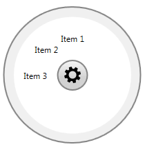
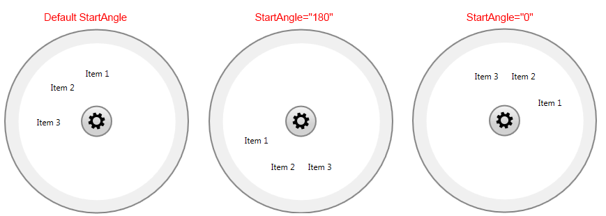
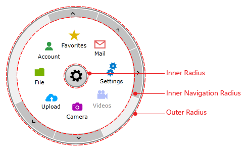

# Configuration

This help topic describes the basic properties used to configure the way __RadRadialMenu__ looks & behaves.

We will go through the following sections:

* [Open the RadialMenu](#open-the-radialmenu)

* [Change the size of the RadialMenu] (#change-the-size-of-the-radialmenu)

* [Change the StartAngle property](#change-the-startangle-property)

* [Change the Radius properties](#change-the-radius-properties)

* [Change the AnimationSpeedFactor property](#change-the-animationspeedfactor-property)

### Open the RadialMenu

Initially __RadRadialMenu__ is closed, you should click on the __RadialMenuButton__ in order to open it and show its items. __IsOpen__ boolean property of the __RadialMenu__ allows you to make it open by default. __Example 1__ shows how __IsOpen__ can be set.          

#### __[XAML] Example 1: Setting IsOpen property__

{{region xaml-radradialmenu-features-configuration_0}}
	<telerik:RadRadialMenu IsOpen="True">
	    <!--...-->
	</telerik:RadRadialMenu>
{{endregion}}

### Change the size of the RadialMenu

The size of __RadRadialMenu__ is set through __MinWidth__ and __MinHeight__ properties. Both should be set to the same value which refers to the diameter of the circle representing the menu.

#### __[XAML] Example 2: Setting MinWidth and MinHeight properties__

{{region xaml-radradialmenu-features-configuration_3}}
	<telerik:RadRadialMenu IsOpen="True" MinWidth="200" MinHeight="200">
	    <telerik:RadRadialMenuItem Header="Item 1" />
	    <telerik:RadRadialMenuItem Header="Item 2" />
	    <telerik:RadRadialMenuItem Header="Item 3" />
	</telerik:RadRadialMenu>
{{endregion}}

__Figure 1__ shows how the __RadialMenu__ looks in smaller size.     

Figure 1: Setting MinWidth and MinHeight properties
       

### Change the StartAngle property

__StartAngle__ property is used to set the angle at which the first __RadRadialMenuItem__ will be positioned.            

#### __[XAML] Example 3: Setting StartAngle property__

{{region xaml-radradialmenu-features-configuration_1}}
	<telerik:RadRadialMenu IsOpen="True" StartAngle="180" >
	    <telerik:RadRadialMenuItem Header="Item 1" />
	    <telerik:RadRadialMenuItem Header="Item 2" />
	    <telerik:RadRadialMenuItem Header="Item 3" />
	</telerik:RadRadialMenu>
{{endregion}}

__Figure 2__ shows how the __RadialMenu__ looks with different settings of the StartAngle property.            

Figure 2: Setting StartAngle property

### Change the Radius properties

__RadRadialMenu__ provides the following Radius properties:

* __InnerRadiusFactor__ - defines the inner radius of the panel holding all __RadRadialMenuItems__ as a fraction of the size of __RadRadialMenu__ control. The value should be between 0 and 1. If the passed value lies outside this range, it is automatically set to the nearest boundary value.                

* __InnerNavigationRadiusFactor__ - defines the inner radius of the panel holding the __NavigationItemButton__ items as a fraction of the size of __RadRadialMenu__ control. The value should be between 0 and 1. If the passed value lies outside this range, it is automatically set to the nearest boundary value.                

* __OuterRadiusFactor__ - defines the outer radius of the panel holding the __NavigationItemButton__ items as a fraction of the size of __RadRadialMenu__ control. The value should be between 0 and 1. If the passed value lies outside this range, it is automatically set to the nearest boundary value.               

Figure 3: Radius Properties

### Change the AnimationSpeedFactor property

__RadRadialMenu__ provides a static *double* property that will help you to adjust the speed of the animations as required. The default value of the __AnimationSpeedFactor__ property is *1.5d**1.6d* and the minimum possible value is *0.1d*. The property can be set as shown below:
 
#### __[C#] Example 4: Setting AnimationSpeedFactor property__
{{region cs-radradialmenu-features-configuration_0}}
	RadRadialMenu.AnimationSpeedFactor = 1.2d;
{{endregion}}

## See Also

 * [Visual Structure]()
