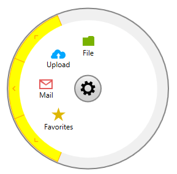
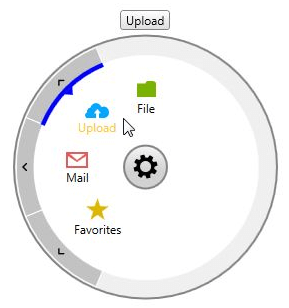
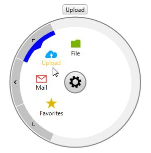

# Styling the RadialMenu

This help topic will explain how you can customize the look of some of the elements of the __RadialMenu__ control.    

>Before proceeding, please check [Setting a Theme]() topic.        

We will go through the following topics:

* [RadialMenu Style Properties](#radialmenu-style-properties)

* [Customize the NavigationItemButtons Style](#customize-the-navigationitembuttons-style)

* [Customize the VisualStatesItemPresenter Style](#customize-the-visualstatesitempresenter-style)

## RadialMenu Style Properties

__RadRadialMenu__ provides __ContentMenuBackgroundStyle__ and __NavigationMenuBackgroundStyle__ properties used to define the Background of the ContentMenu and NavigationMenu parts of the control. Their default values are respectively ContentMenuStyle and NavigationMenuStyle and receive as a TargetType a Rectangle element.

The following code snippets show how these properties can be customized.        

#### __[XAML] Example 1: Define the Style properties__

{{region xaml-radradialmenu-styles-and-templates-styling-radialmenu_0}}
	<UserControl.Resources>
	    
	
	    
	</UserControl.Resources>
{{endregion}}

#### __[XAML] Example 2: Set the Style properties to the RadialMenu__

{{region xaml-radradialmenu-styles-and-templates-styling-radialmenu_1}}
	<telerik:RadRadialMenu ContentMenuBackgroundStyle="{StaticResource CustomContentMenuStyle}"
	               NavigationMenuBackgroundStyle="{StaticResource CustomNavigationMenuStyle}">
	    <!--...-->
	</telerik:RadRadialMenu>
{{endregion}}

Figure 1: Customized RadialMenu

## Customize the NavigationItemButtons Style

In order to change the way the navigation buttons look, you will need to create a Style with TargetType set to __NavigationItemButton__ based on the default __NavigationItemButtonStyle__ and modify the needed properties. __Example 3__ shows how you could change the Background, Foreground ( actually used for the arrow element) and Border colors.        

#### __[XAML] Example 3: Customize the NavigationButtons__

{{region xaml-radradialmenu-styles-and-templates-styling-radialmenu_2}}
	<UserControl.Resources>
	    
	</UserControl.Resources>
{{endregion}}

Figure 2: Customized NavigationButtons

## Customize the VisualStatesItemPresenter Style

__VisualStatesItemPresenter__ is the element used to mark the selected and highlighted RadialMenuItems. Again, to change its Style, you will need to add a new Style to your Resources with TargetType set to __VisualStatesItemPresenter__ and based on the default __VisualStatesItemPresenterStyle__ as shown in __Example 4__.        

#### __[XAML] Example 4: Customize the VisualStatesItemPresenter__

{{region xaml-radradialmenu-styles-and-templates-styling-radialmenu_3}}
	<UserControl.Resources>
	    
	</UserControl.Resources>
{{endregion}}

Figure 3: Customized VisualStatesItemPresenter

Additionally, there are two more properties that you could set through the __VisualStatesItemPresenterStyle__:      

* __ThicknessFactor__ - sets factor defining the thickness of the __VisualStatesItemPresenter__ as a fraction of the size of the __NavigationItemButton__. The value should be between 0 and 1. If the passed value lies outside this range, it is automatically set to the nearest boundary value.            

* __ArrowThicknessFactor__ - sets the factor defining the thickness of the arrow part of the __VisualStatesItemPresenter__ as a fraction of the size of the __NavigationItemButton__. The value should be between 0 and 1. If the passed value lies outside this range, it is automatically set to the nearest boundary value.             

__Example 5__ will show how these properties could be set:        

#### __[XAML] Example 5: VisualStatesItemPresenter with customize Thickness and ArrowThickness__

{{region xaml-radradialmenu-styles-and-templates-styling-radialmenu_4}}
	<UserControl.Resources>
	    
	</UserControl.Resources>
{{endregion}}

Figure 3: Custom Thickness properties

## See Also

 * [Visual Structure]()
