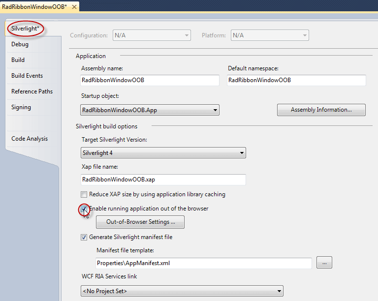
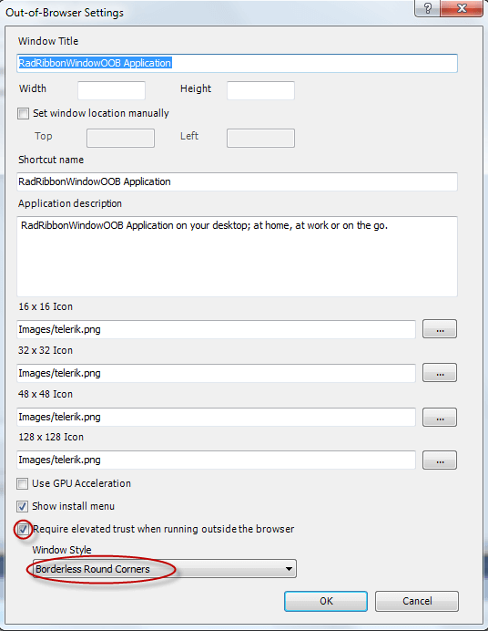
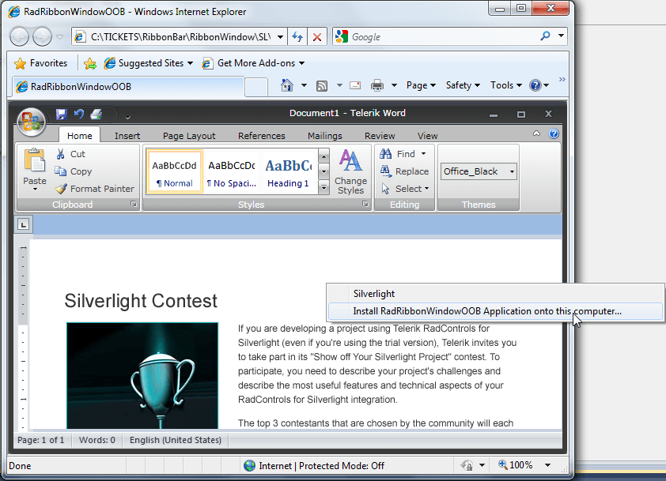
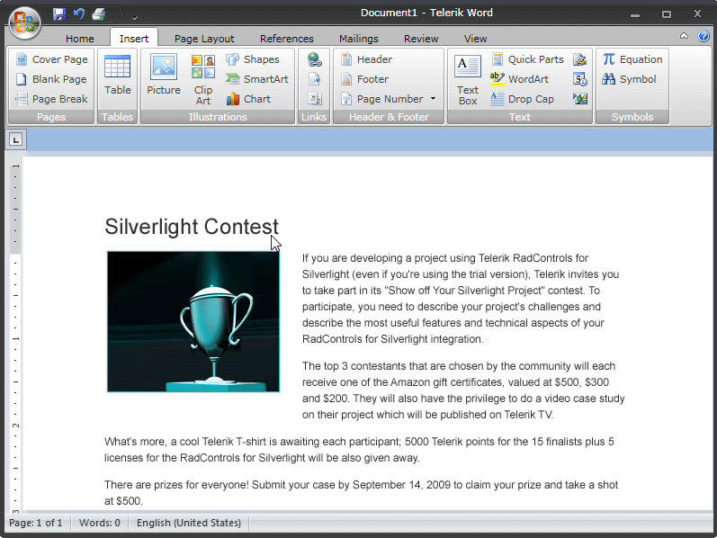

# Ribbon Window

The __RadRibbonWindow__ control is used to define a specialized window that is pre-configured with a__RadRibbonView__ to emulate MS Office UI in Silverlight. 

An application that will use the new __RadRibbonWindow__ should be configured to run in out-of-browser mode and also to require elevated trust permissions with one of these options: No Border or Borderless Round Corners (the preferred one). This tutorial will walk you through the task of defining a RadRibbonWindow in your application.

## Configuration

First you need to configure your Silverlight project. Right click on it and choose __Properties__. Then you should enable the out of browser option:

Then you need to click on the __Out-of-Browser Settings…__ button and check the Require Elevated Trust. Also, make sure that the WindowStyle is Borderless Round Corners: 

## Define the RadRibbonWindow in the application

#### __XAML__
{{region radribbonview-ribbon-window-sl_0}}
	<UserControl x:Class="SampleApplication.RibbonWindowPage" 
	             xmlns="http://schemas.microsoft.com/winfx/2006/xaml/presentation"
	             xmlns:x="http://schemas.microsoft.com/winfx/2006/xaml"
	             xmlns:mc="http://schemas.openxmlformats.org/markup-compatibility/2006"
	             xmlns:telerik="http://schemas.telerik.com/2008/xaml/presentation">
	    <telerik:RadRibbonWindow>
	        <Grid>
	            <Grid.RowDefinitions>
	                <RowDefinition Height="Auto" />
	                <RowDefinition Height="*" />
	            </Grid.RowDefinitions>
	            <telerik:RadRibbonView x:Name="radRibbonView1" 
	                                   Title="Document1"
	                                   ApplicationButtonImageSource="Images/IconMSOffice/AppIcon.png"
	                                   ApplicationName="Telerik Word"
	                                   HelpButtonVisibility="Visible"
	                                   MinimizeButtonVisibility="Visible"
	                                   telerik:KeyTipService.IsKeyTipsEnabled="True">
	                <telerik:RadRibbonView.Backstage>
	                    <telerik:RadRibbonBackstage />
	                </telerik:RadRibbonView.Backstage>
	                <telerik:RadRibbonView.QuickAccessToolBar>
	                    <telerik:QuickAccessToolBar />
	                </telerik:RadRibbonView.QuickAccessToolBar>
	                <telerik:RadRibbonTab Header="Home" telerik:KeyTipService.AccessText="H" />
	                <telerik:RadRibbonTab Header="Page Layout" telerik:KeyTipService.AccessText="P" />
	                <telerik:RadRibbonTab Header="References" telerik:KeyTipService.AccessText="S" />
	                <telerik:RadRibbonTab Header="Mailings" telerik:KeyTipService.AccessText="M" />
	                <telerik:RadRibbonTab Header="Review" telerik:KeyTipService.AccessText="R" />
	                <telerik:RadRibbonTab Header="View" telerik:KeyTipService.AccessText="W" />
	            </telerik:RadRibbonView>
	            <Grid Grid.Row="1" />
	        </Grid>
	    </telerik:RadRibbonWindow>
	</UserControl>
{{endregion}}

Now, when you hit F5 you should get the following result:

In order to run the project in OOB you need to install it:

Then you should get the final result:

## Icon

In order to provide a custom icon for the RadRibbonWindow, you have to set its __Icon__ property as demonstrated in the following code snippet. 

#### __XAML__
{{region xaml-radribbonview-ribbon-window-wpf-3}}
	<telerik:RadRibbonWindow Icon="Images/application-icon.ico">
{{endregion}}

## Themes

__RadRibbonWindow__ comes with full support for all our predefined Telerik themes and you can choose the most suitable for your needs.

In order to apply a Telerik style on the __RadRibbonWindow__, it is best to use the implicit styling mechanism further described in the [Setting a Theme (Using Implicit Styles)](http://www.telerik.com/help/silverlight/styling-apperance-implicit-styles-overview.html) tutorial.		

Please note that the default __RadRibbonWindow__ implicit style cannot be applied on derived controls as their __Type__ is different than the one defined as a __TargetType__ in the implicit style. This is why in order to apply a Telerik predefined style on a __UserControl__ deriving from __RadRibbonWindow__ you need to define a __Style__ targeting the __UserControl__ type in the __Resources__ of the application. Make sure to define that style after merging the Telerik __ResourseDictionaries__ so that you can base it on the predefined __"RadRibbonWindowStyle"__.		

#### __App.xaml__
{{region radribbonview-ribbon-window-wpf-2}}
	<ResourceDictionary xmlns="http://schemas.microsoft.com/winfx/2006/xaml/presentation"
	                    xmlns:x="http://schemas.microsoft.com/winfx/2006/xaml"
						xmlns:local="clr-namespace:RibbonWindow_ImplicitStylesDemo">
		<Style TargetType="local:MainWindow" BasedOn="{StaticResource RadRibbonWindowStyle}" />
	</ResourceDictionary>
{{endregion}}

More information and a sample project using the __RadRibbonWindow__ for Silverlight, can be found [here](http://blogs.telerik.com/silverlightteam/posts/10-11-08/radribbonwindow-for-silverlight-oob.aspx).
