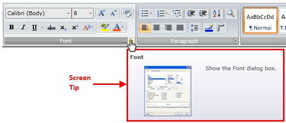
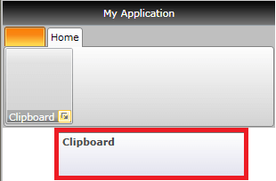

# Screen Tips

Telerik __RadRibbonView__ provides a simple and consistent way for building interfaces similar to the ribbon control used in Microsoft Office. The __RadRibbonView__ consists of various elements, one of which are the __Screen Tips__. This topic discusses concepts fundamental to the __Screen Tips__ at first and then goes into the usage of the __ScreenTip__ class and its features.			

>tip Before proceeding with this tutorial, it is recommended to get familiar with the [Visual Structure]() of the __RadRibbonView__ control.			

## Screen Tips - Fundamentals

__Screen Tip__ is a UI feature in which a small window appears when the __mouse cursor__ is hovered over an icon or a ribbon element (command). The __popup__ window will provide details that explain the command's function. In some instances, though, the __Screen Tip__ will display only the item's name. When the mouse is moved away from the ribbon element, the __Screen Tip__ will disappear from view.

__RadRibbonView__ fully supports the Microsoft Office guidelines for screen tip implementation. You can set a screen tip to any element (command) in the __RadRibbonView__.				

>The class that represents the screen tip is __Telerik.Windows.Controls.ScreenTip__.					

The __ScreenTip__ is a __ToolTip__ (it derives from __ToolTip__), which consists of three parts:				

* __Title__ - specifies the title of the screen tip.					

* __Description__ - specifies the description of the screen tip.					

* __Icon__ - specifies the image of the screen tip.

## Adding Screen Tip

This section shows how to attach a screen tip to a __RadRibbon__ element.				

>tip You can attach __Screen Tip__ to __each one__ of the __RadRibbon__ elements.				

The following subsections are included:

When you want to set a screen tip, you need to use the __ScreenTip__ attached property. 

### Setting Title

The first element you may want to specify is the title of the screen tip. In this case you need to use the __ScreenTip__'s __Title__ property. The next example demonstrates how to set a screen tip to a [Ribbon Group]().							

#### __XAML__
{{region radribbonview-screentips_0}}
	<telerik:RadRibbonView x:Name="radRibbonView">
	    <telerik:RadRibbonTab Header="Home">
	        <telerik:RadRibbonGroup x:Name="radRibbonGroupClipboard" 
	                                DialogLauncherVisibility="Visible"
	                                Header="Clipboard"
	                                telerik:ScreenTip.Title="Clipboard" />
	    </telerik:RadRibbonTab>
	</telerik:RadRibbonView>
{{endregion}}

The same operation can be done in the code-behind, too. You need to invoke the __ScreenTip__'s __SetTitle()__ static method.							

#### __C#__
{{region radribbonview-screentips_1}}
	ScreenTip.SetTitle(radRibbonGroupClipboard, "Clipboard");
{{endregion}}

#### __VB.NET__
{{region radribbonview-screentips_2}}
	ScreenTip.SetTitle(radRibbonGroupClipboard, "Clipboard")
{{endregion}}

You can see a screen tip with only __Title__ property set like it is on the next snapshot.

Setting Description

When you want to set the description of the screen tip, you need to use the __ScreenTip__'s __Description__ property. The next example demonstrates how to do that.							

#### __XAML__
{{region radribbonview-screentips_3}}
	<telerik:RadRibbonView x:Name="radRibbonView">
	    <telerik:RadRibbonTab Header="Home">
	        <telerik:RadRibbonGroup x:Name="radRibbonGroupClipboard" 
	                                DialogLauncherVisibility="Visible"
	                                Header="Clipboard"
	                                telerik:ScreenTip.Description="Show the Clipboard Task options."
	                                telerik:ScreenTip.Title="Clipboard" />
	    </telerik:RadRibbonTab>
	</telerik:RadRibbonView>
{{endregion}}

The same operation can be done in the code-behind, too. You need to invoke the __ScreenTip__'s __SetDescription()__ static method.							

#### __C#__
{{region radribbonview-screentips_4}}
	ScreenTip.SetTitle(radRibbonGroupClipboard, "Clipboard");
	ScreenTip.SetDescription(radRibbonGroupClipboard, "Show the Clipboard Task options.");
{{endregion}}

#### __VB.NET__
{{region radribbonview-screentips_5}}
	ScreenTip.SetTitle(radRibbonGroupClipboard, "Clipboard")
	ScreenTip.SetDescription(radRibbonGroupClipboard, "Show the Clipboard Task options.")
{{endregion}}

You can see a screen tip with __Title__ and __Description__ properties set like on the next snapshot.

### Setting Icon

The last but not least element of the screen tip is its image (icon). It is set through the __ScreenTip__'s __Icon__ property.							

#### __XAML__
{{region radribbonview-screentips_6}}
	<telerik:RadRibbonView x:Name="radRibbonView">
	    <telerik:RadRibbonTab Header="Home">
	        <telerik:RadRibbonGroup x:Name="radRibbonGroupClipboard" 
	                                DialogLauncherVisibility="Visible"
	                                Header="Clipboard"
	                                telerik:ScreenTip.Description="Show the Clipboard Task options."
	                                telerik:ScreenTip.Icon="Images/IconMSOffice/ClipboardScreenTipIcon.png"
	                                telerik:ScreenTip.Title="Clipboard" />
	    </telerik:RadRibbonTab>
	</telerik:RadRibbonView>
{{endregion}}

The same operation can be done in the code-behind, too. You need to invoke the __ScreenTip__'s __SetIcon()__ static method. See the next code-snippets.							

#### __C#__
{{region radribbonview-screentips_7}}
	ScreenTip.SetTitle(radRibbonGroupClipboard, "Clipboard");
	ScreenTip.SetDescription(radRibbonGroupClipboard, "Show the Clipboard Task options.");
	ScreenTip.SetIcon(radRibbonGroupClipboard, new BitmapImage(new Uri("Images/IconMSOffice/ClipboardScreenTipIcon.png",UriKind.Relative)));
{{endregion}}

#### __VB.NET__
{{region radribbonview-screentips_8}}
	ScreenTip.SetTitle(radRibbonGroupClipboard, "Clipboard")
	ScreenTip.SetDescription(radRibbonGroupClipboard, "Show the Clipboard Task options.")
	ScreenTip.SetIcon(radRibbonGroupClipboard, New BitmapImage(New Uri("Images/IconMSOffice/ClipboardScreenTipIcon.png", UriKind.Relative)))
{{endregion}}

The result is shown on the next snapshot.

The __RadRibbonView__ is a complex control and the __screen tips__ are only a small part of it. The __RadRibbonView__ consists of various elements such as:
* [Application Menu]()
* [Backstage Menu]()
* [Quick Access ToolBar]()
* [Ribbon Tab]()
* [Ribbon Gallery]()
* [Ribbon Group]()
* [RibbonButtons Overview]()
* [Ribbon ComboBox]()

Additional features that you may find interesting are:
* [Selection]()
* [Resizing]()
* [Minimization]()
* [Localization]()