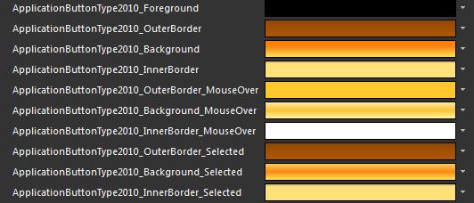
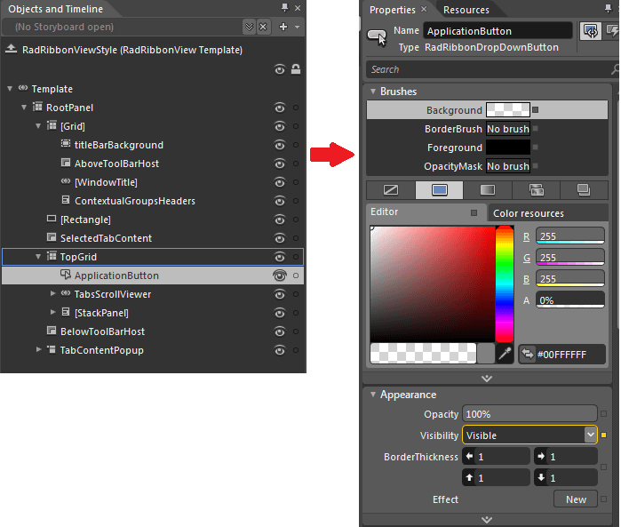
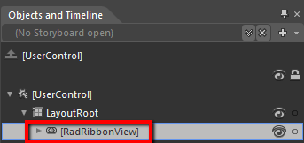
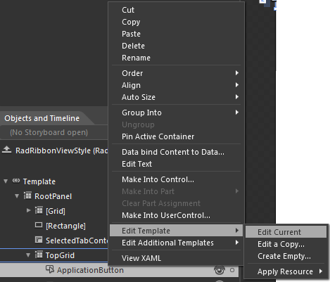
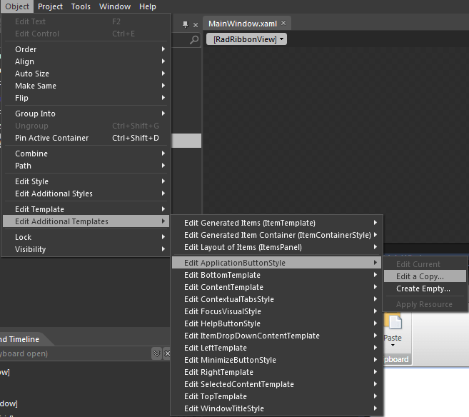
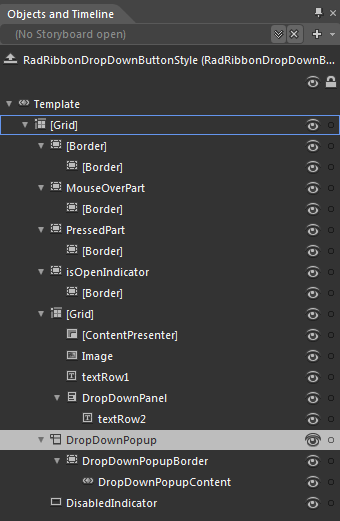

# Styling the ApplicationButton

To style the __ApplicationButton__ of the __RadRibbonView__ you can set an appropriate __Style__ to the __RadRibbonView.ApplicationButtonStyle__ property.
In order to modify the default style of the __ApplicationButton__ you can:			

* Create an empty style and set it up on your own

* Modify some of the resourcesproperties generated for the __RadRibbonView's__ style.				

* Modify the default style of the __ApplicationButton__

This article will demonstrate how to implement the last two approaches.


## Modifying the resources generated for the RadRibbonView's style.

Here is the list of resources that are used to control the appearance of the __ApplicationButton__.

* __ApplicationButtonType2010_Foreground__ - a brush that represents the foreground of the __ApplicationButton__.						

* __ApplicationButtonType2010_OuterBorder__ - a brush that represents the color of the __ApplicationButton's__ border.						

* __ApplicationButtonType2010_Background__ - a brush that represents the background of the __ApplicationButton__.						

* __ApplicationButtonType2010_InnerBorder__ - a brush that represents the color of the __ApplicationButton's__ inner border.						

* __ApplicationButtonType2010_OuterBorder_MouseOver__ - a brush that represents the color of the __ApplicationButton's__ border, when the mouse is over it.						

* __ApplicationButtonType2010_Background_MouseOver__ - a brush that represents the background of the __ApplicationButton__, when the mouse is over it.						

* __ApplicationButtonType2010_InnerBorder_MouseOver__ - a brush that represents the color of the __ApplicationButton's__ inner border, when the mouse is over it.						

* __ApplicationButtonType2010_OuterBorder_Selected__ - a brush that represents the color of the __ApplicationButton's__ border, when the button is selected.						

* __ApplicationButtonType2010_Background_Selected__ - a brush that represents the background of the __ApplicationButton__, when the button is selected.						

* __ApplicationButtonType2010_InnerBorder_Selected__ - a brush that represents the color of the __ApplicationButton's__ inner border, when the button is selected.						

>tip Changing the value of the resources can be done by clicking on the color indicator or the icon next to them.

Modify the resource to bring the desired appearance to the __ApplicationButton__. For more detailed information, please, view the [Example](#example) section below.




## Modifying the properties generated for the RadRibbonView's style.

The __RadRibbonViewControlTemplate__ contains an __ApplicationButton__ element of type __RadRibbonDropDownButton__ control, that represents the __ApplicationButton__. You can find more info about the __RadRibbonViewControlTemplate__ elements in the [TemplateStructure]() topic.



## Modifying the default style of the ApplicationButton

To copy the default style of the __ApplicationButton__, load your project in Expression Blend and open the UserControl that holds the __RadRibbonView__. In the 'Objects and Timeline' pane select the __RadRibbonView,__ whose __ApplicationButton__ you want to style.


From the menu choose *Object -> Edit Style -> Edit a Copy*. You will be prompted for the name of the style and where to be placed.

After clicking 'OK', Expression Blend will generate the default style of the __ApplicationButton__ control along with the __RibbonView__ style in the __Resources__ section of your User Control. In order to edit it you need to locate the __ApplicationButton__ element and right click on it to choose *Edit Template -> Edit Current.*

The properties available for the style will be loaded in the 'Properties' pane and you will be able to modify their default values.

If you go to the 'Resources' pane, you will see an editable list of resources generated together with the style and used by it. In this list you will find the brushes, styles and templates needed to change the visual appearance of the __ApplicationButton.__ Their names indicate to which part of the __ApplicationButton's__ appearance they are assigned. The full list of these resources is given above - those are the same resource generated by the __RadRibbonView__'s style.

From the menu choose *Object -> Edit Additional Templates -> Edit ApplicationButtonStyle -> Edit a Copy*.

You will be prompted for the name of the style and where to be placed.

After clicking 'OK', Expression Blend will generate the default template of the __ApplicationButton__ control in the __Resources__ section of your User Control. The properties available for the template's elements will be loaded in the 'Properties' pane and you will be able to modify their default values.

## ApplicationButton default ControlTemplate structure

* __[Grid]__ - a __Grid__ control, that represents the main layout control in the __ApplicationButton's__ template.						

	* __[Border]__ - a __Border__ control that represents the background of the __ApplicationButton__.								

		* __[Border]__ - a __Border__ control that represents the inner background of the __ApplicationButton__.									

	* __MouseOverPart__ - a __Border__ control that represents the background of the __ApplicationButton__, when the mouse is over it.								

		* __[Border]__ - a __Border__ control that represents the inner background of the __ApplicationButton__, when the mouse is over it									

	* __PressedPart__ - a __Border__ control that represents the background of the __ApplicationButton__, when the button is pressed.								

		* __[Border]__ - a __Border__ control that represents the inner background of the __ApplicationButton__, when the button is pressed.									

	* __IsOpenIndicator__ - a __Border__ control that represents the background of the __ApplicationButton__, when the application/backstage menu is open								

		* __[Border]__ - a __Border__ control that represents the inner background of the __ApplicationButton__, when the application/backstage menu is open									

	* __[Grid]__ - a __Grid__ control that hosts the __ApplicationButton__ content								

		* __[ContentPresenter]__ - a __ContentPresenter__ control, that is used to display the __ApplicationButton__ content
		* __Image__ - an __Image__ control that represents the __ApplicationButtonImage__
		* __textRow1__ - a __TextBlock__ control that represents the content of the __ApplicationButton__
		* __DropwDownPanel__ - a __StackPanel__ control hosting the second row of the __ApplicationButton__ content
			* __textRow2__ -  a __TextBlock__ control that represents the second row of the content of the __ApplicationButton__

	* __DropDownPopup__ - is a __Popup__ control that hosts the __DropDownContent__ (__ApplicationMenu/BackstageMenu__) of the __ApplicationButton__

		* __DropDownPopupBorder__ - is a __Border__ control that represents the background color of the __ApplicationButton__ __DropDownContent__

			* __DropDownPopupContent__ - is a __ContentControl__ hosthe ApplicationButton __DropDownContent__ (__ApplicationMenu/BackstageMenu__)

	* __DisabledIndicator__ - is a __Rectangle__ that represents the background of the __ApplicationButton__, when it is disabled(__ApplicationMenu/BackstageMenu__)

## See Also
 * [Controlling Appearance]()
 * [RadRibbonView Template Structure]()
 * [Styling the RadRibbonView]()