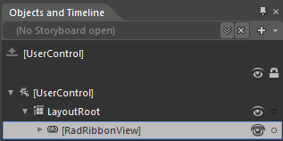
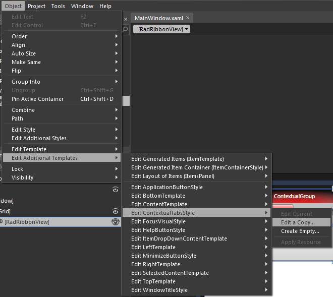
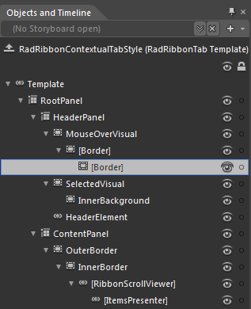

# Styling the ContextualTabs

The __RadRibbonView__ __ContextualTabs__ are of type __RadRibbonTab__ and they can be styled by creating an appropriate __Style__ and setting it to the __RadRibbonView.ContextualTabsStyle__ property.			

You have two options:

* To create an empty style and set it up on your own.				
* To copy the default style of the control and modify it. 

This topic will show you how to perform the second one.

## Modifying the Default Style

To copy the default style, load your project in Expression Blend and open the User Control that holds the __RadRibbonView__. In the 'Objects and Timeline' pane select the __RadRibbonView__ whose __ContextualTabs__ you want to style.

From the menu choose *Object -> Edit Additional Templates -> Edit ContextualTabsStyle -> Edit a Copy*.

You will be prompted for the name of the style and where to be placed.

>If you choose to define the style in Application, it would be available for the entire application. This allows you to define a style only once and then reuse it where needed.

After clicking 'OK', Expression Blend will generate the default style of the __RadRibbonView ContextualTabs__ in the __Resources__ section of your User Control. The properties available for the style will be loaded in the 'Properties' pane and you will be able to modify their default values.				

In the 'Objects and Timeline' pane the element parts for the __ContextualTab's__ template will get loaded.

* __RootPanel__ - a __Grid__ control that represents the main layout control in the __ContextualTab's__ template.						

	* __HeaderPanel__ - a __Grid__ control that hosts the __ContextualTab.Header__ elements								

		* __MouseOverVisual__ - a __Border__ control that represents the outer border of the __ContextualTab.Header__, when the mouse is over it										

			* __[Border]__ - a __Border__ control that represents the inner border of the __ContextualTab.Header__, when the mouse is over it												

				* __[Border]__ - a __Border__ control that represents the background of the __ContextualTab.Header__, when the mouse is over it													

		* __SelectedVisual__ - a __Border__ control that represents the outer border of the __ContextualTab.Header__, when it is selected										

			* __InnerBackground__- a __Border__ control that represents the background and the inner border of the __ContextualTab.Header__, when it is selected											

		* __HeaderElement__ - a __TabItemContentPresenter__ control the represents the content of the __ContextualTab.Header__

	* __ContentPanel__ - a __Grid__ control that hosts the __ContextualTab.Content__ elements								

		* __OuterBorder__ - a __Border__ control that represents the background and the outer border of the __ContextualTab.Content__

			* __InnerBorder__ - a __Border__ control that represents the inner border of the __ContextualTab.Content__

				* __[RibbonScrollViewer]__ - a __RibbonScrollViewer__ control that hosts the __ContextualTab.Content__

					* __[ItemsPresenter]__ - an __ItemsPresenter__ control used to display the __ContextualTab.Content__

>tip If you want to modify the default style of the __RibbonScrollViewer__ control, you can follow the approach described in [this article]().