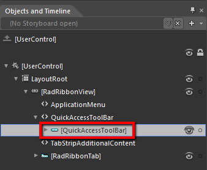
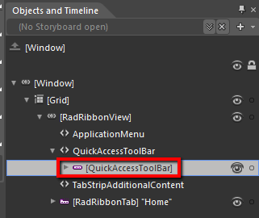
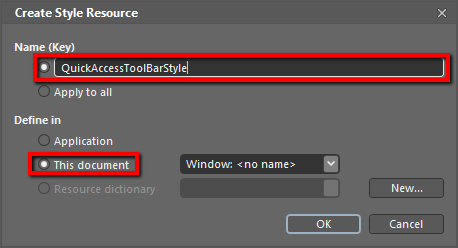
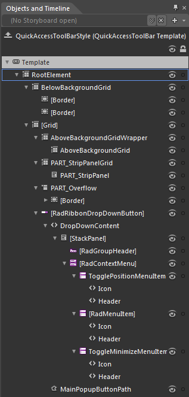
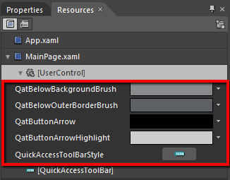
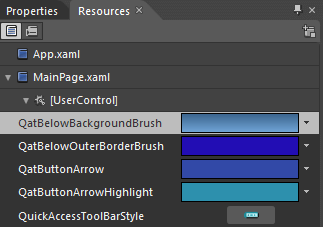
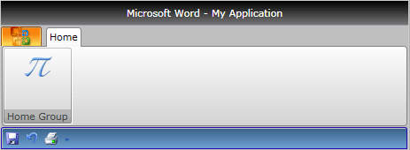

# Styling the QuickAccessToolbar

The __RadRibbonView QuickAccessToolBar__ control can be styled by creating an appropriate __Style__ and setting it to the __Style__ property of the control.

You have two options:

* To create an empty style and set it up on your own.
* To copy the default style of the control and modify it.

This topic will show you how to perform the second one.

## Modifying the Default Style

In order to copy the default style, load your project in Expression Blend and open the User Control that holds the __RadRibbonView__. In the 'Objects and Timeline' pane select the __QuickAccessToolBar__ you want to style.







From the menu choose *Object -> Edit Style -> Edit a Copy*. You will be prompted for the name of the style and where to be placed.

>tip If you choose to define the style in Application, it would be available for the entire application. This allows you to define a style only once and then reuse it where needed.

After clicking 'OK', Expression Blend will generate the default style of the __QuickAccessToolBar__ control in the __Resources__ section of your User Control. The properties available for the style will be loaded in the 'Properties' pane and you will be able to modify their default values.

If you want to change the __ControlTemplate__ elements of the __QuickAccessToolBar__ select the style in the 'Objects and Timeline' pane, right-click on it and choose Edit Template -> Edit Current. In the same pane the element parts for the __QuickAccessToolBar's__ template will get loaded.


You can modify these properties to achieve the desired appearance. However the most of the visual parts of the __QuickAccessToolBar__ have to be styled in the template of it. To modify it select the style in the 'Objects and Timeline' pane, right-click on it and choose *Edit Template -> Edit Current*. In the same pane the element parts for the __QuickAccessToolBar's__ template will get loaded.



Change the elements' properties until you get the desired look.

>You can also modify the trigger defined for the __QuickAccessToolBar__. It is located in the 'Triggers' pane.
>



If you go to the 'Resources' pane, you will see an editable list of resources generated together with the style and used by it. In this list you will find the brushes, styles and templates needed to change the visual appearance of the __QuickAccessToolBar__. Their names indicate to which part of the __QuickAccessToolBar's__ appearance they are assigned.

* QatBelowBackgroundBrush - a brush that represents the background color of the __QuickAccessToolBar__, when it is positioned bellow the RibbonView control						

* QatBelowOuterBorderBrush - a brush that represents the color of the __QuickAccessToolBar__'s border, when it is positioned bellow the RibbonView control						

* QatButtonArrow - a brush that represents the background color of the __Quick Access Menu__ __Button__ indicator						

* QatButtonArrowHighlight - a brush that represents the color of the __Quick Access Menu__ __Button__ indicator's border						

* QuickAccessToolBarStyle - represents the style applied to the __QuickAccessToolBar__

>tip Changing the value of the resources can be done by clicking on the color indicator or the icon next to them.

Modify the resource to bring the desired appearance to the __QuickAccessToolBar__. For more detailed information, please, view the __Example__ section below.

## Example
For the purpure of this example, let's set the __RadRibbonView.QuickAccessToolBarPosition__ to __BelowRibbon__. Then we can modify the __QuickAccessToolBar__ resources like so:

Here is a snapshot of the result:



## Styling QuickAccessToolbar items using ItemContainerStyleSelector

> With **R1 2017** we introduced predefined styles inside QuickAccessToolbar, so in order to style its items you can use QuickAccessToolbar's **ItemContainerStyleSelector** property.

First, define a RadRibbonView with a QuickAccessToolbar:

#### __[XAML] Example 1: RadRibbonView with QuickAccessToolbar__
{{region xaml-radribbonview-styling-quickaccesstoolbar-0}}
	 <telerik:RadRibbonView ApplicationButtonContent="File">
        <telerik:RadRibbonView.QuickAccessToolBar>
            <telerik:QuickAccessToolBar>
               <telerik:RadRibbonButton Text="Save" Foreground="White" />
                <telerik:RadRibbonButton Text="Print" Foreground="White"/>
            </telerik:QuickAccessToolBar>
        </telerik:RadRibbonView.QuickAccessToolBar>
    </telerik:RadRibbonView>
{{endregion}}

Then you will need a custom StyleSelector, which will choose a style for the RadRibbonButtons based on their text:

#### __[C#] Example 2: Define ItemContainerStyleSelector__  
{{region cs-radribbonview-styling-quickaccesstoolbar-2}}
	public class QATItemContainerStyleSelector : StyleSelector
    {
        public Style SaveStyle { get; set; }
        public Style PrintStyle { get; set; }

        public override Style SelectStyle(object item, DependencyObject container)
        {
            var button = item as RadRibbonButton;
            if (button != null)
            {
                if(button.Text == "Save")
                {
                    return this.SaveStyle;
                }
                else if(button.Text == "Print")
                {
                    return this.PrintStyle;
                }
            }

            return base.SelectStyle(item, container);
        }
    }
{{endregion}}

#### __[VB.NET] Example 2: Define ItemContainerStyleSelector__  
{{region vb-radribbonview-styling-quickaccesstoolbar-3}}
    Public Class QATItemContainerStyleSelector
        Inherits StyleSelector
        Public Property SaveStyle() As Style
            Get
                Return m_SaveStyle
            End Get
            Set
                m_SaveStyle = Value
            End Set
        End Property
        Private m_SaveStyle As Style
        Public Property PrintStyle() As Style
            Get
                Return m_PrintStyle
            End Get
            Set
                m_PrintStyle = Value
            End Set
        End Property
        Private m_PrintStyle As Style

        Public Overrides Function SelectStyle(item As Object, container As DependencyObject) As Style
            Dim button = TryCast(item, RadRibbonButton)
            If button IsNot Nothing Then
                If button.Text = "Save" Then
                    Return Me.SaveStyle
                ElseIf button.Text = "Print" Then
                    Return Me.PrintStyle
                End If
            End If

            Return MyBase.SelectStyle(item, container)
        End Function
    End Class
{{endregion}}

Finally, you shold define the two custom styles and assign the __QATItemContainerStyleSelector__ to the __ItemContainerStyleSelector__ property of the QuickAccessToolBar.

#### __[XAML] Example 3: Define custom styles and set ItemContainerStyleSelector__
{{region xaml-radribbonview-styling-quickaccesstoolbar-1}}
	

    

    <local:QATItemContainerStyleSelector x:Key="QATItemContainerStyleSelector"
                    PrintStyle="{StaticResource PrintStyle}"
                    SaveStyle="{StaticResource SaveStyle}" />

    
{{endregion}}

> This example is implemented with [NoXaml Binaries]() and the styles are based on the [default styles]() for the theme.

#### __Figure 1: QuickAccessToolBar styled with ItemContainerStyleSelector__ 
 

## See Also
 * [Styling the RadRibbonView]()
 * [RadRibbonView Template Structure]()
 * [Styling the RadRibbonView TitleBar]()
 * [Styling the ApplicationButton]()
