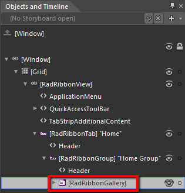
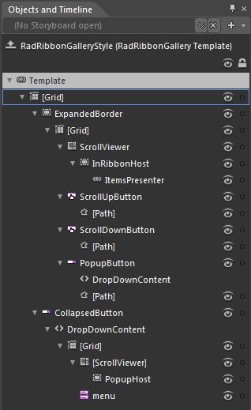
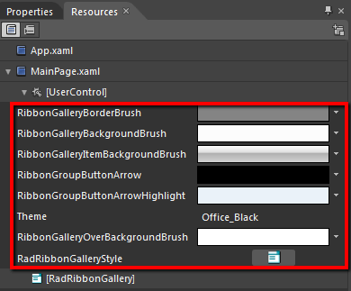
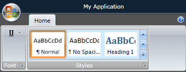

# Styling the RadRibbonGallery

The __RadRibbonGallery__ can be styled by creating an appropriate __Style__ and setting it to the __Style__ property of the control.			

You have two options:

* To create an empty style and set it up on your own.
* To copy the default style of the control and modify it.

This topic will show you how to perform the second one.

## Modifying the Default Style

To copy the default style, load your project in Expression Blend and open the User Control that holds the __RadRibbonView__. In the 'Objects and Timeline' pane select the __RadRibbonGallery__ you want to style.
				








From the menu choose *Object -> Edit Style -> Edit a Copy*. You will be prompted for the name of the style and where to be placed.

>tip If you choose to define the style in Application, it would be available for the entire application. This allows you to define a style only once and then reuse it where needed.

After clicking 'OK', Expression Blend will generate the default style of the __RadRibbonGallery__ control in the __Resources__ section of your User Control. The properties available for the style will be loaded in the 'Properties' pane and you will be able to modify their default values.



If you want to change the ControlTemplate elements of the __RadRibbonGallery__ select the style in the 'Objects and Timeline' pane, right-click on it and choose Edit Template -> Edit Current. In the same pane the element parts for the __RadRibbonGallery__'s template will get loaded.





You can modify these properties to achieve the desired appearance. However the most of the visual parts of the __RadRibbonGallery__ have to be styled in the template of it. To modify it select the style in the 'Objects and Timeline' pane, right-click on it and choose *Edit Template -> Edit Current*. In the same pane the element parts for the __RadRibbonGallery's__ template will get loaded.


>In order to fully style the __RadRibbonGallery__ buttons you have to apply styles to them. Locate the buttons. As they are of type __RadRibbonButton__ and __RadRibbonDropDownButton__, the following topics may be at interest to you.
>	- [Styling Ribbon Button]()
>	- [Styling Ribbon DropDownButton]()



Change the elements' properties untill you get the desired look.

>You can also modify the triggers defined for the __RadRibbonGallery__. They are located in the 'Triggers' pane.
>





If you go to the 'Resources' pane, you will see an editable list of resources generated together with the style and used by it. In this list you will find the brushes, styles and templates needed to change the visual appearance of the __RadRibbonGallery__. Their names indicate to which part of the __RadRibbonGallery's__ appearance they are assigned.

* __RibbonGalleryBorderBrush__ - a brush that represents the color of the __RadRibbonGallery's__ border.				

* __RibbonGalleryBackgroundBrush__ - a brush that represents the background color of the __RadRibbonGallery__.					

* __RibbonGalleryItemBackgroundBrush__ - a brush that represents the background color of the __RadRibbonGallery's__ buttons.					

* __RibbonGroupButtonArrow__ - a brush that represents the color of the button arrows.					

* __RibbonGroupButtonArrowHighlight__ - brush that represents the color of the button arrow's stroke.					

* __RibbonGalleryOverBackgroundBrush__ - a brush that represents the background color of the __RadRibbonGallery__, when the mouse is over.					

* __RadRibbonGalleryStyle__ - represents the style applied to the __RadRibbonGallery__.					

>tip Changing the value of the resources can be done by clicking on the color indicator or the icon next to them.

Modify the resource to bring the desired appearance to the __RadRibbonGallery__ . For more detailed information, please, view the __Example__ section below.

## Example

Here is an example of the above resource modified:

Here is a snapshot of the result:



## See Also
 * [Styling the RadRibbonView]()
 * [Styling the RadRibbonTab]()
 * [Styling the RadRibbonGroup]()
 * [Styling the RadRibbonButton]()
 * [Styling the RadRibbonSplitButton]()