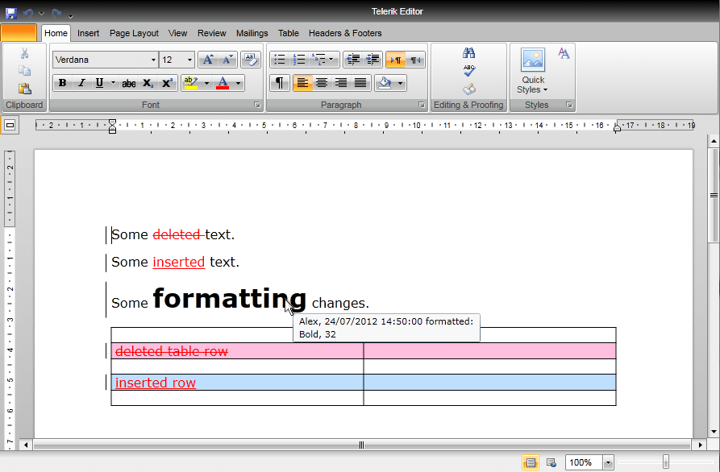
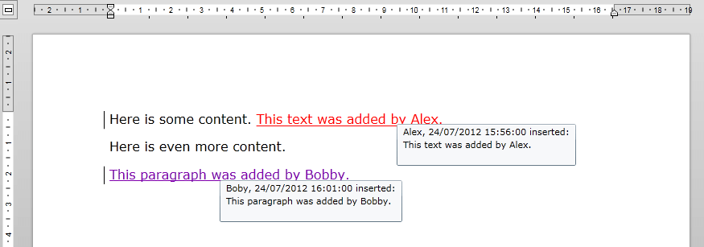

# Track Changes

__Track Changes__ is a way for __RadRichTextBox__ to keep track of the changes you make to a document. You can then choose to accept or reject those changes.
      

* [Activating Track Changes](#activating-track-changes)

* [Customizing Changes Visualization](#customizing-changes-visualization)

* [Changing Current User](#changing-current-user)

* [Navigating Through Changes](#navigating-through-changes)

## Activating Track Changes

You can activate change tracking tgrough the __IsTrackChangesEnabled__ property of __RadRichTextBox__:
        

#### __C#__

{{region radrichtextbox-features-track-changes_0}}
	this.radRichTextBox.IsTrackChangesEnabled = true;
{{endregion}}

When change tracking is enabled all changes made in the document will be tracked. This includes: 

* adding and removing text;

* formatting changes of the document elements;

* adding and removing images, hyperlinks, tables, etc.
 

## Customizing Changes Visualization

As you can see tracked changes are visualized inside the rich text box with different colors. You can modify these colors by using the __TrackChangesOptions__ property of __RadRichTextBox__. Here is for example how to customize the look of the tracked changes so that insertions are shown in green, deletions are shown in underlined orange and the vertical line indicating changes is red:
        

#### __C#__

{{region radrichtextbox-features-track-changes_1}}
	this.radRichTextBox.TrackChangesOptions.Insert.Decoration = RevisionDecoration.ColorOnly;
	this.radRichTextBox.TrackChangesOptions.Insert.ColorOptions = new RevisionColor(Colors.Green);
	
	this.radRichTextBox.TrackChangesOptions.Delete.Decoration = RevisionDecoration.Underline;
	this.radRichTextBox.TrackChangesOptions.Delete.ColorOptions = new RevisionColor(Colors.Orange);
	
	this.radRichTextBox.TrackChangesOptions.ChangedLinesDecorationColorOptions.ColorOptions = new RevisionColor(Colors.Red);
{{endregion}}

The result is:

## Changing Current User

All changes made while track changes are enabled are made on behalf of the current user. The current user can be changed by setting the CurrentUser property of the RadRichTextBox:

#### __C#__

{{region radrichtextbox-features-track-changes_2}}
	this.radRichTextBox.CurrentUser = new UserInfo("Group", "Boby", "Boby", "bobby@telerik.com");
{{endregion}}

Here is the result:

By default, insert and delete changes by different authors will be displayed in different colors. This can be changed through the __TrackChangesOptions__ as described in the previous section.
        

## Navigating through changes

RadDocument provides a set of methods for navigating and getting revisions – a special class containing information for a single change in the document. Revisions can be one of these 3 types: 

* Structure – Inserted or deleted text.

* Formatting – A change in the properties of a document element.

* Table – added or removed table rows.

All revision have a RevisionInfo object associated to them, which contains information about the user who made the change and the date and time it was made. Revisions in the document can be accessed and selected with the following methods of the RadDocument:

#### __C#__

{{region radrichtextbox-features-track-changes_3}}
	public Revision GoToPreviousRevision()
	public Revision GoToNextRevision()
	public Revision GetCurrentRevision()
	public Revision GetNextRevision()
	public Revision GetPreviousRevision()
	public IEnumerable<Revision> GetAllRevisions()
{{endregion}}

