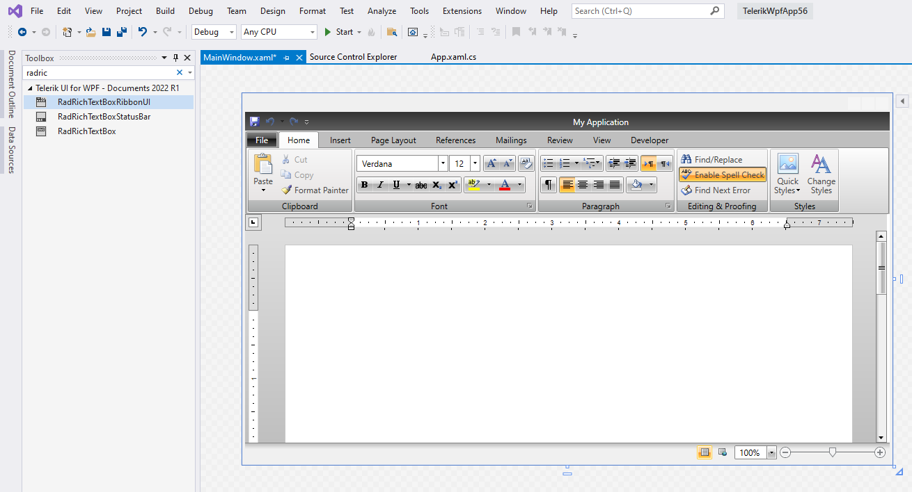
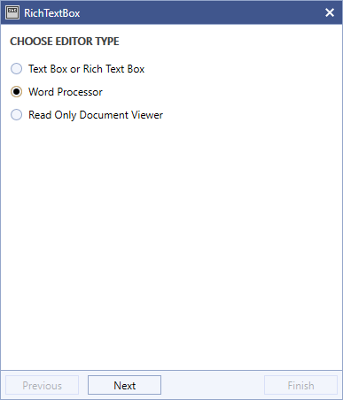
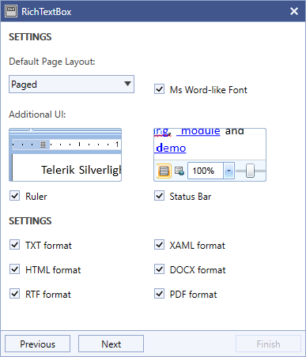
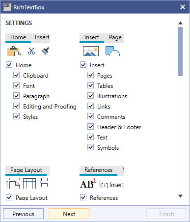
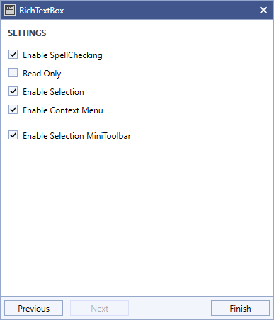
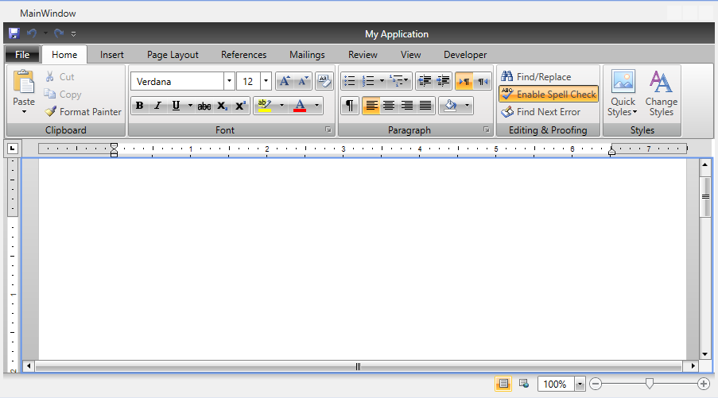

# RadRichTextBoxRibbonUI

This topic explains how the predefined UI of __RadRichTextBox__ - __RadRichTextBoxRibbonUI__ - can be used.

__RadRichTextBoxRibbonUI__ is a ribbon control that has been wired to work with the commands that __RadRichTextBox__ exposes. The control is based on [RadRibbonView]().

## Using RadRichTextBoxRibbonUI

RadRichTextBoxRibbonUI can be found in the Toolbox of Visual Studio, if you have installed the controls automatically.

If you have not installed the __Telerik UI__ automatically or the assemblies you are using are placed in another folder, you have to manually add the __RadRichTextBoxRibbonUI__ to the __Toolbox__. Here are the steps you have to follow in order to do this:

1\. Add references to the following DLLs in your project: 

* __Telerik.Windows.Controls__

* __Telerik.Windows.Controls.Input__

* __Telerik.Windows.Controls.Navigation__

* __Telerik.Windows.Controls.RibbonView__

* __Telerik.Windows.Controls.RichTextBoxUI__
  

2\. Drag __Telerik.Windows.Controls.RichTextBoxUI.dll__ to your toolbox. Ensure that __Telerik.Windows.Controls.RichTextBoxUI.VisualStudio.Design.dll__ assembly is in the same directory as __Telerik.Windows.Controls.RichTextBoxUI.dll__, so the Visual Studio can load it (actually it could be placed one level deeper in a subfolder named __Design__). 

Now you should be able to drag the __RadRichTextBoxRibbonUI__ from the toolbox to the design surface.

In order to use it, you have to open the desired __UserControl__ and choose __Designer View__. Drag an instance of the __RadRichTextBoxRibbonUI__ in the designer area and drop it. Wait for a few seconds. After that all the XAML will be generated automatically and you will get a fully functional and fully customizable UI for your __RadRichTextBox__.
        

>The generated UI will automatically get attached to the first __RadRichTextBox__ control inside the __UserControl__.

If you take a closer look at the generated code there are a few things that must be mentioned:

1. The UI is represented by a __RadRibbonView__ control. You can freely add, remove or modify the elements in it.

1. To associate the UI with the __RadRichTextBox__, the latter one is passed as __DataContext__ of the __RadRichTextBoxRibbonUI__.

1. The functional elements (buttons, etc) have their __RadRichTextBoxRibbonUI__.__RichTextCommand__ property bound to a command exposed by the __RadRichTextBox__, which, as mentioned above, is set as __DataContext__ of the __RadRichTextBoxRibbonUI__.

>You can take a look at the XAML that is generated by following the steps in this topic in the [Telerik Editor](https://github.com/telerik/xaml-sdk/tree/master/RichTextBox/TelerikEditor) SDK example.

>tipTo learn more about the commands exposed by the __RadRichTextBox__ and how to use them read [here]().

By knowing that the UI is connected to the __RadRichTextBox__ via its __DataContext__, you can easily implement a scenario where you have more than one __RadRichTextBox__ controls ruled by one UI. You just have to change the __DataContext__ of the UI depending on which __RadRichTextBox__ is active. An example implementation of this scenario is available in our SDK repository: [ChangeRibbonUIDataContext](https://github.com/telerik/xaml-sdk/tree/master/RichTextBox/ChangeRibbonUIDataContext)

## Adding the RadRichTextBoxRibbonBar via the Design Time  Wizard

When adding RadRichTextBox from the toolbox, a wizard appears and it allows you to add the ribbon as well. To include the ribbon you should choose the "Word Processor" option.

In the next steps, you can set several settings including which tabs to be added.

When you are finished you will see the result in the window.

## Customizing the Ribbon

When the control is added at design time, the entire XAML for all elements is added as well. This allows you to customize the ribbon. For example you can delete tabs and other elements by selecting them and removing their XAML code. You can customize the elements actions by unbinding them from the default commands and adding custom event handlers. You can change any visual properties as well.

## Manually adding the RadRichTextBoxRibbonBar   

If you do not have an option to add the ribbon from the toolbox, you can manually copy the entire XAML and paste it. The entire XAML is available in the following SDK repository: [Telerik Editor](https://github.com/telerik/xaml-sdk/blob/master/RichTextBox/TelerikEditor/TelerikEditor.xaml)        

## Alternatives

If you do not wish to use the ribbon, there are other options for using the RichTextBox. For example, you can use the toolbar or no UI at all. Examples are available in the following SDK repositories:

* [RadToolBarUI](https://github.com/telerik/xaml-sdk/tree/master/RichTextBox/RadToolBarUI)
* [PlainTextEditor](https://github.com/telerik/xaml-sdk/tree/master/RichTextBox/PlainTextEditor)