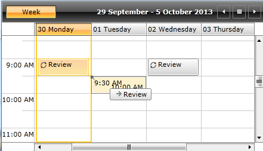
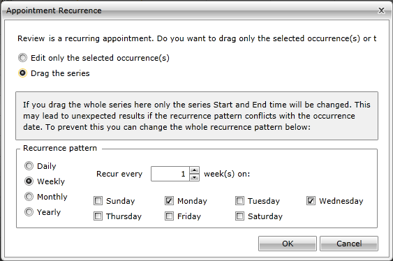

# Dragging a Recurrent Appointment

Using the drag-drop functionality of __RadScheduleView__, you can drag an occurrence of a recurrent appointment as well as the whole series.  This help article will explain how __RadScheduleView__ handles the case when a whole series is dragged.

First, let’s have the following recurrent appointment added to the AppointmentsSource of __RadScheduleView__ (a recurrent appointment which occurs on every Monday and Wednesday):

#### __C#__

{{region radscheduleview-features-recurrences-draggingrecurrentappointment_0}}
	var reviewApp = new Appointment()
	{
	     Subject = "Review",
	     Start = new DateTime(2013,9,30,9,0,0),
	     End = new DateTime(2013,9,30,9,30,0)
	};
	reviewApp.RecurrenceRule = new RecurrenceRule(
	     new RecurrencePattern()
	     {
	        Frequency = RecurrenceFrequency.Weekly,
	        DaysOfWeekMask = RecurrenceDays.Monday | RecurrenceDays.Wednesday,
	        MaxOccurrences = 10
	      }
	);
{{endregion}}

>tipYou could check [here]() for more details about recurrent appointments.

If the user drags and drops a single occurrence of this appointment:

The following dialog pops up:

* Choosing  “Edit only the selected occurrence(s)” option creates [an exception of the recurrence rule]():

* Choosing “Drag the series” option expands the dialog with more options:

>When the Recurrence pattern panel is expanded, the current recurrence days are selected, not the days where the series is dropped.

Note that when dragging the whole series, only the series Start and End times will be updated by default.

So, in this case, if you leave the recurrence pattern like this and confirm the dialog, the result will be the following:

The date of the appointment is updated, however since it occurs only on Monday and Wednesday, its first occurrence is on Wednesday.

If you want to move the series with one day, so that the appointment occurs on Tuesday and Thursday instead of Monday and Wednesday, you should edit the days of the recurrence pattern as well:

And here is the end result:

## See Also

 * [Overview]()

 * [RecurrencePattern]()

 * [RecurrenceRule]()
