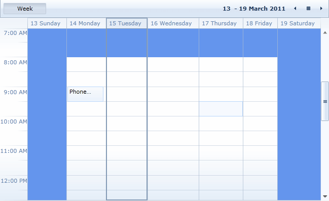
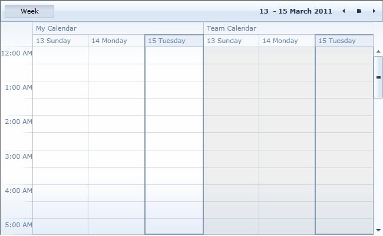

# Special and ReadOnly slots

Using __RadScheduleView for__ you can define special and read-only slots and apply different styles to them.  You just need to prepare a collection of Slot objects and assign it to __SpecialSlotsSource__ property of the ScheduleView.      

Every Slot has the following properties:

* __Start__ - start date of the Slot.          

* __End__ - end date of the Slot.          

* __Resources__ - a collection of resources for which the slot is defined.          

* __RecurrencePattern__ - defines whether the slot will be displayed for repeating days.          

* __IsReadOnly__ - when set to __true__ the slot is disabled.          

>When a slot is disabled you cannot create, edit, delete or drag and drop appointments in it. The existing appointments in disabled slots are in read-only mode - edit appointment dialog is still shown when the appointment is clicked but its properties cannot be edited. ReadOnly slots have a greyed-out style applied, but it can be changed with SpecialSlotsStyleSelector.        

__SpecialSlotsStyleSelector__ allows you to apply a separate Style for the special slots. You can use this feature for working/nonworking hours, holidays, days off, etc.      

This article will cover the following examples:      

[Setting a separate Style for nonworking hours](#setting-a-separate-style-for-nonworking-hours)

[Setting all the slots for a given resource to be read-only](#setting-all-the-slots-for-a-given-resource-to-be-read-only)

>In some cases when using a big number of special slots there could be some __performance__ issues in the RadScheduleView control. In order to not lose performance when using Special and ReadOnly slots you should keep in mind the following measures:      
>	* Populate the Slots that are in the visible range only.       
>	* If a Slot is in multiple Resources at the same time do not create a separate Slot for each Resource but rather assign the Resources to the Slot.     
>	* If a Slot is recurring do not create many different separate Slots but rather create a recurring one.            
>	* Treat the Slots as Appointments, the same performance principals exist.            

## Setting a separate Style for nonworking hours

* First you should create the collection of Slot objects and set their RecurrencePattern property:            

#### __C#__

{{region radscheduleview-features-speacialslots_0}}
	var NonWorkingHours = new ObservableCollection<Slot>();
	DateTime start = new DateTime(2010, 1, 1, 8, 0, 0);
	DateTime end = new DateTime(2010, 1, 1, 18, 0, 0);
	NonWorkingHours.Add(new Slot(end, start.AddDays(1))
	{
	    RecurrencePattern = new RecurrencePattern(
	                null, RecurrenceDays.Monday | RecurrenceDays.Tuesday | RecurrenceDays.Wednesday | RecurrenceDays.Thursday, RecurrenceFrequency.Weekly, 1, null, null)
	});
	
	NonWorkingHours.Add(
	    new Slot(end, start.AddDays(3))
	    {
	        RecurrencePattern = new RecurrencePattern(
	                    null, RecurrenceDays.Friday, RecurrenceFrequency.Weekly, 1, null, null)
	    });
{{endregion}}

* Then create the ScheduleViewStyleSelector class:            

#### __C#__

{{region radscheduleview-features-speacialslots_1}}
	public class SpecialSlotStyleSelector : ScheduleViewStyleSelector
	{
	    private Style nonworkingHourStyle;
	    public Style NonworkingHourStyle
	    {
	        get
	        {
	            return this.nonworkingHourStyle;
	        }
	        set
	        {
	            this.nonworkingHourStyle = value;
	        }
	    }
	    public override Style SelectStyle(object item, DependencyObject container, ViewDefinitionBase activeViewDefinition)
	    {
	        return this.NonworkingHourStyle;
	    }
	}
{{endregion}}

and define the Style:

#### __XAML__

{{region radscheduleview-features-speacialslots_2}}
	<local:SpecialSlotStyleSelector x:Key="SpecialSlotStyleSelector">
		<local:SpecialSlotStyleSelector.NonworkingHourStyle>
			
		</local:SpecialSlotStyleSelector.NonworkingHourStyle>
	</local:SpecialSlotStyleSelector>
{{endregion}}

* Finally, bind them to SpecialSlotsSource and SpecialSlotsStyleSelector properties:            

#### __XAML__

{{region radscheduleview-features-speacialslots_3}}
	<telerik:RadScheduleView x:Name="scheduleView"
	           SpecialSlotsSource="{Binding NonWorkingHours}"
	           SpecialSlotStyleSelector="{StaticResource SpecialSlotStyleSelector}">
			...
	</telerik:RadScheduleView>
{{endregion}}

Here is the result:

##  Setting all the slots for a given resource to be read-only

Let's for example have the following Resource Type defined:

#### __XAML__

{{region radscheduleview-features-speacialslots_4}}
	<telerik:RadScheduleView x:Name="scheduleView">
	 <telerik:RadScheduleView.ResourceTypesSource>
	    <telerik:ResourceTypeCollection>
	        <telerik:ResourceType Name="Calendar">
	            <telerik:Resource ResourceName="John" DisplayName="My Calendar" />
	            <telerik:Resource ResourceName="Team" DisplayName="Team Calendar" />
	        </telerik:ResourceType>
	    </telerik:ResourceTypeCollection>
	  </telerik:RadScheduleView.ResourceTypesSource>
	  ...
	</telerik:RadScheduleView>
{{endregion}}

* You can create the collection of read-only slots for "Team" Resource like this:           

#### __C#__

{{region radscheduleview-features-speacialslots_5}}
	var ReadOnlySlots = new ObservableCollection<Slot>();
	Slot readOnlyslot = new Slot() { 
			Start = DateTime.MinValue, 
			End = DateTime.MaxValue, 
			IsReadOnly = true 
			};
	readOnlyslot.Resources.Add(new Resource("Team", "Calendar"));
	ReadOnlySlots.Add(readOnlyslot);
{{endregion}}

> The types of objects added to the Resources collection of the Slot and to the ResourceType object in the ResourceTypesSource need to match. This is important in scenarios where the __IResource__ interface is implemented.

* And assign it to the ScheduleView's SpecialSlotsSource property:            

#### __XAML__

{{region radscheduleview-features-speacialslots_6}}
	<telerik:RadScheduleView  x:Name="scheduleView" SpecialSlotsSource="{Binding ReadOnlySlots}">
	...
	</telerik:RadScheduleView>
{{endregion}}

The read-only slots will look like this:

Note that EditAppointmentDialog is shown even for appointments which are visualized in the read-only slots. In order to prevent it, susbscribe to ShowDialog event of the RadScheduleView:        

#### __XAML__

{{region radscheduleview-features-speacialslots_7}}
	<telerik:RadScheduleView x:Name="scheduleView" ShowDialog="scheduleView_ShowDialog">
{{endregion}}

and cancel it in the event handler:       

#### __C#__

{{region radscheduleview-features-speacialslots_8}}
	private void scheduleView_ShowDialog(object sender, ShowDialogEventArgs e)
	{
	    var appointmentDialog = e.DialogViewModel as AppointmentDialogViewModel;
	    if (appointmentDialog != null && appointmentDialog.IsReadOnly)
	    {
	        e.Cancel = true;
	    }
	}
{{endregion}}

Check out the [online demo](https://demos.telerik.com/silverlight/#ScheduleView/SpecialSlots)[online demo](https://demos.telerik.com/wpf/?ScheduleView/SpecialSlots) to see special slots in action.        
