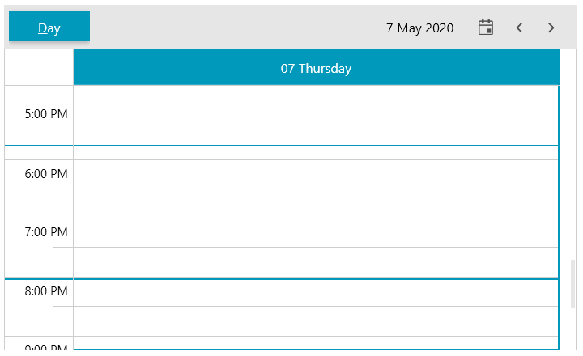

# TimeIndicator

__RadScheduleView__ provides the option to visually mark a specific time on the timeline.

The time indicator is visualized with a straight line that goes across the timer ruler and appointments area of RadScheduleView. To add an indicator set the __TimeIndicatorsCollection__ property of the control and populate it with __TimeIndicator__ objects.

The TimeIndicator class allows you to set __Offset__ and __Location__.

* __Offset__ is a `TimeSpan` property which determines an offset relative to the current DateTime (DateTime.Now).
* __Location__ is a `CurrentTimeIndicatorLocation` property which determines the location of the indicator. This can be set to the following locations:
	* __TimeRulerArea__: The indicator is drawn only in the TimeRulerArea. 
	* __AppointmentsArea__: The indicator is drawn only in the AppointmentsArea.
	* __WholeArea__: The indicator is drawn in both areas - TimeRulerArea and AppointmentsArea.
	
#### __[XAML] Example 1: Adding time indicators in XAML__
{{region radscheduleview-features-timeindicator-0}}
	<telerik:RadScheduleView AppointmentsSource="{Binding Appointments}">
		<telerik:RadScheduleView.ViewDefinitions>
			<telerik:DayViewDefinition />
		</telerik:RadScheduleView.ViewDefinitions>
		<telerik:RadScheduleView.TimeIndicatorsCollection>
			<telerik:TimeIndicatorsCollection>
				<telerik:TimeIndicator Location="WholeArea" />
				<telerik:TimeIndicator Offset="-02:15" Location="WholeArea" />
			</telerik:TimeIndicatorsCollection>
		</telerik:RadScheduleView.TimeIndicatorsCollection>
	</telerik:RadScheduleView>	
{{endregion}}

#### __[C#] Example 2: Adding time indicators in code__
{{region radscheduleview-features-timeindicator-1}}
	var collection = new TimeIndicatorsCollection();
	collection.Add(new TimeIndicator() { Location = CurrentTimeIndicatorLocation.WholeArea });
	collection.Add(new TimeIndicator() { Location = CurrentTimeIndicatorLocation.WholeArea, Offset = new TimeSpan(-2, -15, 0) });
	this.radScheduleView.TimeIndicatorsCollection = collection;
{{endregion}}

#### Figure 1: RadScheduleView with two time indicators

## TimeIndicatorStyleSelector

The __TimeIndicatorStyleSelector__ property of RadScheduleView is used to provide styles for the __TimeIndicatorItem__ controls generated from the TimeIndicators in the TimeIndicatorsCollection. 

The default __TimeIndicatorStyleSelector__ class can be used to customize the time indicators in the different locations (TimeRulerArea, AppointmentsArea and WholeArea).

Additionally, a class that derives from StyleSelector can be created in order to provide custom style selection logic.

## CurrentTimeIndicator

This a special time indicator that is not in the TimeIndicatorsCollection, but it is displayed in the same way, with the sole difference that it shows on the current DateTime (DateTime.Now). The offset of the TimeIndicator items is relative to the position of the current time indicator. Read more in the [CurrentTimeIndicator]() article. 

## Custom TimeIndicator

The following example shows how to inherit the TimeIndicator class and override its __GetDateTime__ method. This allows creating an indicator with a concrete date, instead of using an offset.

#### __[C#] Example 3: Creating a custom TimeIndicator__
{{region radscheduleview-features-timeindicator-2}}
	public class CustomTimeIndicator : TimeIndicator
    {
        public DateTime DateTime { get; set; }

        public override DateTime GetDateTime()
        {
            return this.DateTime;
        }
    }
{{endregion}}

#### __[XAML] Example 4: Using the custom TimeIndicator__
{{region radscheduleview-features-timeindicator-3}}	
	<telerik:RadScheduleView.TimeIndicatorsCollection>
		<telerik:TimeIndicatorsCollection>
			<local:CustomTimeIndicator DateTime="5/7/2020 16:15" />
		</telerik:TimeIndicatorsCollection>
	</telerik:RadScheduleView.TimeIndicatorsCollection>
{{endregion}}

## See Also  
* [Getting Started]()
* [Visual Structure]()
* [View Definintions]()

