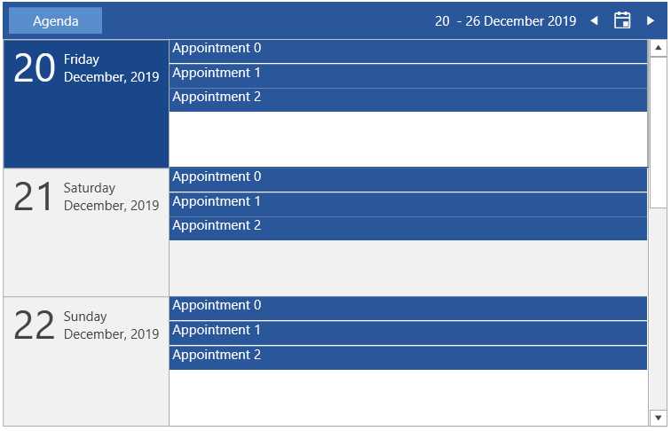
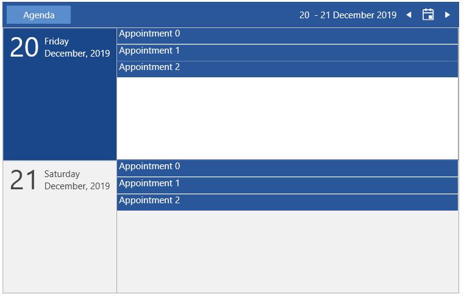

# Agenda View

__AgendaViewDefinition__ allows you to display a set of appointments for a specific period of time.

[image]

>tip See the [Common Features] article to see the functionality that is shared accross the different views.

## Setting up the View

To set any of the RadScheduleView's view definition objects, add it in the ViewDefinitions collection. The following example shows how to setup RadScheduleView in a basic scenario and use the AgendaViewDefinition element.

#### __[XAML] Example 1: Define RadScheduleView and set AgendaViewDefinition in the ViewDefinitions collection__
{{region radscheduleview-viewdefinitions-agenda-0}}
	<telerik:RadScheduleView x:Name="radScheduleView">
		<telerik:RadScheduleView.ViewDefinitions>
			<telerik:AgendaViewDefinition />
		</telerik:RadScheduleView.ViewDefinitions>
	</telerik:RadScheduleView>
{{endregion}}

#### __[C#] Example 2: Setting the AppointmentSource of RadScheduleView__
{{region radscheduleview-viewdefinitions-agenda-1}}
	var currentDate = DateTime.Today;
	var source = new ObservableCollection<Appointment>();
	for (int i = 0; i < 5; i++)
	{
		currentDate = DateTime.Today.AddDays(i);
		for (int k = 0; k < 3; k++)
		{
			source.Add(new Appointment() { Subject = "Appointment " + k , Start = currentDate.AddHours(k), End = currentDate.AddHours(k + 1)});
		}
	}

	this.radScheduleView.AppointmentsSource = source;
{{endregion}}

#### Figure 1: AgendaViewDefinition

## Number of Visible Days

To set the number of visible days, set the __VisibleDays__ property of AgendaViewDefinition. This determines how many rows with days will be visible in the current view.

#### __[XAML] Example 3: Setting visible days number__
{{region radscheduleview-viewdefinitions-agenda-2}}
	<telerik:RadScheduleView.ViewDefinitions>
		<telerik:AgendaViewDefinition VisibleDays="3" />
	</telerik:RadScheduleView.ViewDefinitions>
{{endregion}}

The default value of VisibleDays is 7.

#### Figure 2: AgendaViewDefinition with 3 visible days

## Hide Empty Days

The agenda view displays empty days by default. You can alter this behavior and hide days that don't contain appointments, by setting the __ShowEmptyDays__ property to __False__.

#### __[XAML] Example 4: Hiding empty days__
{{region radscheduleview-viewdefinitions-agenda-3}}
	<telerik:RadScheduleView.ViewDefinitions>
		<telerik:AgendaViewDefinition ShowEmptyDays="False" />
	</telerik:RadScheduleView.ViewDefinitions>
{{endregion}}

#### Figure 3: AgendaViewDefinition with shown and hidden empty days (comparison)

## See Also
* [Getting Started]()
* [ViewDefinitions Overview]()
* [ViewDefinitions Configuration]()

