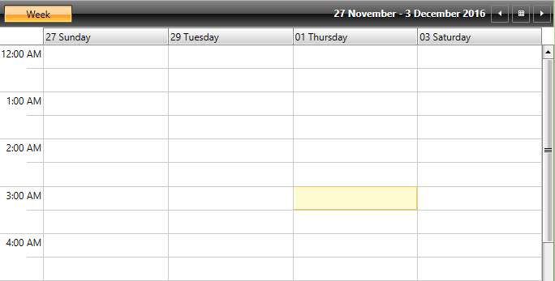
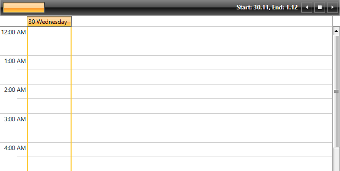
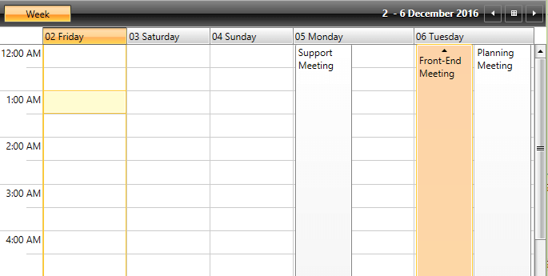

# Define a Custom ViewDefinition

This topic will demonstrate the customization capabilities provided by __RadScheduleView__ for defining a custom ViewDefinition. Determining which ViewDefinition to inherit, so that the needed customizations are based on it, depends on the particular needs. More information on the built-in ViewDefinitions can be found in the [Overview]() topic.

>As modifying the appearance of different elements of the control is discussed in this article, it is recommended to review the [Visual Structure]() topic first.

* [Custom DateGroupDescription](#custom-dategroupdescription)

* [Set the Format of the Group Header](#set-the-format-of-the-group-header)

* [Format the text of the visible range](#format-the-text-of-the-visible-range)

* [Show the Week Group Headers](#show-the-week-group-headers)

* [Set the Beginning and the End of the Visible Range](#set-the-beginning-and-the-end-of-the-visible-range)

## Custom DateGroupDescription

When a custom ViewDefinition based on __WeekViewDefinition__ or __MonthViewDefinition__ is defined, you could customize the grouping of the used __DateGroupDescription__. In this case the __DateGroupDescription__ property of the ViewDefinition needs to be overriden by returning a  custom object inheriting from __DateGroupDescription__. The custom __DateGroupDescription__ object needs to override the __GroupLength__ property.

#### __[C#] Example 1: Defining the custom DateGroupDescription__
{{region radscheduleview-features-viewdefinitions-define-custom-viewdefinition-0}}
	class MyGroupDescription : DateGroupDescription
	{
	    public override TimeSpan GroupLength
	    {
	        get
	        {
	            return TimeSpan.FromDays(2);
	        }
	    }
	}
{{endregion}}

#### __[VB.NET] Example 1: Defining the custom DateGroupDescription__
{{region radscheduleview-features-viewdefinitions-define-custom-viewdefinition-1}}
	Class MyGroupDescription
	Inherits DateGroupDescription
		Public Overrides ReadOnly Property GroupLength() As TimeSpan
			Get
				Return TimeSpan.FromDays(2)
			End Get
		End Property
	End Class
{{endregion}}

After the needed __DateGroupDescription__ is defined, it needs to be returned by the __DateGroupDescription__ property of the custom ViewDefinition.

#### __[C#] Example 2: Return the custom DateGroupDescription__
{{region radscheduleview-features-viewdefinitions-define-custom-viewdefinition-2}}
	protected override DateGroupDescription DateGroupDescription
	{
		get
		{
			return new MyGroupDescription();
		}
	}
{{endregion}}

#### __[VB.NET] Example 2: Return the custom DateGroupDescription__
{{region radscheduleview-features-viewdefinitions-define-custom-viewdefinition-3}}
		Protected Overrides ReadOnly Property DateGroupDescription() As DateGroupDescription
			Get
				Return New MyGroupDescription()
			End Get
		End Property
{{endregion}}

#### __Figure 1: Custom DateGroupDescription__

## Set the Format of the Group Header

The format of the Group Header can be altered by overriding the __FormatGroupHeaderName__ method.

#### __[C#] Example 3: Set the format of the Group Header__
{{region radscheduleview-features-viewdefinitions-define-custom-viewdefinition-4}}
	protected override string FormatGroupHeaderName(IFormatProvider formatInfo, object groupName)
	{
		var date = (DateTime)groupName;	       
		return String.Format("{0} {1}", date.DayOfWeek, date.Day);
	}
{{endregion}}

#### __[VB.NET] Example 3: Set the format of the GroupHeader__
{{region radscheduleview-features-viewdefinitions-define-custom-viewdefinition-5}}
	Protected Overrides Function FormatGroupHeaderName(formatInfo As IFormatProvider, groupName As Object) As String
		Dim [date] = DirectCast(groupName, DateTime)

		Return [String].Format("{0} {1}", [date].DayOfWeek, [date].Day)
	End Function
{{endregion}}

#### __Figure 2: Formatted GroupHeader name__

## Format the Text of the Visible Range 

The format of the string that represents the currently visible range can be modified by overriding the __FormatVisibleRangeText__ method. 

#### __[C#] Example 4: Set the format of the currently visible range text__
{{region radscheduleview-features-viewdefinitions-define-custom-viewdefinition-6}}
	protected override string FormatVisibleRangeText(IFormatProvider formatInfo, 
            DateTime rangeStart, DateTime rangeEnd, DateTime currentDate)
	{
		return String.Format("Start: {0}.{1}, End: {2}.{3}", 
			rangeStart.Day, rangeStart.Month, rangeEnd.Day, rangeEnd.Month);
	}
{{endregion}}

#### __[VB.NET] Example 4: Set the format of the currently visible range text__
{{region radscheduleview-features-viewdefinitions-define-custom-viewdefinition-6}}
	Protected Overrides Function FormatVisibleRangeText(formatInfo As IFormatProvider, 
		rangeStart As DateTime, rangeEnd As DateTime, currentDate As DateTime) As String
			Return [String].Format("Start: {0}.{1}, End: {2}.{3}", rangeStart.Day, rangeStart.Month, rangeEnd.Day, rangeEnd.Month)
	End Function
{{endregion}}

#### __Figure 3: Modified format of the visible range text__

## Show the Week Group Headers

By default, the week group headers are hidden. They can be shown by overriding the __GetShowWeekGroupHeaders__ method

#### __[C#] Example 5: Show the week group headers__
{{region radscheduleview-features-viewdefinitions-define-custom-viewdefinition-7}}
	protected override bool GetShowWeekGroupHeaders()
	{
		return true;
	}
{{endregion}}

#### __[VB.NET] Example 5: Show the week group headers__
{{region radscheduleview-features-viewdefinitions-define-custom-viewdefinition-8}}
	Protected Overrides Function GetShowWeekGroupHeaders() As Boolean
		Return True
	End Function
{{endregion}}

#### __Figure 4: Showing the week group headers__

## Set the Beginning and the End of the Visible Range

The DateTime values for the start and end of the visible range, can be set through the __GetVisibleRangeStart__ and __GetVisibleRangeEnd__ methods.

#### __[C#] Example 6: Setting visible range__
{{region radscheduleview-features-viewdefinitions-define-custom-viewdefinition-9}}
	protected override DateTime GetVisibleRangeStart(DateTime dateTime, 
	System.Globalization.CultureInfo culture, DayOfWeek? firstDayOfWeek)
	{
		return dateTime;
	}

	protected override DateTime GetVisibleRangeEnd(DateTime dateTime, 
		System.Globalization.CultureInfo culture, DayOfWeek? firstDayOfWeek)
	{
		return dateTime.AddDays(5);
	}
{{endregion}}

#### __Figure 5: Modify the start and end of the visible range__

## See Also
* [Custom Slots]()
* [Custom Dialogs]()
* [Customizing Dialog Windows]()
