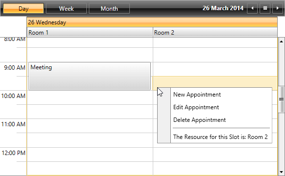

# Get the Resource of the Clicked Slot/Appointment

In many scenarios you may need to implement a __RadContextMenu__ within the __RadScheduleView__ and depending on the clicked item to execute custom logic. This article will demonstrate an approach how to get the Resource of the clicked __Appointment__ or __Slot__ in __RadScheduleView__ and use it as __Header__ of a __RadMenuItem__.

Let’s start with the following __RadScheduleView__ definition which includes Resources and a __RadContextMenu__ attached:

#### __[XAML] Example 1: Defining RadScheduleView__

{{region radscheduleview-howto-get-clicked-element_0}}
	<telerik:RadScheduleView AppointmentsSource="{Binding Appointments}">
	    <telerik:RadScheduleView.ViewDefinitions>
	        <telerik:DayViewDefinition />
	        <telerik:WeekViewDefinition />
	        <telerik:MonthViewDefinition />
	    </telerik:RadScheduleView.ViewDefinitions>
	    <telerik:RadScheduleView.ResourceTypesSource>
	        <telerik:ResourceTypeCollection>
	            <telerik:ResourceType Name="Location">
	                <telerik:Resource ResourceName="Room 1" />
	                <telerik:Resource ResourceName="Room 2" />
	            </telerik:ResourceType>
	        </telerik:ResourceTypeCollection>
	    </telerik:RadScheduleView.ResourceTypesSource>
	    <telerik:RadScheduleView.GroupDescriptionsSource>
	        <telerik:GroupDescriptionCollection>
	            <telerik:DateGroupDescription />
	            <telerik:ResourceGroupDescription ResourceType="Location" />
	        </telerik:GroupDescriptionCollection>
	    </telerik:RadScheduleView.GroupDescriptionsSource>
	    <telerik:RadContextMenu.ContextMenu>
	        <telerik:RadContextMenu>
	            <telerik:RadMenuItem Header="New Appointment" />
	            <telerik:RadMenuItem Header="Edit Appointment" />
	            <telerik:RadMenuItem Header="Delete Appointment" />
	        </telerik:RadContextMenu>
	    </telerik:RadContextMenu.ContextMenu>
	</telerik:RadScheduleView>
{{endregion}}

## Determine Whether an Appointment or a Slot is Clicked

> When an __Appointment__ is selected, the __SelectedSlot__ property of __RadScheduleView__ will be set to __null__. Respectively, when a __Slot__ is clicked, the __SelectedAppointment__ property will have a __null value__.

The process of determining whether an __Appointment__ or a __Slot__ is clicked will be demonstrated through the following steps.

**1.** Define the needed __IValueConverters__.

The built-in __NullToVisibilityConverer__  will set the __Visibility__ of the __MenuItems__ according the value of the __SelectedAppointment__ and the __SelectedSlot__. When the value is null the converter will return __Visibility.Collapsed__. 

#### __[XAML] Example 2: Defined the needed IValueConverters__

{{region radscheduleview-howto-get-clicked-element_1}}
	<Grid.Resources>
	    <telerik:NullToVisibilityConverter x:Key="NullToVisibilityConverter"/>
	    <local:ClickedElementToResourceNameConverter x:Key="ClickedElementToResourceNameConverter" />
	</Grid.Resources>
{{endregion}}

**2.** Implement the __ClickedElementToResourceNameConverter__. 

As its name hints, it will get the clicked item and return a simple string with __Resource__ name.

#### __[C#] Example 3: Implement the ClickedElementToResourceNameConverter__

{{region radscheduleview-howto-get-clicked-element_0}}
	public class ClickedElementToResourceNameConverter : IValueConverter
	{
	    public object Convert(object value, Type targetType, object parameter, System.Globalization.CultureInfo culture)
	    {
	        if (value is Appointment)
	        {
	            var appointment = value as Appointment;
	
	            return "The Resource for this Appointment is: " + appointment.Resources.First();
	
	        }
	        else if (value is Slot)
	        {
	            var slot = value as Slot;
	
	            return "The Resource for this Slot is: " + slot.Resources.First();
	        }
	
	        return null;
	    }
	
	    public object ConvertBack(object value, Type targetType, object parameter, System.Globalization.CultureInfo culture)
	    {
	        return value;
	    }
	}
{{endregion}}

**3.** Add two additional __RadMenuItems__. The first one will be shown when an Appointment is clicked and the second one when a Slot is clicked. 

In order to get the __SelectedAppointment__ and the __SelectedSlot__, the __Menu__ property of __RadMenuItem__ can be used. It holds a reference to the __UIElement__ on which the __RadContextMenu__ is attached. This way, the values of the __SelectedAppointment__ and __SelectedSlot__ properties will be easily fetched through binding and used in the __Header__ of the __RadMenuItem__.

#### __[XAML] Define the two RadMenuItems__

{{region radscheduleview-howto-get-clicked-element_2}}
	<telerik:RadMenuItem
	        Header="{Binding Path=Menu.UIElement.SelectedAppointment, RelativeSource={RelativeSource Self}, Converter={StaticResource ClickedElementToResourceNameConverter}}" 
	        Visibility="{Binding Header, RelativeSource={RelativeSource Self}, Converter={StaticResource NullToVisibilityConverter}}" />
	<telerik:RadMenuItem 
	        Header="{Binding Path=Menu.UIElement.SelectedSlot, RelativeSource={RelativeSource Self}, Converter={StaticResource ClickedElementToResourceNameConverter}}" 
	        Visibility="{Binding Header, RelativeSource={RelativeSource Self}, Converter={StaticResource NullToVisibilityConverter}}" />
{{endregion}}  

__Figure 1__ and __Figure 2__ demonstrate the final result.

__Figure 1: When an Appointment is clicked the RadContextMenu will have information about its Resource__

__Figure 2: When an empty Slot is clicked the RadContextMenu will have information about its Resource__

## See Also

 * [Getting Started]()

 * [Understanding Appointments]()

 * [Special and ReadOnly slots]()
