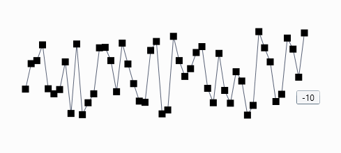
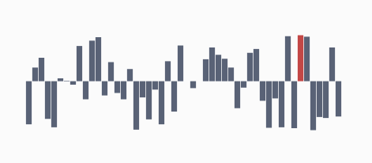
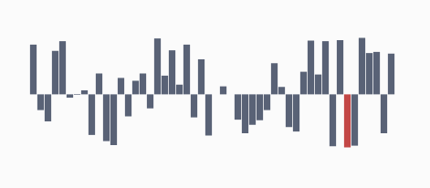
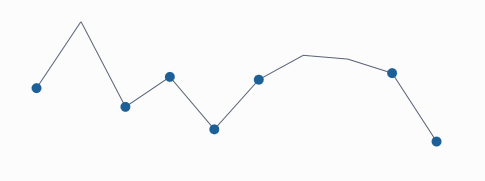
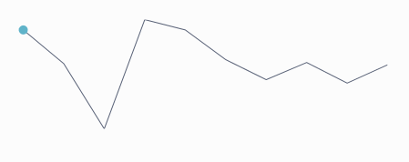
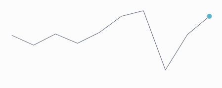

# Indicators

The controls from the RadSparkline suite support several types of indicators which can be used to highlight the plotted data.

## Markers

The markers are visual indicators showing the location of each data point along the graph line. This setting is applicable to sparkline controls deriving from __RadLinearSparklineBase__ - RadLinearSparkline and RadAreaSparkline. To enable the markers set the __ShowMarkers__ property to True.

#### __[XAML] Example 1: Show markers of RadLinearSparkline in XAML__
{{region radsparkline-features-indicators-0}}
	 <telerik:RadLinearSparkline ShowMarkers="True" />
{{endregion}}

#### __[C#] Example 2: Show markers of RadLinearSparkline in code__
{{region radsparkline-features-indicators-1}}	
	this.sparklineControl.ShowMarkers = true;
{{endregion}}

#### __Figure 1: RadLinearSparkline and RadAreaSparkline with shown markers__

You can change the color of the marker via the __MarkersBrush__ property.

The markers can be customized via the __MarkersStyle__ property of the control.

#### __[XAML] Example 3: Setting MarkersStyle__
{{region radsparkline-features-indicators-2}}	
	<telerik:RadLinearSparkline.MarkersStyle>
		
	</telerik:RadLinearSparkline.MarkersStyle>
{{endregion}}

#### __Figure 2: RadLinearSparkline with custom MarkersStyle__

## High Point

This is a visual indicator which highlights the single highest-value datapoint in a series. In case there is more than one high point, all such points are highlighted. If the spark line is of type RadColumnSparkline or RadWinLossSparkLine, the bar which represents the highest value is highlighted. The highpoint is enabled by setting the __ShowHighPointIndicator__ property to True.

#### __[XAML] Example 4: Show high point indicator of RadColumnSparkline in XAML__
{{region radsparkline-features-indicators-3}}
	 <telerik:RadColumnSparkline ShowHighPointIndicators="True" />
{{endregion}}

#### __[C#] Example 5: Show high point indicator of RadColumnSparkline in code__
{{region radsparkline-features-indicators-4}}
	this.sparklineControl.ShowHighPointIndicators = true;
{{endregion}}

#### __Figure 3: RadColumnSparkline with shown high point indicator__

You can change the color of the high point indicator via the __HighPointBrush__ property.

You can customize the appearance of the data point via the __HighPointStyle__ property.

#### __[XAML] Example 6: Setting HighPointStyle__
{{region radsparkline-features-indicators-5}}	
	<telerik:RadColumnSparkline.HighPointStyle>
		
	</telerik:RadColumnSparkline.HighPointStyle>
{{endregion}}

#### __Figure 4: RadColumnSparkline with custom HighPointStyle__

## Low Point

This is a visual indicator which highlights the single lowest-value datapoint in a series. In case there is more than one such point, all similar points are highlighted. If the spark line is of type RadColumnSparkline or RadWinLossSparkLine, the bar which represents the lowest value is highlighted. The low point is enabled by setting the __ShowLowPointIndicator__ property to True.

#### __[XAML] Example 7: Show low point indicator of RadColumnSparkline in XAML__
{{region radsparkline-features-indicators-6}}
	 <telerik:RadColumnSparkline ShowLowPointIndicators="True" />
{{endregion}}

#### __[C#] Example 8: Show low point indicator of RadColumnSparkline in code__
{{region radsparkline-features-indicators-7}}
	this.sparklineControl.ShowLowPointIndicators = true;
{{endregion}}

#### __Figure 5: RadColumnSparkline with shown low point indicator__

You can change the color of the low point indicator via the __LowPointBrush__ property.

You can customize the appearance of the data point via the __LowPointStyle__ property.

#### __[XAML] Example 9: Setting LowPointStyle__
{{region radsparkline-features-indicators-8}}	
	<telerik:RadColumnSparkline.LowPointStyle>
		
	</telerik:RadColumnSparkline.LowPointStyle>
{{endregion}}

#### __Figure 6: RadColumnSparkline with custom LowPointStyle__

## Negative Points

These visual indicators highlight all negative data points in a series. If the spark line is of type RadColumnSparkline or RadWinLossSparkLine the bars which represent negative values are highlighted. The negative points indicators are enabled by setting the __ShowNegativePointsIndicator__ to True.

#### __[XAML] Example 10: Show negative points of RadLinearSparkline in XAML__
{{region radsparkline-features-indicators-9}}
	 <telerik:RadLinearSparkline ShowNegativePointIndicators="True" />
{{endregion}}

#### __[C#] Example 11: Show negative points of RadLinearSparkline in code__
{{region radsparkline-features-indicators-10}}	
	this.sparklineControl.ShowNegativePointIndicators = true;
{{endregion}}

#### __Figure 7: RadLinearSparkline with shown negative point indicators__

You can change the color of the negative points via the __NegativePointBrush__ property.

The negative points can be customized via the __NegativePointStyle__ property of the control.

#### __[XAML] Example 12: Setting NegativePointStyle (see Figure 7)__
{{region radsparkline-features-indicators-11}}	
	<telerik:RadLinearSparkline.NegativePointStyle>
		
	</telerik:RadLinearSparkline.NegativePointStyle>
{{endregion}}

## First Point

This is a visual indicator, which highlights the first data point in a series. If the spark line is of type RadColumnSparkline or RadWinLossSparkLine the bar which represents the first data point is highlighted. If the spark line is of type RadColumnSparkline or RadWinLossSparkLine the first bar is highlighted.

The first point is enabled in the series by setting the __ShowFirstPointIndicator__ property to True.

#### __[XAML] Example 13: Show first point of RadLinearSparkline in XAML__
{{region radsparkline-features-indicators-12}}
	 <telerik:RadLinearSparkline ShowFirstPointIndicator="True" />
{{endregion}}

#### __[C#] Example 14: Show first point of RadLinearSparkline in code__
{{region radsparkline-features-indicators-13}}	
	this.sparklineControl.ShowFirstPointIndicator = true;
{{endregion}}

#### __Figure 8: RadLinearSparkline with shown first point indicator__

You can change the color of the first point via the __FirstPointBrush__ property.

The first point can be customized via the __FirstPointStyle__ property of the control.

#### __[XAML] Example 15: Setting FirstPointStyle (see Figure 8)__
{{region radsparkline-features-indicators-14}}	
	<telerik:RadLinearSparkline.FirstPointStyle>
		
	</telerik:RadLinearSparkline.FirstPointStyle>
{{endregion}}

## Last Point 

This is a visual indicator which highlights the last data point in a series. If the spark line is of type RadColumnSparkline or RadWinLossSparkLine the bar which represents the last value is highlighted. The last point is indicated in the series, by setting the __ShowLastPointIndicator__ property to True.

#### __[XAML] Example 16: Show last point of RadLinearSparkline in XAML__
{{region radsparkline-features-indicators-15}}
	 <telerik:RadLinearSparkline ShowFirstPointIndicator="True" />
{{endregion}}

#### __[C#] Example 17: Show last point of RadLinearSparkline in code__
{{region radsparkline-features-indicators-16}}	
	this.sparklineControl.ShowFirstPointIndicator = true;
{{endregion}}

#### __Figure 9: RadLinearSparkline with shown last point indicator__

You can change the color of the last point via the __LastPointBrush__ property.

The last point can be customized via the __LastPointStyle__ property of the control.

#### __[XAML] Example 18: Setting LastPointStyle (see Figure 9)__
{{region radsparkline-features-indicators-17}}	
	<telerik:RadLinearSparkline.LastPointStyle>
		
	</telerik:RadLinearSparkline.LastPointStyle>
{{endregion}}

## Empty Points

There are cases when the collection of data to which the Sparkline is bound may contain empty elements (null values) with no data to which the control can bind and visualize. The behavior of the control in such cases is governed by the __EmptyPointBehavior__ property of the control. There are two possible settings:

* __DropPoint__: The empty point is removed. This is the __default__ value.
* __ShowAsZero__: The empty point visualizes as though its original value was zero.

#### __[XAML] Example 19: Setting EmptyPointBehavior__
{{region radsparkline-features-indicators-18}}	
	<telerik:RadColumnSparkline EmptyPointBehavior="ShowAsZero" />
{{endregion}}

#### __Figure 10: RadLinearSparkline and RadColumnSparkline with a single null value shown as zero__

## See Also
* [Data Binding]()
