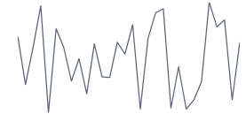
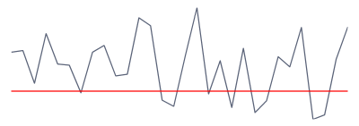

# Getting Started

This tutorial will walk you through the creation of a sample application that contains __RadLinearSparkline__. The other controls from the RadSparkline suite are set up using the same principle.

* [Assembly References](#assembly-references)
* [Sparkline Types](#sparkline-types)
* [Defining Sparkline](#defining-sparkline)
* [Showing Axis](#showing-axis)

## Assembly References

In order to use the __RadSparkline__ control, you will need to add references to the following assemblies:

* __Telerik.Windows.Controls__
* __Telerik.Windows.Controls.DataVisualization__
* __Telerik.Windows.Data__

## Sparkline Types

The sparkline bundle contains few controls which can be used for different data visualization. The supported visualizations are line, scatter points, area, column and win/loss bars. Read more about this in the [Sparkline Types]() article.

## Defining Sparkline

To show the sparkline control you can define a custom model for the data points as shown in __Example 1__. Then create a collection with the model and set it to the ItemsSource of the sparkline control (see __Example 3__).

#### __[C#] Example 1: Create the model__
{{region radsparkline-getting-started-0}}
	public class PlotInfo
    {
        public double YValue { get; set; }
        public double XValue { get; set; }
    }
{{endregion}}

#### __[XAML] Example 2: Define the sparkline__
{{region radsparkline-getting-started-1}}
	<telerik:RadLinearSparkline x:Name="sparkline"
								YValuePath="YValue"
								XValuePath="XValue"	/>
{{endregion}}

The __XValuePath__ and __YValuePath__ properties should be set to the names of the corresponding properties in the data point model (in this case PlotInfo).

#### __[C#] Example 3: Populate and set the ItemsSource__
{{region radsparkline-getting-started-2}}
	var randomNumberGenerator = new Random();
	var source = new ObservableCollection<PlotInfo>();
	for (int i = 0; i < 30; i++)
	{
		source.Add(new PlotInfo() { XValue = i, YValue = randomNumberGenerator.Next(100, 300) });
	}
	this.sparkline.ItemsSource = source;
{{endregion}}

#### Figure 1: RadLinearSparkline

## Showing Axis

You can show the axis of the sparkline control by setting its __ShowAxis__ property to True. The axis is horizontal. Read more about customizing the axis range and appearance in the [Axis]() article.

> By default the axis will be shown on value 0. This means that if the axis' range doesn't contain the 0 value, the axis won't be displayed. In this case you can set the __AxisOriginValue__ property of the sparkline control manually.

#### Figure 2: Sparkline axis

## See Also
* [Indicators]()
* [Data Binding]()
