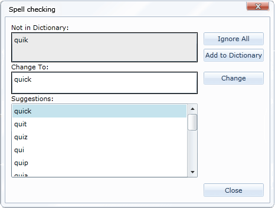

# SpellChecking Modes

__RadSpellChecker__ allows you to choose between two spellchecking modes when using it  with TextBox, RichTextBox and RadRichTextBox:

* [Check Word By Word](#check-word-by-word)

* [Check All Words At Once](#check-all-words-at-once)

## Check Word by Word

To do this kind of check, use the method as follows:

#### __C#__

{{region radspellchecker-spellchecking-modes_0}}
	private void Button_Click( object sender, RoutedEventArgs e )
	{
	   RadSpellChecker.Check(this.textBox1, SpellCheckingMode.WordByWord);
	}
{{endregion}}

When using this mode RadSpellChecker will check every word in a separate window, which looks like this: 

You are presented with a list of all possible suggestions, from which you can choose a word to replace the wrong one. Alternatively you can ignore the word or add it to a custom dictionary.

>This dialog will be called on every word considered wrong.

## Check All Words At Once

You can trigger this operation using the method below:

#### __C#__

{{region radspellchecker-spellchecking-modes_1}}
	private void Button_Click( object sender, RoutedEventArgs e )
	{
	   RadSpellChecker.Check(this.textBox1, SpellCheckingMode.AllAtOnce);
	}
{{endregion}}

When using AllAtOnce mode, RadSpellChecker loads the entire content of the control being spell-checked in a window looking like this:

You are presented with the same options as the WordByWord mode. The difference is that the entire spell checking is executed in this window and only after that the content is transferred to the original control being spellchecked.

>The control that shows the context of the spell-checked word in the window is a RadRichTextBox. Thus, a “conversion” has to be made when you are using the spell checker on a custom control. With regard to the correct transferring of the text, you have to carefully implement the methods in IControlSpellChecker, so that the context is fetched correctly.

>In this mode, the type of the spellchecker used is that of RadRichTextBox. Therefore, if you need to get a reference to the spellchecker in order to register the SpellChecker manually or load a dictionary when MEF is disabled, you can do it like this:

#### __C#__

{{region radspellchecker-spellchecking-modes_2}}
	public MainPage()
	{
	    InitializeComponent();
	 
	    ControlSpellCheckersManager.RegisterControlSpellChecker(new TextBoxSpellChecker());
	 
	    ControlSpellCheckersManager.RegisterControlSpellChecker(new RadRichTextBoxSpellChecker());
	    IControlSpellChecker controlSpellchecker = ControlSpellCheckersManager.GetControlSpellChecker(typeof(RadRichTextBox));
	    ISpellChecker spellChecker = controlSpellchecker.SpellChecker;
	    DocumentSpellChecker documentSpellChecker = (DocumentSpellChecker)spellChecker;
	    documentSpellChecker.AddDictionary(new RadEn_USDictionary(), new System.Globalization.CultureInfo("en-US"));
	}
	
{{endregion}}

