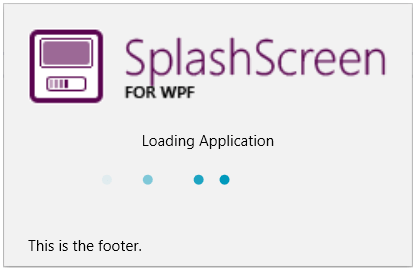

# Getting Started

This tutorial will walk you through the creation of a sample application that shows a splash screen using __RadSplashScreenManager__.

## Assembly References

In order to use __RadSplashScreen__, you will need to add references to the following assemblies:

* __Telerik.Windows.Controls__
* __Telerik.Windows.Controls.Navigation__

You can find the required assemblies for each control from the suite in the [Controls Dependencies]() help article.

## Showing Splash Screen

To shows a splash screen, use the __RadSplashScreenManager__ class. This allows you to display the default RadSplashScreen control.

> Note that the splash screen window is running on a separate UI thread.

You can start the splash screen anywhere you need to show a busy indication. The following example shows how to open the screen before the MainWindow is shown. To do this, call the __RadSplashScreenManager.Show__ method. This displays a screen hosting a __RadSplashScreen__ control.

#### __[C#] Example 1: Starting the splash screen on application startup__
{{region radsplashscreen-getting-started-0}}
	public partial class App : Application
	{
		protected override void OnStartup(StartupEventArgs e)
		{
			var dataContext = (SplashScreenDataContext)RadSplashScreenManager.SplashScreenDataContext;
			dataContext.ImagePath = "/SplashScreenWPFApplication;component/Images/splashscreen-for-wpf-image.png";
			dataContext.Content = "Loading Application";
			dataContext.Footer = "This is the footer.";
			
			RadSplashScreenManager.Show();
						
			Thread.Sleep(7000);	

			RadSplashScreenManager.Close();

			base.OnStartup(e);
		}
	}	
{{endregion}}

The splash screen is setup via the __RadSplashScreenManager.SplashScreenDataContext__ object which by default holds an object of type __SplashScreenDataContext__. Read more about the data context in the [Splash Screen Manager]() article.

This example is using `Thread.Sleep` to imitate a loading process, but you can replace this by any code that takes time and notifies you about its actions. Basically, call Show method when you need to display the screen and once your action is completed call the Close method.

## Showing Progress Bar

To enable the progress bar in RadSplashScreen, set the __IsIndeterminate__ property of SplashScreenDataContext to __False__. Then you can control the range and current value via the __ProgressValue__, __MinValue__ and __MaxValue__ properties of the data context. Read more about this in the [Progress Bar]() article.

## Showing Custom User Control in the Splash Screen

RadSplashScreenManager can be used to display any UI element. This means that you can create a custom UserControl and pass its type to the Show method. You can also replace the `RadSplashScreenManager.SplashScreenDataContext` with a custom object that can be used with the UserControl.

#### __[XAML] Example 2: Creating a UserControl__
{{region radsplashscreen-getting-started-1}}
	<UserControl x:Class="RadSplashScreenTest.MyUserControl"
             xmlns="http://schemas.microsoft.com/winfx/2006/xaml/presentation"
             xmlns:x="http://schemas.microsoft.com/winfx/2006/xaml"
             xmlns:mc="http://schemas.openxmlformats.org/markup-compatibility/2006" 
             xmlns:d="http://schemas.microsoft.com/expression/blend/2008" 
             mc:Ignorable="d" d:DesignHeight="450" d:DesignWidth="800"
             Width="{Binding Width}" Height="{Binding Height}">
		<Grid Background="#40568D">
			<TextBlock Text="{Binding Text}" Foreground="White" HorizontalAlignment="Center" VerticalAlignment="Center" />
		</Grid>
	</UserControl>	
{{endregion}}

#### __[C#] Example 3: Defining custom model__
{{region radsplashscreen-getting-started-2}}
	public class MyUserControlViewModel
    {
        public string Text { get; set; }
		public double Width { get; set; }
        public double Height { get; set; }
    }
{{endregion}}

#### __[C#] Example 4: Showing a splash screen with custom control__
{{region radsplashscreen-getting-started-3}}
	RadSplashScreenManager.SplashScreenDataContext = new MyUserControlViewModel() { Text = "Loading applicaiton...", Width = 150, Height = 150 };
	RadSplashScreenManager.Show<MyUserControl>();
{{endregion}}

## See Also  
* [Splash Screen Manager]()
* [Animations]()