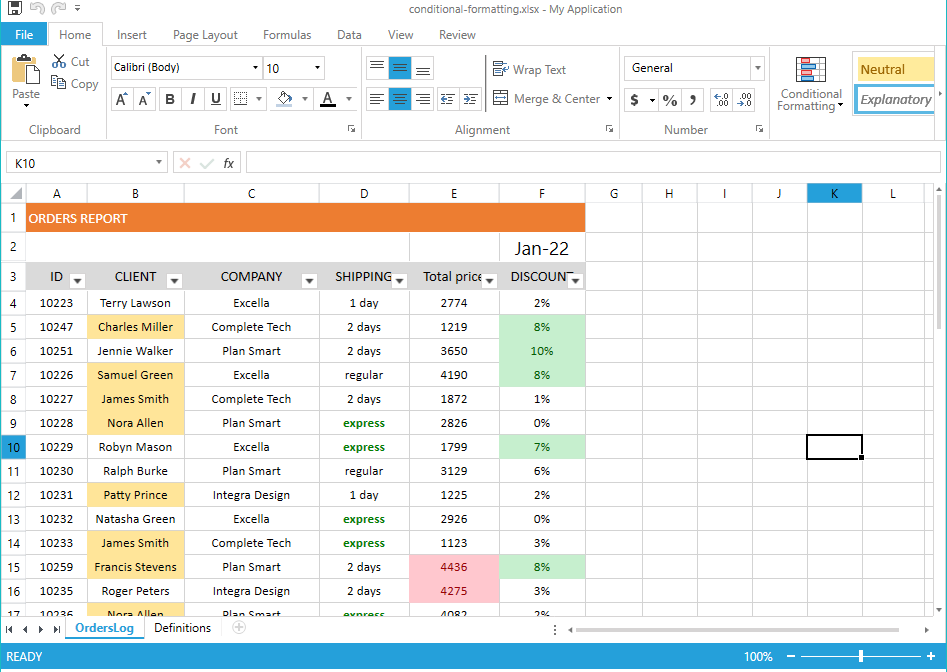
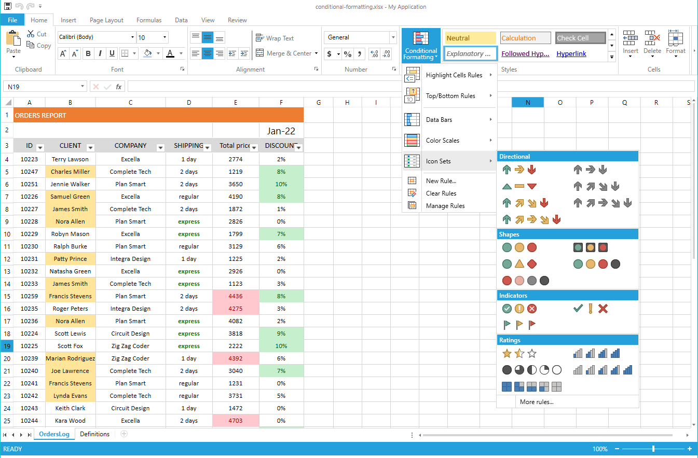

# Conditional Formatting

Since R2 2022 the Spreadsheet control supports working with conditional formatting and different rules. The conditional formatting in spreadsheet documents helps you visualize the data inside in a user-friendly manner, making it easy to analyze data, find critical issues, patterns and trends.

A conditional format changes the appearance of cells based on conditions that you specify. If the conditions are true, the cell range is formatted; if the conditions are false, the cell range is not formatted. There are many built-in conditions, and you can also create your own (including by using a formula that evaluates to True or False).

>If you would like to create or manipulate conditional formatting in code, refer to [SpreadProcessing | Conditional Formatting](https://docs.telerik.com/devtools/document-processing/libraries/radspreadprocessing/features/conditional-formatting).
 
On **Figure 1** you can see the effect of applying conditional formatting. The columns are styled as following: 
- On column B (Client) the **DuplicateValues** rule is used to highlight duplicate values
- The values in column D (Shipping) use **Contains** rule to highlight cells containing the "express" value
- The prices in column E (Total price) are styled through a **Top** rule to highlight the top 5 values
- On the Discount values in column D, the **GreaterThanOrEqual** rule is applied so the user can easily see discounts bigger than or equal to 7% 

#### Figure 1: Conditional Formatting

### Supported Conditional Formatting Rules

RadSpreadsheet supports many different types of formatting rules. All of them are listed in **Table 1**.

#### Table 1: Supported formatting rules

| Rule | Description |
|---|---|
| **ColorScaleRule** | Specificies a gradient range of colors that is used to give additional meaning to data by assigning certain values to colors in the gradient spectrum. |
| **DataBarRule** | A graphical representation of the cells' content. |
| **IconSetRule** | Specifies a collection of icons that can be used to comment and classify data into categories. |
| **BetweenRule** | This conditional formatting rule determines whether a cell value is inside a specified range. |
| **NotBetweenRule** | This conditional formatting rule determines whether a cell value is outside a specified range. |
| **EqualToRule** | Determines whether a cell value matches a specified value. |
| **NotEqualToRule** | Determines whether a cell value doesn't match a specified value. |
| **GreaterThanOrEqualToRule** | Determines whether a cell value matches specified value or it is greater. |
| **GreaterThanRule** | Determines whether a cell value is greater than the specified value. |
| **LessThanOrEqualToRule** | Determines whether a cell value matches specified value or it is smaller. |
| **LessThanRule** | Determines whether a cell value is smaller than the specified value. |
| **HasErrorRule** | Matches cell values that contain errors. |
| **HasNoErrorRule** | Matches cell values that do not contain errors. |
| **BeginsWithRule** | Matches cells whose values begin with a specified string. |
| **EndsWith** | Matches cells whose values end with a specified string. |
| **ContainsBlanksRule** | Matches blank cells. |
| **NotContainsBlanksRule** | Matches non-empty cells. |
| **ContainsRule** | This conditional formatting rule highlights cells containing given text. |
| **NotContainsRule** | This conditional formatting rule highlights cells that do not contain given text. |
| **TopRule** | This conditional formatting rule highlights cells whose values fall in the top N bracket. It can also work for N % instead of N items. It has two Boolean configuration properties: Items and Percent, which act like switches for these behaviors. |
| **BottomRule** | This conditional formatting rule highlights cells whose values fall in the bottom N bracket. It can also work for N % instead of N items. It has two Boolean configuration properties: Items and Percent, which act like switches for these behaviors. |
| **DuplicateValuesRule** | Matches values that are duplicate inside a specified range. |
| **UniqueValuesRule** | Matches values that are unique inside a specified range. |
| **ValueDistributionRule** | This conditional formatting rule highlights cells that are above or below the average for all values in the range. It has four Boolean configuration properties – `AboveAverage`, `AboveOrEqualToAverage`, `BelowAverage`, `BelowOrEqualToAverage`. |
| **DateOccurringRule** | This conditional formatting rule compares the values entered in date format in the cells. It has four Boolean configuration properties – `AboveAverage`, `AboveOrEqualToAverage`, `BelowAverage`, `BelowOrEqualToAverage`. |

## Working with Conditional Formatting

RadSpreadsheet comes with built-in UI to create, edit or remove conditional formatting rules and the styles they use. All options are available in the Conditional Formatting dropdown inside the Home tab of the ribbon. Through this dropdown you can create new rules, edit, or clear existing ones. There are also predefined options that you can directly set.

#### Figure 1: Working with conditional formatting

## See Also

* [Conditional Formatting API](https://docs.telerik.com/devtools/document-processing/libraries/radspreadprocessing/features/conditional-formatting)
