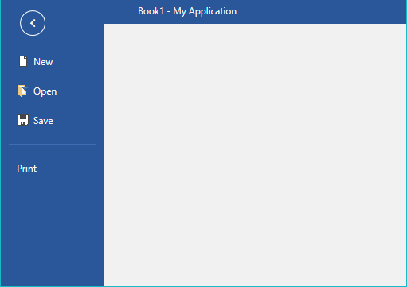

# Import/Export

The model of **RadSpreadsheet** enables you to easily open or save documents from the most common spreadsheet formats. This topic describes how you can use these functionalities in your application.

## Supported Formats

Here is a list of all the formats supported in **RadSpreadsheet**:

* **Xlsx**: Rich text format, which exports the whole content of a workbook: worksheets, formula values, formatting, hyperlinks etc.


* **Xls**: Rich text format, which exports the content of a workbook: worksheets, formula values, formatting, hyperlinks etc. Supported in older applications.


* **Pdf**: Fixed format, which preserves the content of a workbook in independent from software or hardware manner.

* **Csv** (comma separated): Plain text format that saves the content of the cells in the *active* worksheet. The format strips all formatting and keeps only the result values of cells. These values are separated by a *culture dependent* delimiter.

* **Txt** (tab delimited): Plain text format, which preserves only the content of the cells in the *active* worksheet. The format does not save any formatting and keeps only the result values of the cells. These values are delimited via tabs.

## Format Providers

The **CsvFormatProvider** and **TxtFormatProvider** are automatically registered with the control. **XlsxFormatProvider**, **XlsFormatProvider** and **PdfFormatProvider** should be additionally registered if you are planning on using them. 

### Register and Unregister Format Providers

##### Through WorkbookFormatProvidersManager

You can register and unregister format providers through the static **WorkbookFormatProvidersManager**. In this case, the registered format providers are used from all instances of **RadSpreadsheet** in your application. For more information on how to implement this approach, check the [Format Providers Manager](https://docs.telerik.com/devtools/document-processing/libraries/radspreadprocessing/formats-and-conversion/import-export-format-providers-manager) topic.

##### Through the Properties of RadSpreadsheet

The **RadSpreadsheet** class exposes the **FormatProviders** property. It is of type [WorkbookFormatProvidersCollection](https://docs.telerik.com/devtools/wpf/api/telerik.windows.controls.spreadsheet.workbookformatproviderscollection) and you can use it to specify the format providers that should be used by the current instance of **RadSpreadsheet**. If no format providers are explicitly added, the format providers registered in [WorkbookFormatProvidersManager](https://docs.telerik.com/devtools/document-processing/libraries/radspreadprocessing/formats-and-conversion/import-export-format-providers-manager) are used. Otherwise, when the **FormatProviders** property is set, the format providers registered through it are used by the control.

**Example 1** shows how you can set the FormatProviders property in XAML and in code-behind. To use the XAML code, you should add the following namespaces:


#### [XAML] Namespaces for the format provider classes
{{region radspreadsheet-import-export_0}}

	xmlns:Txt="clr-namespace:Telerik.Windows.Documents.Spreadsheet.FormatProviders.TextBased.Txt;assembly=Telerik.Windows.Documents.Spreadsheet" 
    xmlns:Csv="clr-namespace:Telerik.Windows.Documents.Spreadsheet.FormatProviders.TextBased.Csv;assembly=Telerik.Windows.Documents.Spreadsheet" 
    xmlns:Pdf="clr-namespace:Telerik.Windows.Documents.Spreadsheet.FormatProviders.Pdf;assembly=Telerik.Windows.Documents.Spreadsheet.FormatProviders.Pdf" 
    xmlns:Xlsx="clr-namespace:Telerik.Windows.Documents.Spreadsheet.FormatProviders.OpenXml.Xlsx;assembly=Telerik.Windows.Documents.Spreadsheet.FormatProviders.OpenXml"
    xmlns:Xls="clr-namespace:Telerik.Windows.Documents.Spreadsheet.FormatProviders.Xls;assembly=Telerik.Windows.Documents.Spreadsheet.FormatProviders.Xls"
{{endregion}}

#### [XAML] Example 1: Register format provider through the FormatProviders property

{{region radspreadsheet-import-export_1}}

	<telerik:RadSpreadsheet x:Name="radSpreadsheet" DataContext="{Binding CommandDescriptors, ElementName=radSpreadsheet}" Grid.Row="2">
	    <telerik:RadSpreadsheet.FormatProviders>
	        <Txt:TxtFormatProvider/>
	        <Csv:CsvFormatProvider/>
	        <Pdf:PdfFormatProvider/>
	        <Xlsx:XlsxFormatProvider/>
	        <Xls:XlsFormatProvider/>
	    </telerik:RadSpreadsheet.FormatProviders>
	</telerik:RadSpreadsheet>
{{endregion}}



#### [XAML] Namespaces for the format provider classes
{{region radspreadsheet-import-export_0}}

	xmlns:Txt="clr-namespace:Telerik.Windows.Documents.Spreadsheet.FormatProviders.TextBased.Txt;assembly=Telerik.Windows.Documents.Spreadsheet" 
    xmlns:Csv="clr-namespace:Telerik.Windows.Documents.Spreadsheet.FormatProviders.TextBased.Csv;assembly=Telerik.Windows.Documents.Spreadsheet" 
    xmlns:Pdf="clr-namespace:Telerik.Windows.Documents.Spreadsheet.FormatProviders.Pdf;assembly=Telerik.Windows.Documents.Spreadsheet.FormatProviders.Pdf" 
    xmlns:Xlsx="clr-namespace:Telerik.Windows.Documents.Spreadsheet.FormatProviders.OpenXml.Xlsx;assembly=Telerik.Windows.Documents.Spreadsheet.FormatProviders.OpenXml"
{{endregion}}

#### [XAML] Example 1: Register format provider through the FormatProviders property

{{region radspreadsheet-import-export_1}}

	<telerik:RadSpreadsheet x:Name="radSpreadsheet" DataContext="{Binding CommandDescriptors, ElementName=radSpreadsheet}" Grid.Row="2">
	    <telerik:RadSpreadsheet.FormatProviders>
	        <Txt:TxtFormatProvider/>
	        <Csv:CsvFormatProvider/>
	        <Pdf:PdfFormatProvider/>
	        <Xlsx:XlsxFormatProvider/>
	    </telerik:RadSpreadsheet.FormatProviders>
	</telerik:RadSpreadsheet>
{{endregion}}


#### [C#] Example 1: Register format provider through the FormatProviders property

{{region radspreadsheet-import-export_2}}

	this.radSpreadsheet.FormatProviders.Add(new Telerik.Windows.Documents.Spreadsheet.FormatProviders.TextBased.Txt.TxtFormatProvider());
	this.radSpreadsheet.FormatProviders.Add(new Telerik.Windows.Documents.Spreadsheet.FormatProviders.TextBased.Csv.CsvFormatProvider());
	this.radSpreadsheet.FormatProviders.Add(new Telerik.Windows.Documents.Spreadsheet.FormatProviders.Pdf.PdfFormatProvider());
	this.radSpreadsheet.FormatProviders.Add(new Telerik.Windows.Documents.Spreadsheet.FormatProviders.OpenXml.Xlsx.XlsxFormatProvider());
{{endregion}}

## Open/Save Document

### Using Code-Behind

To open or save a document with RadSpreadsheet, you can use the **Import()** and **Export()** methods respectively. Each of the format providers expose them and **Example 2** and **Example 3** shows how you could use both functionalities with [**XlsxFormatProvider**](https://docs.telerik.com/devtools/document-processing/libraries/radspreadprocessing/formats-and-conversion/xlsx/xlsxformatprovider). 

#### [C#] Example 2: Import XLSX document

{{region radspreadsheet-import-export_3}}

	XlsxFormatProvider formatProvider = new XlsxFormatProvider();
	
	using (Stream input = new FileStream(fileName, FileMode.Open))
	{
	    this.radSpreadsheet.Workbook = formatProvider.Import(input);
	}
{{endregion}}

#### [C#] Example 3: Export XLSX document

{{region radspreadsheet-import-export_4}}

	XlsxFormatProvider formatProvider = new XlsxFormatProvider();
	
	using (Stream output = new FileStream(fileName, FileMode.Create))
	{
	    formatProvider.Export(this.radSpreadsheet.Workbook, output);
	}
{{endregion}}

>More information about the usage of the format providers is available in the [Formats and Conversion](https://docs.telerik.com/devtools/document-processing/libraries/radspreadprocessing/formats-and-conversion/general-information) section of the documentation for the model of **RadSpreadsheet** - [**RadSpreadProcessing**](https://docs.telerik.com/devtools/document-processing/libraries/radspreadprocessing/overview).

### Using UI

Through the UI of RadSpreadsheet you can enable the end user to open and save documents. Clicking the Open or Save button in the File menu of RadRSpreadsheetRibbon opens the Open/Save File dialog and lets the user to choose the file they would like to open or, respectively, the location they would like to save to.

#### Figure 1: Open and Save buttons in the File menu

## See Also

* [Spreadsheet UI]()
* [Formats and Conversion - RadSpreadProcessing](https://docs.telerik.com/devtools/document-processing/libraries/radspreadprocessing/formats-and-conversion/general-information)
